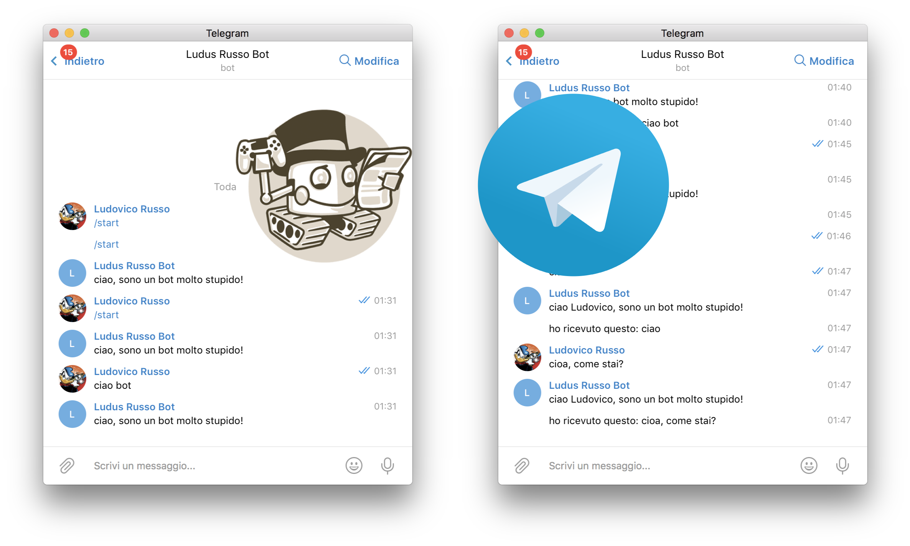
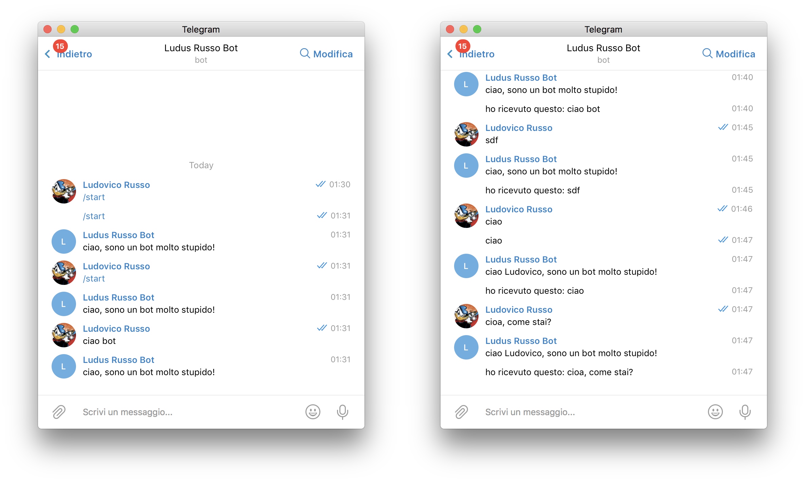

Da un po' di tempo ho scoperto la bellezza ed il divertimento di implementare bot telegram, cioè chatbot automatici che possono essere programmati per rispondere in modo semplice (o complesso) a messaggi da utenti reali.

Chi mi segue su questo blog o su [HotBlack Robotics](http://www.hotblackrobotics.com/) sa bene che mi diletto non poco con questa tecnologia. Vi propongo oggi quindi una brevissima introduzione allo sviluppo di chatbot utilizzando _Python_ e la libreria _Telepot_.



## La libreria telepot

Esistono diverse api Telegram per lo sviluppo di bot telegram in Python.
Tra le più semplici, almeno dal mio punto di vista, troviamo [telepot](https://github.com/nickoala/telepot).
Questa libreria permette in modo semplice e veloce di implementare bot telegram semplici, anche se risulta essere complessa e poco scalabile nel caso in cui si vogliano creare bot telegram più professionali.

Per installare questa libreria, basta semplicemente eseguire il comando `pip install telepot`.

## Setup Ambiente di sviluppo

Come sempre (e non smetterò mai di dirlo), consiglio di creare prima di tutto un ambiente virtuale python su cui lavorare.

Per farlo, accediamo nel nostro workspace di lavoro e creiamo un nuovo ambiente virtuale con il seguete comando:

```bash
$ virtualenv telepot-example
$ cd telepot-example
$ source bin/activate
(telepot-example)$ pip install telepot
(telepot-example)$ mkdir project
(telepot-example)$ cd project
```

## Creazione di un bot Telegram

Per creare un bot in telegram, possiamo sfruttare il bot Telegram (scusate il gioco di parole) @BotFather, a cui si può accedere cercando semplicemente @BotFather tra le chat telegram.

Una volta connessi al bot, ci basterà scrivere il comando `/newbot` e seguire le sue istruzioni per avere a di sposizione il nostro bot. In particolare, dovremmo fornire al bot le seguenti informazioni:

- Nome del bot
- username (che deve essere unico e finire con la parola "bot")

Una volta completata la procedura, il avremmo a disposizione un nostro TOKEN univoco (attenzione, non pubblicatelo altrimenti chiunque potrà usarlo) da utilizzare per sviluppare il nostro programma.


## Implementiamo il primo programma!

Una volta ottenuto il token, siamo pronti a sviluppare il nostro primo bot! Questo bot semplicementemente risponderà a qualsiasi messaggio con una frase preimpostata, del tipo: "ciao, sono un bot molto stupido!".

Creiamo un file chiamato `simple_bot.py`, apriamolo e inseriamoci il seguiente codice. Questo basta per creare il nostro semplicissimo bot!

```python
import telepot

def on_chat_message(msg):
    content_type, chat_type, chat_id = telepot.glance(msg)
    if content_type == 'text':
        bot.sendMessage(chat_id, 'ciao, sono un bot molto stupido!')

TOKEN = '*** inserisci il tuo token qui  ***'

bot = telepot.Bot(TOKEN)
bot.message_loop(on_chat_message)

print 'Listening ...'

import time
while 1:
    time.sleep(10)
```

### Analizziamo il codice passo passo

Vediamo adesso passo passo come funziona il codice implementato sopra:

Per prima cosa, dobbiamo importare la libreria telepot all'interno del nostro programma, in modo da porterla usare in seguito.

```python
import telepot
```

Una volta importata la libreria, possiamo andare a creare il nostro bot con questi semplici passaggi:

```python
TOKEN = '*** inserisci il tuo token qui  ***'
bot = telepot.Bot(TOKEN)
bot.message_loop(on_chat_message)
```

In particolare, all'interno della variabile `TOKEN` dovremmo andare a inserire il token ritornato dal botFather (attezione, si tratta di una stringa).

Una volta ottenuto il token, creiamo realmente il bot con il comando `bot = telepot.Bot(TOKEN)`.

Per finire, linkiamo il bot con la funzione `on_chat_message`. Questa funzione verrà richiamata ogni qual volta il nostro bot riceve un messaggio, ed è (a tutti gli effetti), il vero cuore del nostro programma.

Questa funzione riceverà sempre un argomento, che corrisponde al messaggio che è stato inviato al bot, contenuto nel parametro `msg`:

```python
def on_chat_message(msg):
    content_type, chat_type, chat_id = telepot.glance(msg)
    if content_type == 'text':
        bot.sendMessage(chat_id, 'ciao, sono un bot molto stupido!')
```

Essendo il bot semplice, anche la funzione è semplice. In particolare, all'interno di `on_chat_message`, facciamo solo 3 operazioni.

Per prima cosa, estraiamo dei dati importanti dal messaggio usando il comando `content_type, chat_type, chat_id = telepot.glance(msg)`. In questo modo, creiamo 3 variabili con i seguenti significati:

- `content_type` dice che tipo di dati sono contenuti nel messaggio (se un messaggio di testo, un'immagine, un messaggio vocale, o altro);
- `chat_type` contiene informazioni sul tipo di chat: se privata, gruppo, ecc.
- `chat_id` contiene un identificativo univoco alla chat, e può essere usato per rispondere nella stessa chat in cui è stato mandato il messaggio.

Come seconda operazione, controlliamo che il messaggio che è stato mandato al robot sia di tipo testuale, andando a fare un check sul contenuto di `content_type`, con la rica `if content_type == 'text':`.
Ricordiamo infatti che il bot è stupido, e sa rispondere solo a messaggi testuale.

Per finire, il bot invia sulla chat da cui è arrivato il messaggio un messaggio fisso: `bot.sendMessage(chat_id, 'ciao, sono un bot molto stupido!')`.

L'utima parte del codice, serve semplicemente per evitare che il programma termini. Senza un ciclo infino, infatti, il programma terminerebbe e il bot non potrebbe rispondere alla chat.

```python
print 'Listening ...'

import time
while 1:
    time.sleep(10)
```

### Test del programma

Per testare il programma, semplicemente lanciamolo utilizzando il seguente comando:

```bash
(telepot-example)$ python simple_bot.py
```

Una volta in funzione, apriamo la chat telegram ed iniziamo a messaggiare con il nostro bot. Per chiudere il programma, semplicemente basta premere i pulsanti `ctrl-C` dal terminale.

## Leggere il messaggio e le informazioni dell'utente!

Complichiamo adesso leggermente il nostro piccolo bot in modo che sia in grado di ricevere informazioni sull'utente con sta chattando e i messaggi che gli arrivano.

Per farlo, modifichiamo la funzione `on_chat_message` come segue (lasciando il resto inalterato):

```python
def on_chat_message(msg):
    content_type, chat_type, chat_id = telepot.glance(msg)
    if content_type == 'text':
        name = msg["from"]["first_name"]
        txt = msg['text']
        bot.sendMessage(chat_id, 'ciao %s, sono un bot molto stupido!'%name)
        bot.sendMessage(chat_id, 'ho ricevuto questo: %s'%txt)
```

come vedete, abbiamo aggiunto le due variabili

```python
name = msg["from"]["first_name"]
txt = msg['text']
```

In cui estrapoliamo e salviamo, rispettivamente, il nome dell'utente che ha mandato il messaggio al bot e il testo del messaggio.

A questo punto, usiamo queste informazioni per scrivere delle risposte dinamiche, sfruttando l'operatore speciale `%s` delle stringhe python:

```python
bot.sendMessage(chat_id, 'ciao %s, sono un bot molto stupido!'%name)
bot.sendMessage(chat_id, 'ho ricevuto questo: %s'%txt)
```

In particolare, utilizzando una stringa contenente la sequenza `%s` e seguita da `%variabile`, python automaticante inserirà il contenuto della variabile nella posizione in cui si trova il `%s`.

L'effetto, come potete immaginare, è quello di far sembrare il bot un po' meno stupido.



## Conclusioni

Che ve ne pare di questa breve guida? Siete interessati ad approfondire l'utilizzo di questa libreria? Scrivetemelo su [facebook](https://www.facebook.com/ludusrusso.cc/).

## Update

Questo post ha ricevuto un notevole successo, per questo motivo, ho deciso di scrivere altri
tutorial sull'argomento telegram.

Ma voglio fare qualcosa di più divertente.. Invece che pubblicare i nuovi tutorial direttamente
sul sito, ho sviluppato un bot Telegram che vi dirà dove trovare i nuovi tutorial!

Provatelo [cliccando qui](https://t.me/ludusrusso_bot)
