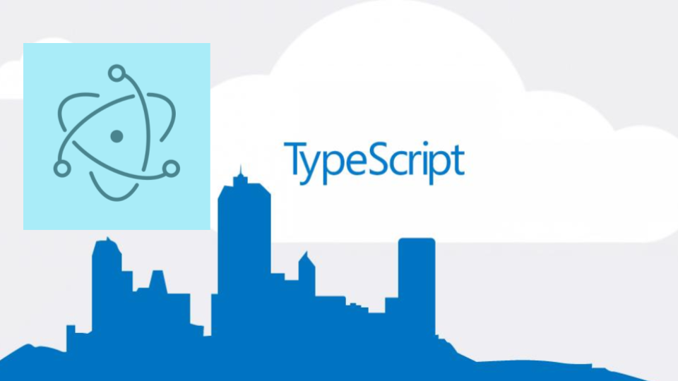
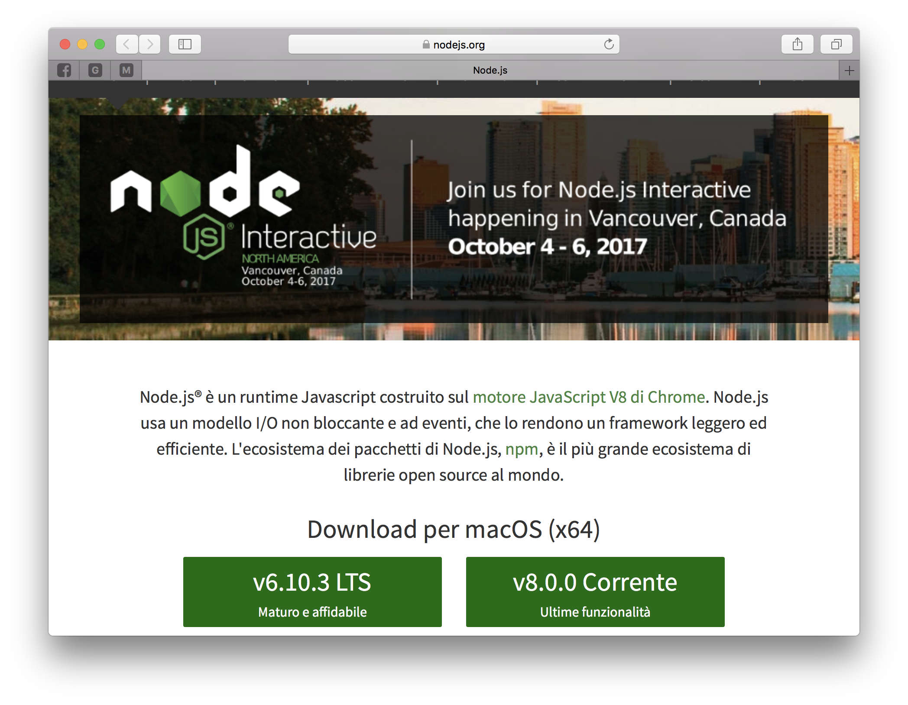
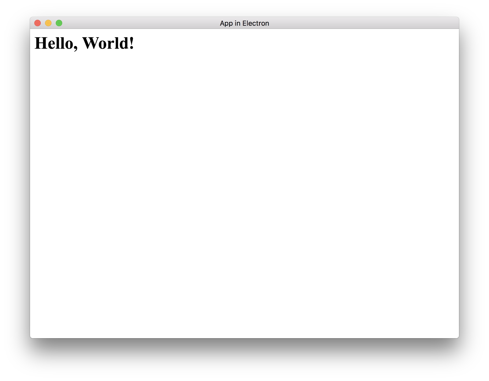

Mi sono avvicinato alle tecnologie Web per caso qualche anno fa, e mi si è aperto un mondo che molto spesso non sono riuscito ad approfondire, un po' per questioni di tempo, un po' perchè il linguaggio Javascript (il principale linguaggio per la programmazione di WebApp) non mi ha mai appassionato tanto.



Recentemente ho iniziato ad approfondire invece un linguaggio di programma ideato da Mycrosoft chiamato [**TypeScript**](https://www.typescriptlang.org/). Da definizione, TypeScript è un "superset" di JavaScript, cioè un'estensione di JavaScript, ed include una serie di caratteristiche dei linguaggi di programmazione moderni, quali classi, interfacce, ecc., rendendolo un linguaggio di programmazione degno di questo nome.

Con TypeScript, mi sto riavvicinando ad un progetto che conosco già da tempo ma che non ho mai approfondito: [**Electron**](https://electron.atom.io/). Electron è un sistema che sfrutta tecnologie web (quindi HTML, CSS e JS) per creare applicazioni native desktop. L'idea di base è molto semplice: le tecnologie web sono arrivate ad una maturità tale da permettere di scrivere applicazioni complesse che girano su qualsiasi browser e su qualsiasi piattaforma, quindi perchè non sfruttarle per sviluppare anche per applicazioni native? In pratica, con electron possiamo prendere una WebApp, impacchetarla e distribuirla come applicazione nativa su Windows, macOS e Linux.

Vediamo in seguito come fare!

## Installare Node.js

Per utilizzare electron, è necessario installare node.js sul nostro computer. Per farlo, accedete al [sito nodejs.org](https://nodejs.org/it/) e scaricate l'ultima versione disponibile (consiglio la versione LTS), scaricate e seguite le istruzioni di installazione.



Una volta installato node, avremmo a disposizione il comando npm per la gestione dei pacchetti javascript. Dobbiamo installare sul nostro computer il compilatore **typescript**. Per farlo, basterà aprire il terminale e digitare

```
$ npm install -g typescript
```

per installare globalmente (opzione `-g`) typescrit.

## Creazione progetto e installazione dipendenze

A questo punto, sempre da terminale, accediamo nel nostro workspace e creiamo una certella chiamata `electro_ts`: questa sarà la base del nostro progetto.

```bash
$ mkdir electro_ts
$ cd electro_ts
```

All'interno della cartella, inizializziamo il progetto digitando il comando

```
$ npm init
```

Il prompt di comandi ci chiederà una serie di informazioni per inizializzare il progetto, come nome dell'autore, licenza, ecc. Una volta risposto a tutte quante, noteremo che è stato creato un nuovo file chiamato `package.json`, con il seguente cotenuto:

```json
{
  "name": "electron_ts",
  "version": "1.0.0",
  "description": "",
  "main": "index.js",
  "scripts": {
    "test": "echo \"Error: no test specified\" && exit 1"
  },
  "author": "",
  "license": "ISC"
}
```

Potete modificare dopo queste informazioni per inserire correttamente alcuni dati.

### Installazione di Electron

Per usare Electron, ovvialmente, dobbiamo installare la libreria. Per farlo, eseguiamo il comando

```bash
$ npm install --save-dev electron
```

dove l'opzione `--save-dev` dice di installare electron come componente di sviluppo.

Una volta eseguito il comando, noterete che è apparsa una nuova cartella chiamata `node_modules`. Qui dentro verranno salvate tutte le dipendenze locali del progetto.

Inoltre, aprendo il file `package.json`, vi accorgerete che sono state aggiunge alcune righe, che essenzialmente memorizzano le dipendenze del progetto.

```json
{
  ...
  "devDependencies": {
    "electron": "^1.6.10"
  }
}
```

Siamo pronti per implementare l'applicazione.

## Prima App in Electron: Hello, World!

Sviluppiamo adesso una semplice applicazione che mostra, all'interno di una finestra, la scritta `Hello World!`.

Creiamo un file chiamato `main.ts`. Questo è un file in cui andremo a sviluppare il core dell'app usando typescript.

Creiamo anche un file `index.html`, in cui implementeremo la schermata dall'applicazione.

All'interno del file `index.html`, implementiamo semplicemente un tag `h1` con il testo _Hello, World!_

```html
<html>
  <head>
    <title>App in Electron</title>
  </head>
  <body>
    <h1>Hello, World!</h1>
  </body>
</html>
```

All'interno del file `main.ts`, implementiamo il seguente codice:

```typescript
import { app, BrowserWindow } from "electron"

let mainWindows = null

app.on("ready", () => {
  mainWindows = new BrowserWindow({ width: 800, height: 600 })
  mainWindows.loadURL("file://" + __dirname + "/index.html")
})
```

### Analizziamo il codice TypeScript

Vediamo riga per riga il significato del codice.

Per prima cosa, importiamo i componenti `app` e `BrowserWindow` dal modulo `electron`:

```typescript
import { app, BrowserWindow } from "electron"
```

Creiamo quindi una variabile, che gestirà la finestra principale della nostra applicazione:

```typescript
let mainWindows = null
```

A questo punto, dobbiamo aspettare che l'applicazione sia correttamente lanciata prima di iniziare a fare qualcosa. Per far questo, associamo all'evento `ready` una funzione:

```typescript
app.on("ready", () => {
  // codice da eseguire quando l'app è pronta.
})
```

All'interno della funzione, creiamo una finestra di dimensioni $800x600$ e, all'interno di questa finestra, carichiamo il file `index.html`:

```typescript
mainWindows = new BrowserWindow({ width: 800, height: 600 })
mainWindows.loadURL("file://" + __dirname + "/index.html")
```

### Compiliamo il codice

Come detto prima, ogni file `ts` deve essere compilato in modo da generare codice `javascript`. Per farlo, eseguiamo il comando

```bash
tsc main.ts
```

Che esegue il compilatore typescript sul file `main.ts`. Terminato il processo di compilazione, noterete che è stato creato un nuovo file, chiamato `main.js`. Questo sarà il file che andremo ad eseguire per lanciare il programma.

### Eseguiamo il codice

Per eseguire il codice, ci manca un ultimo passaggio: dobbiamo creare un nuovo comando di npm che lancia electron passandogli il file `main.js`, che viene gerato compilando `main.ts`.

Per farlo, modifichiamo il file `package.json` aggiungendo un nuovo script:

```json
{
  ...
  "scripts": {
    "electron": "electron main.js",
    ...
  },
  ...
}
```

Salviamo il file, ed eseguiamo il comando da terminale

```bash
npm run electron
```

Se tutto va bene, la nuova applicazione si aprirà e vedremo una schermata come questa.



## Conclusioni

Come potete notare, lo sviluppo di applicazioni usando questa tecnologia, risulta molto semplice.
Nei prossimi giorni approfondirò l’uso di TypeScript per incominciare a sviluppare applicazioni complete.
