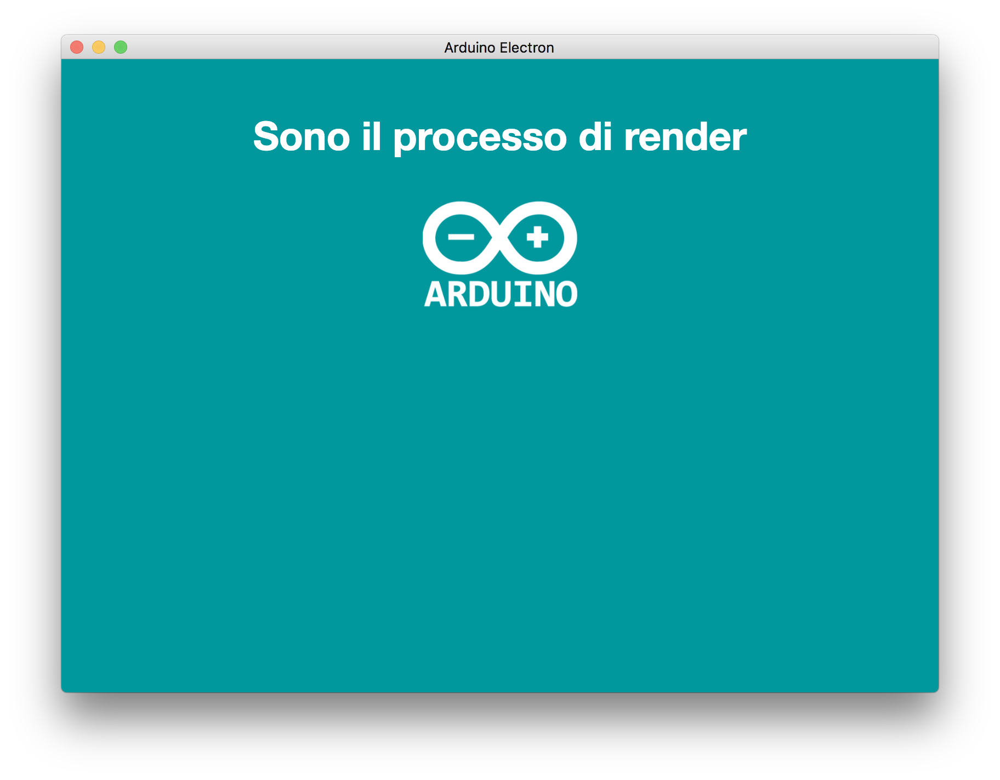
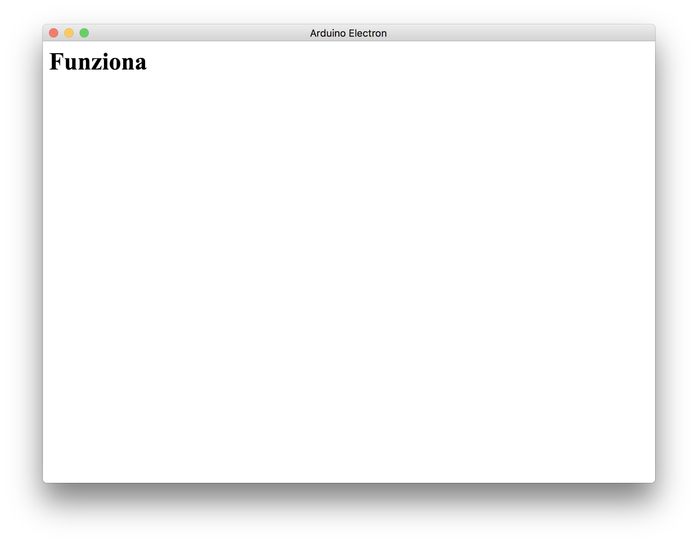
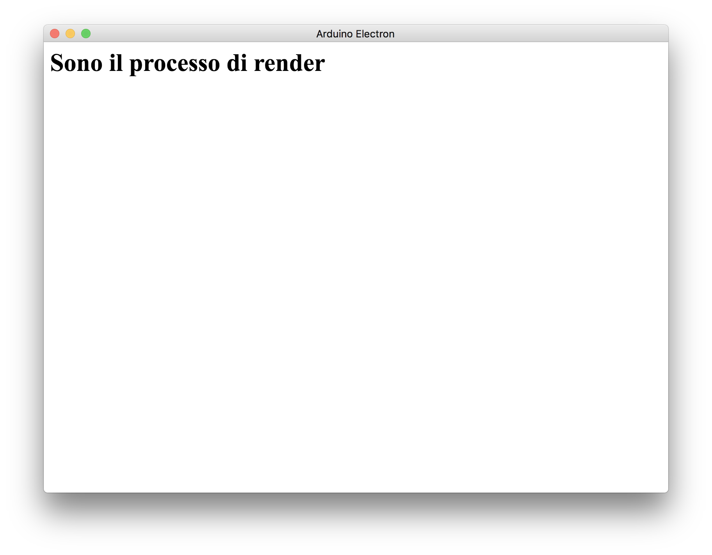
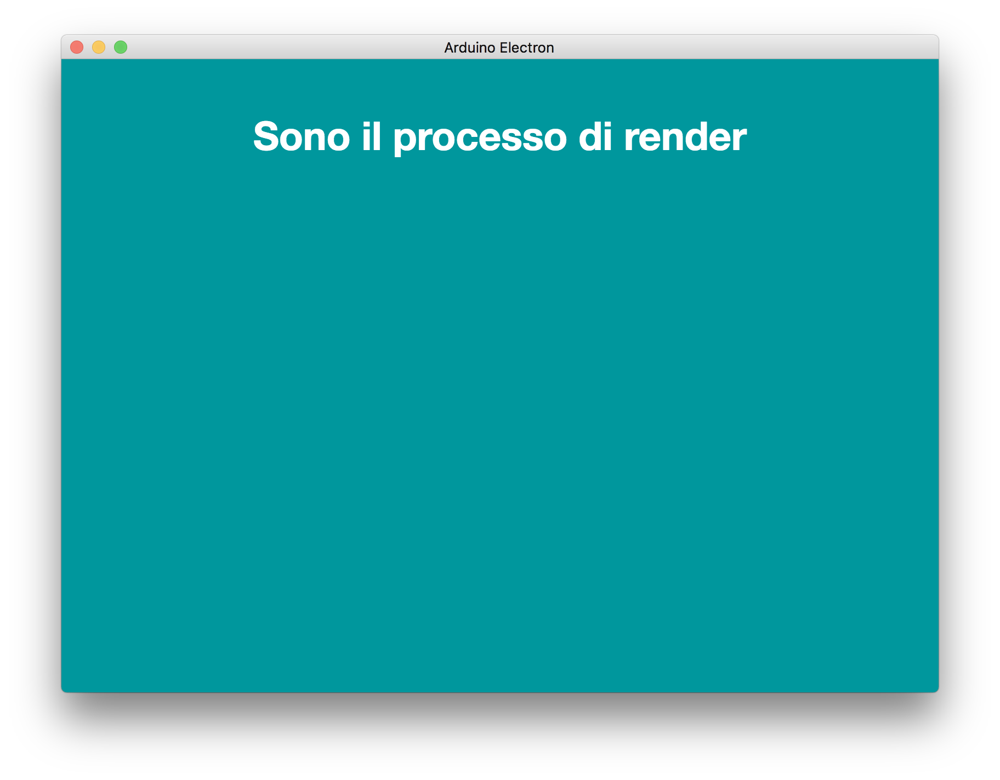

In un mio [precedente post](http://www.ludusrusso.cc/posts/2017-06-04-primi-test-con-typescript-ed-electron) vi ho parlato di come creare una semplicissima applicazione sfruttando Electron e il nuovo linguaggio di programmazione TypeScript. In questo periodo, ho approfondito un po' queste tecnologie, ed oggi vi propongo qui un tutorial completo su come sviluppare un'applicazione in Electron per il controllo di una scheda Arduino connessa via USB al computer su cui gira l'applicazione.



Il tutorial sarà diviso in due parti:

- Nella prima parte (questa), imposteremo ed entreremo nel dettaglio dell'utilizzo di Electron. Questa parte può quindi essere considerata una versione riveduta e corretta del mio [precedente post](http://www.ludusrusso.cc/posts/2017-06-04-primi-test-con-typescript-ed-electron).
- [Nella seconda parte](http://www.ludusrusso.cc/posts/2017-06-28-sviluppiamo-un-app-in-electron-per-controllare-la-scheda-arduino-parte-2), ci interfacceremo ad Arduino da TypeScript, e svilupperemo una semplice (ma efficace ed estendibile) interfaccia di controllo per Arduino.

Questo tutorial si basa sul protocollo **Firmata** e sulla libreria **arduino-firmata** in Node.js. Vedremo nel dettaglio in seguito di cosa parliamo.

In questo tutorial, useremo anche l'interessantissimo progetto [electron-compile](https://github.com/electron/electron-compile), che essenzialmente permette direttamente di utilizzare codice **TypeScritp** (ed altri linguaggi ad alto livello per web) senza doverlo prima compilare.

## Creazione del progetto e installazione delle librerie

Vediamo come inizializzare il progetto ed installare le librerie necessarie.

### Inizializzazione del progetto Node

Dopo aver scaricato **node.js**, come illustrato nel mio [precedente post](http://www.ludusrusso.cc/posts/2017-06-04-primi-test-con-typescript-ed-electron), creiamo un nuovo progetto chiamato `electron-arduino`:

```bash
$ mkdir electron-arduino
$ cd electron-arduino
$ npm init
```

Dopo aver eseguito il comando `npm init`, rispondiamo alle domande per creare il progetto node.

### Installazione delle dipendenze

Possiamo quindi iniziare ad installare le dipendenze di cui abbiamo bisogno. Installiamo `electron-prebuilt-compile` con il comando

```bash
$ npm install --save-dev electron-prebuilt-compile
```

`electron-prebuilt-compile` è una versione precompilata di electron-compile, che ci permette di utilizzarlo esattamente come se fosse electron.

Andiamo anche ad installare `typescript` in quanto useremo questo linguaggio, invece che javascript, per lo sviluppo dell'applicazione

```bash
$ npm install --save-dev  typescript
```

## Iniziamo ad implementare l'applicazione

Siamo quindi pronti per iniziare a scrivere codice. Al momento svilupperemo lo scheletro dell'app, che si compone di due file principali:

- Il file `app.ts` conterrà il codice per creare e lanciare l'applicazione electron.
- Il file `index.html` conterrà un template html per gestire l'aspetto dell'applicazione.
- Il file `index.ts`, che conterrà il codice TypeScript che verrà eseguito una volta renderizzata la finestra.

Creiamo quindi una cartella `src` in cui inserire tutti i sorgenti dell'app, e creiamo questi due file al suo interno:

```bash
$ mkdir src && cd src
$ touch app.ts  index.html index.ts
```

### Il file `app.ts`

Ad essere onesti, il file `app.ts` deve fare veramente poche operazioni: in particolare, deve creare una finestra grafica (di dimensioni specificate da noi) e renderizzare al suo interno il file `index.html`.

Vediamo quindi come implementare questo semplice codice. Apriamo questo file con un qualsiasi editor di test e iniziamo a scrivere.

Per prima cosa, importiamo gli oggetti `app` e `BrowserWindow` da `electron`:

```typescript
import { app, BrowserWindow } from "electron"
```

`app` reppresenta l'istanza dell'applicazione che stiamo creando, mentre `BrowserWindow` è una classe necessaria per la creazione di finestre grafiche.

A questo punto, è necessario aspettare che l'applicazione venga correttamente caricata prima di fare qualsiasi operazione. Per farlo, possiamo usare la funzione `app.on`, che crea una callback in base ad alcuni eventi del ciclo vita dell'applicazione. A noi, in particolare, interessa l'evento `ready`, che viene eseguito quando l'app è stata correttamente caricata:

```typescript
app.on("ready", () => {
  // codice da implementare
})
```

Come vedete, il secondo argomento della funzione è un'altra funzione (callback), che verrà eseguita solo quando l'app sarà pronta.

All'interno della callback, creiamo la nostra finestra, usando l'oggetto `BrowserWindow`, dandogli una dimensione di 600x800:

```typescript
app.on("ready", () => {
  let mainWindow = new BrowserWindow({ width: 800, height: 600 })
  // codice da implementare
})
```

Per finire, carichiamo all'interno della finestra il file `index.html`:

```typescript
app.on("ready", () => {
  let mainWindow = new BrowserWindow({ width: 800, height: 600 })
  mainWindow.loadURL("file://" + __dirname + "/index.html")
})
```

Si noti l'utilizzo della variabile `__dirname`, che contiene al suo interno il path globale della cartella all'interno della quale ci troviamo.

Ecco il codice completo sviluppato:

```typescript
import { app, BrowserWindow } from "electron"

app.on("ready", () => {
  let mainWindow = new BrowserWindow({ width: 800, height: 600 })
  mainWindow.loadURL("file://" + __dirname + "/index.html")
})
```

### Il file `index.html`

Mentre il file `app.ts` rimarrà invariato da qui alla fine del tutorial, il file `index.html` sarà un po' più complicato e ci lavoreremo molto.
Per il momento, per arrivare il prima possibile a far girare l'applicazione, sviluppiamo un file più semplice possibile :D

Apriamo il file `index.html` e scriviamo questo codice:

```html
<html>
  <head>
    <title>Arduino Electron</title>
  </head>
  <body>
    <h1>Funziona</h1>
  </body>
</html>
```

In questo file, abbiamo implementato il titolo (_Arduino Electron_) e stampiamo nella finestra, con tag `h1` la stringa _Funziona_.

### Testiamo l'applicazione

Siamo quasi pronti per far partire l'applicazione, un ultimo sforzo è necessario per configurare il file `package.json` per dire ad `npm` cosa fare per avviare l'app.

Apriamo il file `package.json`, e modifichiamo il campo `main`, in modo da settarlo a `src/app.ts`. In questo modo diremo all'applicazione che lo script principale è questo file.

Inoltre, all'interno del campo `scripts`, settiamo `start` ad `electron .`. In questo modo, informiamo npm, eseguendo il comando `npm start`, dovremmo lanciare electron!

Possiamo anche rimuovere lo script `test`. Il file dovrebbe apparire come segue:

```json
{
  ...
  "main": "src/app.ts",
  "scripts": {
    "start": "electron ."
  },
  ...
}
```

Una volta salvato il file, lanciamo il comando `npm start` per avviare l'applicazione. Se tutto va come deve, si aprirà la finestra che vedete in figura. Si noti il titolo e il suo contenuto!



### Il file `index.ts`

A differenza del file `app.ts`, che serve semplicemente per far partire l'applicazione, il file `index.ts` conterrà l'_intelligenza_ dell'applicazione stessa, cioè il codice che ne decide il comportamento. Questo file è separato dal primo in quanto è associato alla finestra della nostra app, e quindi al file `index.html` (non è un caso che entrambi i file abbiano lo stesso nome).

In gergo, il file `main.ts` viene chiamato **main process**, mentre il file `index.ts` è detto **render process**.

Il fatto di avere due file può sembrare confusionario, ma questa scelta si comprende meglio se immaginiamo un'applicazione con più finestre. In questo caso, avremmo sempre un unico **main process**, ma tanti **render process** quante sono le finistre!

Capito (spero) questo concetto di Electron, iniziamo ad implementare un semplice file `index.ts` che cambia il contenuto del tag `h1`, per vedere se tutto fuonziona correttamente. Apriamo il file `index.ts` e sviluppiamo il seguente codice:

```typescript
let title_h1 = document.getElementById("title_id")
title_h1.innerHTML = "Sono il processo di render"
```

La prima riga, serve per selezionare dal documento html (il file `index.html`) l'elemento avente **id** pari a _title_id_.
La seconda riga, cambia il contenuto di tale elemento con la stringa _Sono il processo di render_.

Come è possibile immaginare, prima di testare l'applicazione, dobbiamo modificare il file `index.html`. Le modifiche sono due:

- Aggiungere l'id _title_id_ all'elemento `h1`, modificando la riga corrispondente come segue: `<h1 id="title_id">Funziona</h1>`;
- Importare lo script `index.ts` alla fine del file, aggiungendo le seguenti linee prima della chiusura del tag `html`:

```html
<script>
  require("./index.ts")
</script>
```

Il file `index.html` dovrà quindi avere la seguente forma:

```html
<html>
  <head>
    <title>Arduino Electron</title>
  </head>
  <body>
    <h1 id="title_id">Funziona</h1>
  </body>
  <script>
    require("./index.ts")
  </script>
</html>
```

Salviamo i file, rilanciamo il programma digitando `npm start`, e dovrebbe apparire la finestra nell'immagine seguente:



Si noti come il processo di render modifica l'html della nostra applicazione.

L'applicazione sviluppata fino a questo punto è disponibile a [questo link](https://github.com/ludusrusso/electron-arduino/tree/55c979ed57b39dcbaf9efd3d8a2ebbfbdbdccf5d).

## L'aspetto conta

La nostra applicazione è funzionante ma poco interessante da un punto di vista grafico. Vediamo come migliorarla.

Per prima cosa, installiamo `boostrap` nella nostra applicazione, in modo da poter utilizzare i pacchetti css definiti da questo progetto.

```sh
$ npm install --save bootstrap
```

[Bootstrap](http://getbootstrap.com/) è un popolarissimo framework per la cura grafica di applicazioni web.

Per definire l'aspetto dell'applicazione, inoltre, useremo `scss` (e non direttamente `css`) per definire lo stile. Come per `TypeScript`, electron-compile è in grado di usare direttamente file `.scss`, senza una fase di compilazione per generare `css`.

### file `index.scss`

Creiamo quindi un file `src/index.scss` e apriamolo per editarlo.

Per prima cosa, importiamo i sorgenti css di bootstrap:

```scss
@import url("../node_modules/bootstrap/dist/css/bootstrap.min.css");
```

Settiamo quindi il colore di backgroud dello sfondo al colore di Arduino (codice `#00979d`) e il colore del testo bianco. Per farlo, definiamo una variabile contenente il codice colori richiesto

```scss
$arduino-color: #00979d;
```

e quindi settiamo le proprietà del tag `body`

```scss
body {
  background-color: $arduino-color;
  color: white;
}
```

andiamo anche a settare la proprietà del titolo `h1` in modo che il testo sia centrato. Aumentiamo anche il padding e settiamo il font in modo che sia in grassetto (bold). Per farlo, selezioniamo l'elemento tramite il suo tag `#title_id`

```scss
body {
  // ...
  #title_id {
    text-align: center;
    padding: 30px;
    font-weight: bold;
  }
}
```

Il file completo avrà quindi questa forma:

```scss
@import url("../node_modules/bootstrap/dist/css/bootstrap.min.css");

$arduino-color: #00979d;

body {
  background-color: $arduino-color;
  color: white;

  #title_id {
    text-align: center;
    padding: 30px;
    font-weight: bold;
  }
}
```

### modifichiamo il file `index.html`

Per finire, modifichiamo il file `index.html` in modo che usi il file appena implementato.

Aggiungiamo, per prima cosa, il link file `index.scss` appena creato, all'interno del tag `head`:

```html
<head>
  <title>Arduino Electron</title>
  <link rel="stylesheet" href="./index.scss" />
</head>
```

Lanciamo l'applicazione, il risultato sarà questo:



A questo punto, aggiungiamo un'immagine (figa) per completare l'aspetto della nostra applicazione. Per l'occasione, userò il logo di Arduino (che trovate [qui](https://raw.githubusercontent.com/ludusrusso/electron-arduino/master/img/arduino_white.png)).

Creiamo una cartella `src/imgs/` e copiamo al suo interno il logo.

A questo punto, aggiorniamo il file `index.html` aggiungendo il codice che seguente sotto subito dopo il tag `h1`

```html
<body>
  <h1 id="title_id">Funziona</h1>

  <div class="container">
    <div class="row">
      <div class="col-xs-4 col-xs-offset-4">
        
      </div>
    </div>
  </div>
</body>
```

In questo modo, abbiamo creato un container bootstrap. All'interno del container troviamo una `row`, con all'interno una colonna con offset: in questo modo, l'immagine non sarà a tutto schermo. Per finire, all'interno della colonna, abbiamo renderizzato l'immagine come classe `img-responsive`, in modo che si adatti automaticamente alle dimensioni della colonna.

Lanciamo il programma ed otterremo questo risultato:


L'app, sviluppata fino a questo punto, è disponibile [qui](https://github.com/ludusrusso/electron-arduino/tree/5fc13acf71c0c7b9744ca9e7660f5d91cdcb59ab).
## Fine prima parte

Come vedete, in questa prima parte abbiamo tirato su, usando Electron e Typescript, una prima applicazione! Nella prossima parte della guida, vedremo come interfacciare Arduino all'app per leggere i dati.
