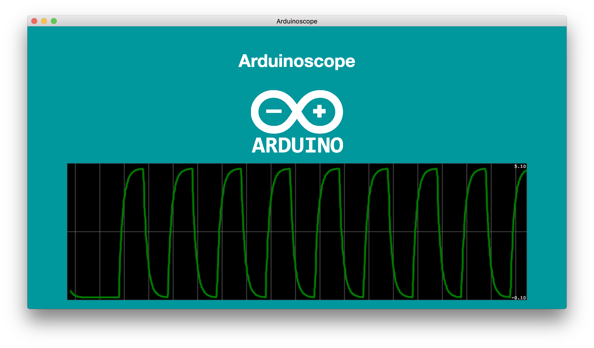
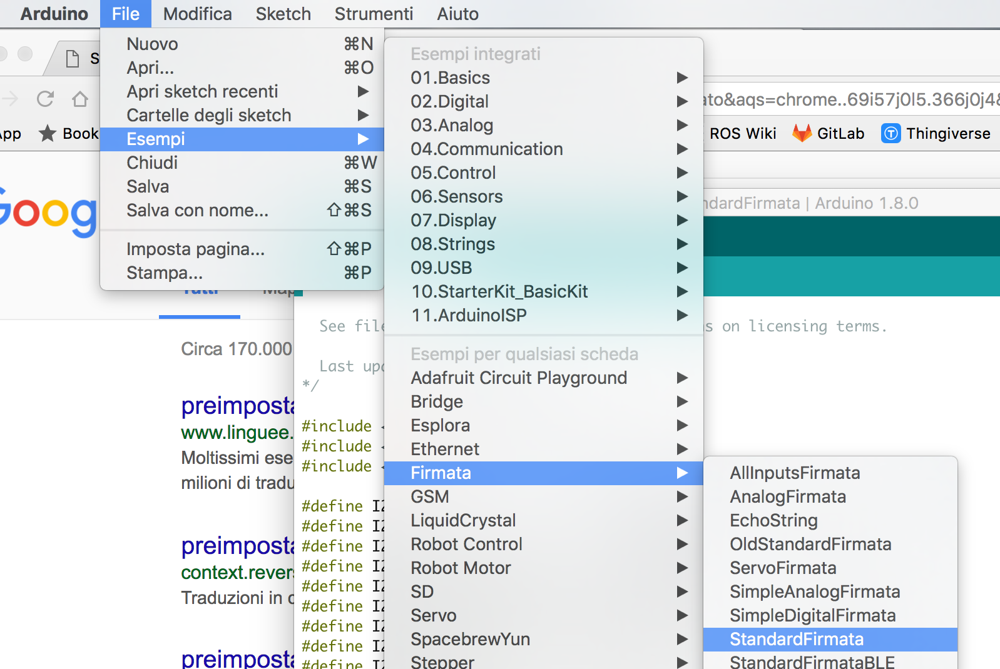
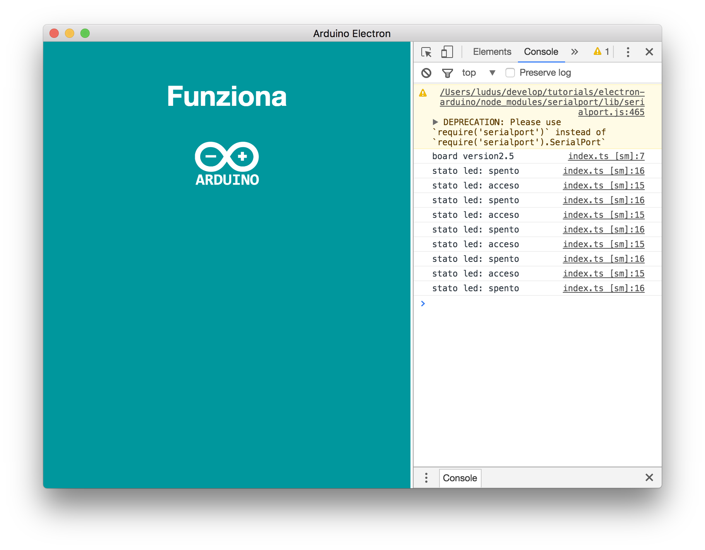
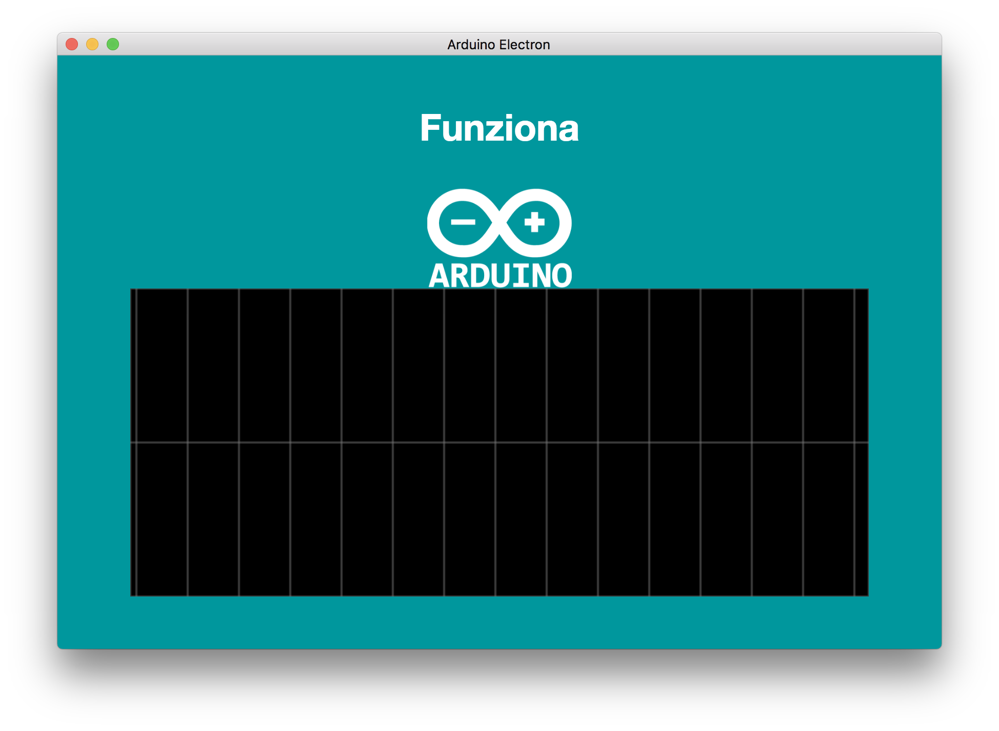
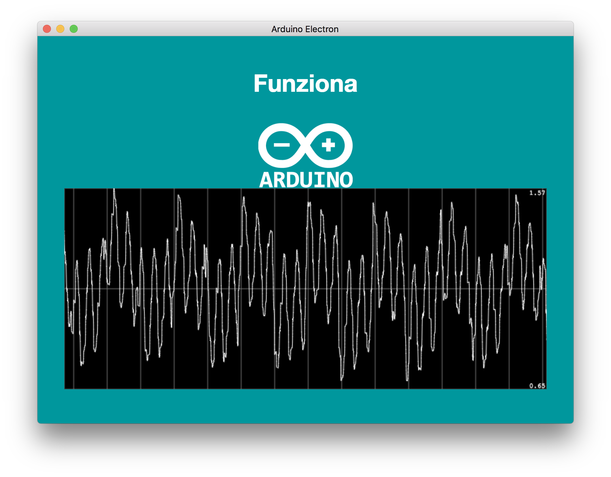
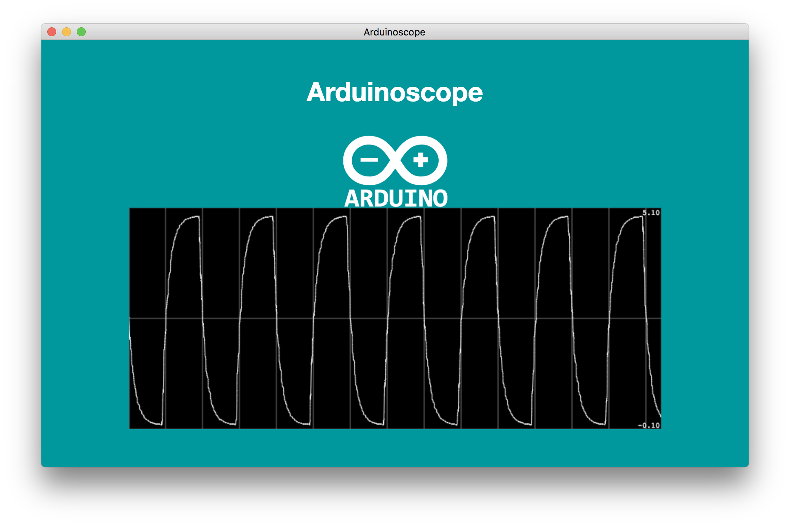
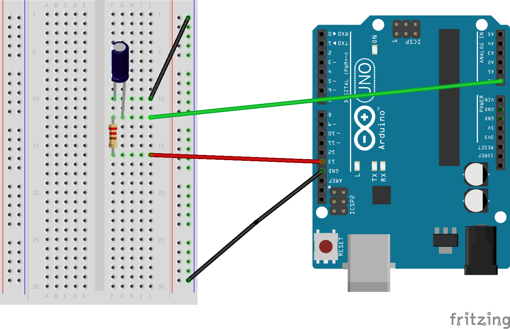

Ecco qui la seconda parte del mio tutorial sull'utilizzo di Electron per sviluppare un'applicazione Desktop in grado di interfacciarsi con Arduino.



Mentre nella [prima parte](http://www.ludusrusso.cc/posts/2017-06-26-sviluppiamo-un-app-in-electron-per-controllare-la-scheda-arduino-parte-1) abbiamo visto come creare la nostra applicazione ed impostare la grafica, in questo parte entremo nel dettaglio su come utilizzare **arduino-firmata** per far comunicare la nostra applicazione con Arduino.

Ma prima di tutto, cerchiamo di capire cosa è **Firmata**.

### Il protocollo Firmata

[**Firmata**](https://github.com/firmata/protocol) è un protocollo pensato per permettere la comunicazione tra un microcontrollore ed un software su un computer. Il protocollo è abbastanza generico da poter essere implementato sul firmware di qualsiasi microcontrollore e sul software di un qualsiasi computer. Firmata è già implemetato in Arduino ed è talmente popolare che nelle ultime versioni dell'IDE lo troviamo già disponibile all'installazione. Inoltre, firmata è disponibile su tantissimi linguaggi di programmazione, come Python o javascript in Node.

#### Firmata su Arduino
Firmata in Arduino può essere usata in due modi diversi:

- il modo più semplice, è di utilizzare uno sketch preimpostato e general porpouse (**StandardFirmata**) che permette di interagire in modo semplice con la scheda Arduino dal computer principale, e permette (con delle API già impostate) di accedere alle varie funzionalità di Arduino, come accendi/spegni i led. Questo è il modo che utilizzeremo in questo tutorial.
- il secondo modo, più interessante, è quello di sviluppare uno schetch custom sfruttando le varie funzionalità di firmata, in modo da creare uno sketch più leggero e che faccia esattamente quello che serve fare.

#### Firmata e Node.js

Come sapete, Node.js è una piattaforma che permette di sviluppare applicazioni in javascript che girano su un computer (invece che su un browser come normalmente avviene).

Per node, troviamo implementazioni già pronte di Firmata, e tra queste, vi è anche la libreria [arduino-firmata](https://github.com/shokai/node-arduino-firmata) che è già pronta per comunicare con lo schetch **StandardFirmata**.

## Installare Firmata su Arduino

L'installazione di Firmata su Arduino risulta essere molta facile. Infatti, lo Sketch **StandardFirmata** è già disponibile in Arduino accendendo da menu _File_ ad _Esempi_ > _Firmata_ > _StandardFirmata_.




Una volta aperto lo Sketch, non ci resta che uploadarlo su un Arduino collegato via USB al computer. Dato che ci siamo, ricordiamo di segnare la porta seriale dell'Arduino, in quanto dovrà essere utilizzata nel nostro progetto! Nel mio caso, la porta è `/dev/cu.usbmodem1461`.

## Utilizzo di Arduino Firmata nel progetto Electron

Uploadato il Firmware StandardFirmata, siamo pronti ad installare ed utilizzare `arduino-firmata` all'interno della nostra applicazione in electron.

### Installazione di `arduino-firmata`

Apriamo quindi (da terminale) la cartella di lavoro, ed installiamo il pacchetto `arduino-firmata` digitando:

```bash
$ npm install --save arduino-firmata
```

Una volta installato il pacchetto, possiamo iniziare ad usarlo all'interno della nostra applicazione.

Una piccola nota: purtroppo, arduino-firmata attualmente non è disponibile come pacchetto generico TypeScript. Questo non significa che non possiamo usarlo (ricordo che TypeScript è un _superset_ di JavaScript, quindi ogni cosa implementata in JavaScript è automaticamente funzionante in TypeScript). Tuttavia, dovremo usare alcuni "trick" strani per utilizzare il pacchetto nel nostro codice.

### Primo utilizzo `arduino-firmata`

Come anticipato nel precedente tutorial, lavoreremo principalmente nel processo di rendering, cioè nel file `src/index.ts`. All'interno di questo file, dobbiamo importare la libraria, aprire una comunicazione seriale con Arduino ed interagire sfruttando la API di Arduino Firmata.

Apriamo il file `src/index.ts`. Per prima cosa, dobbiamo importare la libreria, aggiungendo la linea di codice all'inizio del programma (possiamo rimuovere il vecchio codice typescript che cambia il titolo al progetto):

```typescript
let ArduinoFirmata = require("arduino-firmata")
```

Si noti che, invece di utilizzare il classico import TypeScript `import {ArduinoFirmata} from 'arduino-firmata'`, ho dovuto utilizzare il "vecchio" metodo `require`. Questo è il "trick" di cui accennavo poco fa per far funzionare un modulo JavaScript in TypeScript.

A questo punto, creiamo l'oggetto che si occuperà di comunicare con la scheda Arduino. Una volta creato, dobbiamo utilizzare il metodo `.connect` per connettere l'oggetto alla porta seriale.

```typescript
let ArduinoFirmata = require("arduino-firmata")

let arduino = new ArduinoFirmata()

let arduino_port = "/dev/cu.usbmodem1461"
arduino.connect(arduino_port)
```

Ovviamente, dovete inzializzare la variabile `arduino_port` con il nome della porta a cui è collegata il vostro arduino, che (al 99%) sarà diversa dalla mia.

Come sapete, JavaScript (e quindi TypeScript), sono linguaggi fortemente orientati agli eventi. Come nel caso dell'applicazione electron, che chiama l'evento `ready`, anche in questo caso, possiamo iniziare ad utilizzare arduino una volta che si verifica l'evento `connect`, ed utilizzeremo di nuovo il metodo `on` ed una **callback**:

```typescript
let ArduinoFirmata = require("arduino-firmata")

let arduino = new ArduinoFirmata()

let arduino_port = "/dev/cu.usbmodem1461"
arduino.connect(arduino_port)

arduino.on("connect", () => {
  // il codice da implementare va qui!
})
```

All'interno della funzione, dobbiamo implementare le varie azioni da fare una volta che Arduino è connesso. Per prima cosa, stampiamo sulla console di Electron la versione di della scheda a cui siamo connessi:

```typescript
// ...

arduino.on("connect", () => {
  console.log("board version" + arduino.boardVersion)
  // ...
})
```

Come ultima cosa, per verificare l'effettivo funzionamento del programma, programmiamo in TypeScript il classico **blink** di Arduino, facendo lampeggiare il led 13.

Come al solito, dovremmo usare gli eventi per eseguire questa operazione. In particolare, dobbiamo chiamare una callback (che cambialo lo stato del pin), associata ad un evento che si verifica periodicamente (ogni secondo), sfruttando la funzione `setInterval` di JavaScript.

`setInterval` prende due parametri in ingresso:

- il primo, è la funzione di callback da eseguire
- il secondo, è l'intervallo di tempo tra le varie chiamate della funzione (in millisecondi).

Come al solito su Arduino, dobbiamo ricordarci di settare il pin 13 come pin di output, usando la stringa `arduino.pinMode(7, ArduinoFirmata.OUTPUT);`.

Utilizzo una variabile `status` per far cambiare lo stato del led. Sfruttiamo `status` anche per stampare a video lo stato attuale del led, usando un semplice `if`.

```typescript
// ...
arduino.on("connect", () => {
  console.log("board version" + arduino.boardVersion)

  arduino.pinMode(13, ArduinoFirmata.OUTPUT)

  let status = true
  setInterval(() => {
    status = !status
    arduino.digitalWrite(13, status)
    if (status == true) console.log("stato led: acceso")
    else console.log("stato led: spento")
  }, 1000)
})
```

Ecco qui il codice completo appena sviluppato

```typescript
let ArduinoFirmata = require("arduino-firmata")

let arduino_port = "/dev/cu.usbmodem1461"
let arduino = new ArduinoFirmata()
arduino.connect(arduino_port)
arduino.on("connect", () => {
  console.log("board version" + arduino.boardVersion)

  arduino.pinMode(13, ArduinoFirmata.OUTPUT)

  let status = true
  setInterval(() => {
    status = !status
    arduino.digitalWrite(13, status)
    if (status == true) console.log("stato led: acceso")
    else console.log("stato led: spento")
  }, 1000)
})
```

### Test del codice... OPS, errore

Prima di testare il codice, configuriamo l'app in modo che apra all'avvio la il tool degli sviluppatori, da cui potremmo vedere in modo più semplice eventuali errori e tutti i log sulla console.

Per farlo, aggiugiamo la riga di codice `mainWindow.toggleDevTools();` all'interno del file `app.ts`, che diventerà così:

```typescript
import { app, BrowserWindow } from "electron"

app.on("ready", () => {
  let mainWindow = new BrowserWindow({ width: 800, height: 600 })
  mainWindow.toggleDevTools() // <- Riga Aggiunta
  mainWindow.loadURL("file://" + __dirname + "/index.html")
})
```

Avendo cura che l'arduino sia collegato al nostro computer, lanciamo l'app con `npm start` e vediamo che succedere.


Nel mio caso, appare un brutto errore sulla console, che probabilmente apparirà anche a voi. Se non appare, potete saltare completamente questa sezione e riprendere alla prossima, altrimenti, vediamo come risolvere il problema.

L'errore che ottengo è il seguete:

```
Uncaught Error: The module '../node_modules/serialport/build/Release/serialport.node'
was compiled against a different Node.js version using
NODE_MODULE_VERSION 48. This version of Node.js requires
NODE_MODULE_VERSION 53. Please try re-compiling or re-installing
the module (for instance, using `npm rebuild` or`npm install`).
```

Essenzialmente questo ci dice che il modulo `serialport` (utilizzato internamente da `arduino-firmata`), è stato compilato su una versione diversa di `npm`. Fortunatamente, c'è un modo molto semplice per risolvere il problema, e consiste nell'utilizzare il progetto `electron-rebuild`, che è stato sviluppato proprio per risolvere questo tipo di incoveniente.

Installiamo il progetto con il comando:

```
$ npm install --save-dev electron-rebuild
```

Aggiungiamo quindi un nuovo script all'interno del file `package.json`:

```json
...
"scripts": {
  "test": "echo \"Error: no test specified\" && exit 1",
  "start": "electron .",
  "rebuild": "electron-rebuild ."
},
...
```

Ed eseguiamo questo script:

```bash
$ npm run rebuild
```

Una volta completata la fase di compilazione, lanciamo l'app! Vedrete che tutto funziona come previsto:



Come vedete, il programma scrive (correttamente), la versione di Arduino, fa blinkare il led 13 a frequenza di 1 secondo, e stampa sulla console lo stato della scheda stessa.

## Interagire con la GUI - Implementiamo un oscilloscopio

Testato il classico esempio di Blink, iniziamo a fare qualcosa di più interessante. La mia idea è di sviluppare un semplice oscilloscopio, che legge i dati dal PIN A0 di Arduino e li disegna su un grafico animato.

Per farlo, utilizzeremo la libreria JavaSript [smoothie](http://smoothiecharts.org/), che permette di disegnare plot nel tempo in modo semplice e veloce.

Installiamo la libreria utilizzando il comando npm, e le sue definizione per TypeScript `@types/smoothie`.

```bash
$ npm install --save smoothie @types/smoothie
```

A questo punto, dobbiamo creare un'area **html** in cui disegnare il grafico. Per farlo, modifichiamo il file `index.html`, aggiungendo una nuova `div`
(classe `col-md-12`) con all'interno un `canvas`, come segue:

```html
<html>
  ...
  <body>
    ...
    <div class="container">
      <div class="row">
        ...
        <div class="col-md-12">
          <canvas id="plotA0" style="width:100%; height: 300px"></canvas>
        </div>
      </div>
    </div>
  </body>
  ...
</html>
```

Notare che al canvas abbiamo settato un `id` a `plotA0`!

Il file completo `src/index.html` sarà quindi così

```html
<html>
  <head>
    <title>Arduino Electron</title>
    <link rel="stylesheet" href="./index.scss" />
  </head>
  <body>
    <h1 id="title_id">Funziona</h1>

    <div class="container">
      <div class="row">
        <div class="col-xs-4 col-xs-offset-4">
          
        </div>

        <div class="col-md-12">
          <canvas id="plotA0" style="width:100%; height: 300px"></canvas>
        </div>
      </div>
    </div>
  </body>
  <script>
    require("./index.ts")
  </script>
</html>
```

Apriamo quindi il file `src/index.ts`. Prima di tutto, dobbiamo importare gli oggetti `SmoothieChart` e `TimeSeries` dalla libreria `smoothie`:

```typescript
import { SmoothieChart, TimeSeries } from "smoothie"
```

A questo punto, creiamo un nuovo `SmoothieChart` (cioè un elemento grafico in cui visualizzare il plot) a partire dall'elemento con id `plotA0` appena creato

```typescript
let plotter = new SmoothieChart({ responsive: true })
let canvasPlot = document.getElementById("plotA0")
plotter.streamTo(canvasPlot, 30)
```

Il parametro di configurazione `{responsive: true}` che passiamo al costruttore `SmoothieChart` serve a far si che il grafico di adatti automaticamente alle dimensioni della pagina all'interno della quale si trova.

Notare che il metodo `streamTo` prende due parametri:

- il primo rappresenza l'elemento del file `html` all'interno del quale mostrare i dati;
- il secondo, rappresenta il tempo di refresh del grafico, in questo case impostato a $30ms$.

Il file `src/index.ts` avrà quindi questa forma

```typescript
let ArduinoFirmata = require("arduino-firmata")
import { SmoothieChart, TimeSeries } from "smoothie"

let plotter = new SmoothieChart({ responsive: true })
let canvasPlot = document.getElementById("plotA0")
plotter.streamTo(canvasPlot, 30)

let arduino_port = "/dev/cu.usbmodem1461"
let arduino = new ArduinoFirmata()
arduino.connect(arduino_port)

arduino.on("connect", () => {
  console.log("board version" + arduino.boardVersion)

  arduino.pinMode(13, ArduinoFirmata.OUTPUT)

  let status = true
  setInterval(() => {
    status = !status
    arduino.digitalWrite(13, status)
    if (status == true) console.log("stato led: acceso")
    else console.log("stato led: spento")
  }, 1000)
})
```

Una volta lanciata l'applicazione, dovremmo vedere un grafico (vuoto). Vediamo come inserire i dati da arduino al suo interno.



### Leggere dati da arduino e disegnarli dentro il plotter

Vediamo adesso come leggere i dati da Arduino e creare un plot con questi dati.

Per prima cosa, dobbiamo creare un oggetto `TimeSeries`. Questa classe rappresenta una linea da disegnare che varia nel tempo.

```typescript
var plotline = new TimeSeries()
```

Una volta creato questo oggetto, dobbiamo informare l'oggetto `plotter`, creato prima, di disegnare i valori contenuti all'interno della `plotline`.

```typescript
plotter.addTimeSeries(plotline)
```

Perfetto, ora abbiamo una linea correttamente configurata, ma ancora senza dati. Usiamo l'oggetto `arduino` per inserire i dati a partire dai valori letti dal pin `A0`. Dato che la lettura dei dati deve essere periodica, utilizziamo nuovamente la funzione `setInterval`. Come prima, lavoreremo dentro la callback chiamata dell'eventi `connect`.

```typescript
arduino.on("connect", () => {
  // ...
  setInterval(() => {
    let v = (arduino.analogRead(0) * 5.0) / 1023
    let time = new Date().getTime()
    plotline.append(time, v)
  }, 30)
})
```

Come vedete, l'oggetto `plotline` presenta un metodo `append`, che vuole due valori: il tempo a cui è stato preso il dato `time`, ed il dato stesso `v`.

Il dato `v` è ottenuto leggendo il pin `A0` di arduino, e normalizzando la lettura nell'intervallo $[0 -- 5]V$. Il dato `time`, invece, viene ottenuto pendendo il tempo del sistema nel momento in cui è eseguita la funzione, utilizzando l'oggetto `Date()``.

```typescript
let v = (arduino.analogRead(0) * 5.0) / 1023
let time = new Date().getTime()
plotline.append(time, v)
```

Queste tre operazioni vengono eseguite ogni 30ms, il tempo di refresh del plotter.

Il codice completo è riportato qui sotto

```typescript
let ArduinoFirmata = require("arduino-firmata")
import { SmoothieChart, TimeSeries } from "smoothie"

let plotter = new SmoothieChart({ responsive: true })
let canvasPlot = document.getElementById("plotA0")
plotter.streamTo(canvasPlot, 30)

var plotline = new TimeSeries()

plotter.addTimeSeries(plotline)

let arduino_port = "/dev/cu.usbmodem1461"
let arduino = new ArduinoFirmata()
arduino.connect(arduino_port)
arduino.on("connect", () => {
  console.log("board version" + arduino.boardVersion)

  arduino.pinMode(13, ArduinoFirmata.OUTPUT)

  let status = true
  setInterval(() => {
    status = !status
    arduino.digitalWrite(13, status)
    if (status == true) console.log("stato led: acceso")
    else console.log("stato led: spento")
  }, 1000)

  setInterval(() => {
    let v = (arduino.analogRead(0) * 5.0) / 1023
    let time = new Date().getTime()
    plotline.append(time, v)
  }, 30)
})
```

Lanciamo l'applicazione, e vedremo finalmente il grafico apparire all'interno dell'aria dedicata.
Se non collegate niente al pin `A0`, noterete un segnale molto casuale, come quello mostrato qui sotto



Ho anche provato a realizzare un semplicissimo circuito RC, la cui uscita è stata collegata al pin `A0`. Il tutto sembra funzionare come previsto!
Si noti che ho sfruttato il Pin 13 (che continua a blinkare), per controllare la carica e scarica del condensatore nel circuito.





### Miglioriamo la grafica

App funzionante, cerchiamo ora di renderla un po' più carina.

Prima di tutto, scegliamo un titolo decente: `Arduinoscope`. Settiamo questo
titolo sia come titolo dell'applicazione, che come testo all'interno del tag `h1` principale.
Entrambi sono definiti nel file ``src/index.html`, che diventerà così dopo le modifiche:

```html
<html>
  <head>
    <title>Arduinoscope</title>
    <link rel="stylesheet" href="./index.scss" />
  </head>
  <body>
    <h1 id="title_id">Arduinoscope</h1>

    <div class="container">
      <div class="row">
        <div class="col-xs-4 col-xs-offset-4">
          
        </div>

        <div class="col-md-12">
          <canvas id="plotA0" style="width:100%; height: 300px"></canvas>
        </div>
      </div>
    </div>
  </body>
  <script>
    require("./index.ts")
  </script>
</html>
```

Allontaniamo un po' il grafico dal logo di Arduino, settando il `padding-top` del grafico nel file `index.scss`,
che diventerà così

```scss
@import url("../node_modules/bootstrap/dist/css/bootstrap.min.css");

$arduino-color: #00979d;

body {
  background-color: $arduino-color;
  color: white;

  #title_id {
    text-align: center;
    padding: 30px;
    font-weight: bold;
  }

  #plotA0 {
    padding-top: 20px;
  }
}
```

Per finire, settiamo alcune configurazione agli oggetti `plotter` e `plotline` nel file `index.html`.

Per prima cosa, fissiamo l'asse verticale del grafico a valori fissi: in particolare fisserò il valore inferiore a $-0.1$ e quello superiore a $5.1$. Questo si fa
passando i valiri `minValue` e `maxValue` al costruttore `SmoothieChart`.

```typescript
let plotter = new SmoothieChart({
  responsive: true,
  minValue: -0.1,
  maxValue: 5.1,
})
```

Per finire, diamo uno stile migliore alla linea `plotline`, settandone un colore e uno spessore.
Questo viene fatto passando i parametri di configurazione `strokeStyle` e `lineWidth` al metodo `addTimeSeries`

```
plotter.addTimeSeries(plotline, {
  strokeStyle: 'rgba(0, 124, 0, 1)',
  lineWidth: 4
});
```

Il file `src/index.ts` diventerà quindi così

```typescript
let ArduinoFirmata = require("arduino-firmata")
import { SmoothieChart, TimeSeries } from "smoothie"

let plotter = new SmoothieChart({
  responsive: true,
  minValue: -0.1,
  maxValue: 5.1,
})

let canvasPlot = document.getElementById("plotA0")
plotter.streamTo(canvasPlot, 30)

var plotline = new TimeSeries()

plotter.addTimeSeries(plotline, {
  strokeStyle: "rgba(0, 124, 0, 1)",
  lineWidth: 4,
})

let arduino_port = "/dev/cu.usbmodem1461"
let arduino = new ArduinoFirmata()
arduino.connect(arduino_port)
arduino.on("connect", () => {
  console.log("board version" + arduino.boardVersion)

  arduino.pinMode(13, ArduinoFirmata.OUTPUT)

  let status = true
  setInterval(() => {
    status = !status
    arduino.digitalWrite(13, status)
    if (status == true) console.log("stato led: acceso")
    else console.log("stato led: spento")
  }, 1000)

  setInterval(() => {
    let v = (arduino.analogRead(0) * 5.0) / 1023
    let time = new Date().getTime()
    plotline.append(time, v)
  }, 30)
})
```

E questo è il risultato finale dell'applicazione


## Conclusioni

Siamo giunti alla fine di questo lungo tutorial. Trovate la versione qui realizzata dell'applicazione a [questo link](https://github.com/ludusrusso/electron-arduino/tree/07c897b1a462baf6e6f22260db730cc9678f7bc3).
Che dire, mi sto divertendo tantissimo ad usare TypeScript ed Electron, e penso che, con poco effort, si riescano a fare grandi cose.
Sicuramente approfondirò ancora queste tecnologie!
