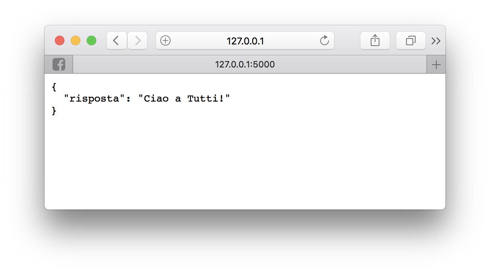

Python è un linguaggio di programmazione molto pragmatico e potente.
Tra le funzionalità che preferisco (anche se ho iniziato a sfruttare seriamente da poco),
troviamo i _decoratos_ (decoratori), a cui Python dedica una sintassi speciale.

In questo post, voglio analizzare l'utilizzo dei decoratori in Python, facendo vedere come possono essere usati per semplificare non poco lo sviluppo di API in un'applicazione _Flask_ con un semplice esempio pratico.

## Decorator Design Pattern

I decorator fanno parte dei **Design Pattern** fondamentali. Per chi non lo sapesse, un design pattern è una soluzione standardizzata (e spesso elegante) ad un problema ricorrente in programmazione.

Il decorator risolve la necessità (ai programmatori) di aggingere funzionalità ad uno specifico oggetto (per semplicità limitiamoci a parlare di funzioni), senza dover modificare l'oggetto stesso.

Facciamo un esempio pratico:

Supponiamo di definire una serie di funzioni (per semplicità due) che generano dei dizionari Python.

```python
def dict_name(name):
    return dict(name=name)

def dict_age(age):
    return dict(age=age)
```

Queste due semplicissime funzioni ritornano due dizionari con un solo elemento entrambi:

```
>>> dict_name('ludovico')
{'name': 'ludovico'}
>>> dict_age(12)
{'age': 12}
```

Supponiamo a questo punto di voler utilizzare queste funzioni per ritornare non un oggetto `dict` ma un oggetto `JSON`, magari da utilizzare all'interno di un server web.

Le soluzioni possono essere due:

1. Modificare le due funzioni come segue:

```python
import json

def dict_name_json(name):
    return json.dumps(dict(name=name))

def dict_age_json(age):
    return json.dumps(dict(age=age))
```

Che può essere utilizzata esattamente nello stesso modo di prima:

```
>>> dict_age_json(12)
'{"age": 12}'
>>> dict_name_json('ludovico')
'{"name": "ludovico"}'
```

2. Utilizzare la funzione `json.dumps()` esternamente alle due funzioni.

```
>>> json.dumps(dict_name('ludovico'))
'{"name": "ludovico"}'
>>> json.dumps(dict_age(12))
'{"age": 12}'
```

Entrambe queste soluzioni sono funzionali ma poco _Pythoniche_. Inoltre, richiedono al programma o di modificare una funziona esistente oppure di utilizzare continuamente la funzione `json.dumps()`.

A questo punto ci viene in aiuto il pattern decorator. Un decorator è (essenzialmente) una funzione che prende in ingresso un'altra funzione e ne ritorna una simile ma con il comportamento modificato.

Riprendiamo il nostro esempio: se vogliamo utilizzare questo design pattern, dobbiamo scrivere una funzione che prende in ingresso un'altra funzione che ritorna un dizionario, e genera una funzione che ritorna lo stesso dizionario _jsonizzato_.

Ecco il codice:

```python
def as_json(func):
    def func_wrapper(arg):
        d = func(arg)
        return json.dumps(d)
    return func_wrapper
```

Vediamo cosa fa questo codice:

1. Per prima cosa abbiamo definito una funzione chiamata `as_json`, che prende come parametro una funzione generica `func`.

2. All'interno di questa funzione, definiamo una seconda funzione chiamata `func_wrapper`. Questa funzione prende in ingresso un parametro (`args`), chiama la funzione `func` su `args`, e ritorna il risultato come `json`, utilizzando la funzione `json.dumps()`.

3. Alla fine, ritorniamo la funzione `func_wrapper`, che _decora_ la funzione `func`.

Di seguito, vediamo come utilizzarla.

```
>>> dict_name = as_json(dict_name)
>>> dict_name('ludovico')
'{"name": "ludovico"}'
>>> dict_age = as_json(dict_age)
>>> dict_name(12)
'{"age": 12}'
```

In particolare, le due seguenti righe di codice

```python
dict_name = as_json(dict_name)
dict_age = as_json(dict_age)
```

sono quelle in cui _decoriamo_ le funzioni con il decoratore `as_json`.

Questa sintassi è un po' brutta, per questo motivo, python mette a disposizione una speciale sintassi che permette di decorare una funzione nel momento in cui viene creata:

```python
@as_json
def dict_name(name):
    return dict(name=name)

@as_json
def dict_age(age):
    return dict(age=age)
```

Che è equivalente (ma decisamente più bella) a

```python
def dict_name(name):
    return dict(name=name)
dict_name=as_json(dict_name)

def dict_age(age):
    return dict(age=age)
dict_age=as_json(dict_age)
```

### Miglioriamo il decoratore

Notare che, a questo punto, il nostro decoratore funziona con qualsiasi funzione che ritorna un oggetto `dict` (o comunque un oggetto jsonizzabile) e ha un solo parametro in ingresso.

Che succede se proviamo ad usare questo decoratore con una funzione più complessa? Provando a lanciare il seguente codice

```python
@as_json
def dict_name_age(name, age):
    return dict(name=name, age=age)

dict_name_age("ludovico", 12)
```

otterremo un errore

```
Traceback (most recent call last):
  File "decorator_example.py", line 13, in <module>
    print(dict_name_age("ludovico", 12))
TypeError: func_wrapper() takes 1 positional argument but 2 were given
```

Questo succede perchè la funzione `func_wrap` all'interno del decoratore prende solo un parametro. Come facciamo a fare in modo che questa prenda un numero indefinito di parametri in modo da essere compabile con qualsiasi funzione decorata? Ci aiuta una funzione di python chiamata **unpacking**, che magari discuterò in un altro post. Al momento, vi basti sapere che la soluzione è la seguente:

```python
def as_json(func):
    def func_wrapper(*args, **kargs):
        d = func(*args, **kargs)
        return json.dumps(d)
    return func_wrapper
```

In cui `*args, **kargs` intercettano genericamente qualsiasi parametro venga passato alla `func_wrapper` e li passano alla funzione `func` decorata. Ora possiamo usare il nostro decoratore in modo più generale.

```python
@as_json
def dict_name_age(name, age):
    return dict(name=name, age=age)
```

```
>>> dict_name_age("ludovico", 12)
'{"name": "ludovico", "age": 12}'
```

### Decoratori parametrizzabili

A questo punto le cose potrebbero sembrare più complesse, ma in realtà una volta
capito il meccanismo il tutto risulta molto banale.

Che fare se volessimo creare un decoratore _parametrizzabile_, cioè al quale
vogliamo passare degli argomenti (come se fosse una funzione) nel momento in cui
viene usato?

L'esempio, riprendendo il discorso di prima, è il seguente. Vogliamo un decoratore
a cui specificare se ritornare il json in formato più leggibile (con le indentazioni e gli a capo per interderci) oppure normalmente senza occuparci troppo del formato visivo.

Per farlo, ecco il codice che propongo:

```python
def as_json(indent=False):
    def as_json_dec(func):
        def func_wrapper(*args, **kargs):
            d = func(*args, **kargs)
            if indent:
                return json.dumps(d, indent=4)
            else:
                return json.dumps(d)
        return func_wrapper
    return as_json_dec
```

In questo caso, `as_json` non è più una decorator, ma una funzione che ritorna a sua volta
un decoratore (`as_json_dec`). Il parametro passato alla fuzione `as_json` viene utilizzato all'interno del decoratore per modificarne il suo comportamento.

Questo decoratore può essere utilizzato come segue:

```python
@as_json()
def dict_name_age(name, age):
    return dict(name=name, age=age)
```

o, in alternativa, in questo modo:

```python
@as_json(True)
def dict_name_age(name, age):
    return dict(name=name, age=age)
```

Nel secondo caso, il risultato è il seguente:

```
{
    "name": "ludovico",
    "age": 12
}
```

## Esempio Reale: decoratore in Flask

Uno dei miei [framework preferiti](/2016/12/27/tutorial-flask/) è _Flask_, un microframework in python per creare siti web (lato server). Flask è molto potente per la creazione di API REST. Per chi non lo sapesse, le API REST sono una soluzione che permette ad un'applicazione generica (web, mobile, desktop) di scambiare dati con un server, indipendentemente dal linguaggio di programmazione scelto e dalla piattaforma.

Entrerò nel dettaglio sulle funzionalità di REST in futuro, vediamo però ora come utilizzare il nostro decoratore in Flask per ritornare dati in JSON dalla nostra applicazione.

### WebApp Flask

Vogliamo implementare una semplice app _Flask_ che ritorna una dato json, invece di una pagina in HTML.
Per farlo, esiste un'estensione di Flask che già implementa questa funzionalià, ma voglio farvi vedere come, utilizzando i decoratori, la cosa è molto semplice da implementare.

Prima di tutto, notiamo che Flask mette a disposizione la funzione `jsonify()` che ha un comportamento simile a `json.dumps()`, ma ritorna una risposta HTML completa, settando anche nell'header il tipo di contenuto come `application/json` (in questo modo i browser capiranno che stiamo utilizzando dei dati di tipo json).

Per farlo, quindi, definitiamo il nostro decoratore come segue:

```python
from flask import Flask, jsonify

def as_json(func):
    def func_wrapper(*args, **kargs):
        d = func(*args, **kargs)
        return jsonify(d)
    return func_wrapper
```

E utilizziamolo all'interno della nostra `route` flask, nel seguente modo:

```python
app = Flask(__name__)

@app.route('/')
@as_json
def index():
    res = {'risposta': 'Ciao a Tutti!'}
    return res

if __name__ == '__main__':
    app.run(debug=True)
```

Se a questo punto lanciamo la nostra applicazione **Flask** e accediamo al browser, vedremo che la riposta viene correttamente interpretata come un JSON.



Ovviamente questo decoratore ha ancora molti margini di miglioramento: ad esempio, non possiamo specificare lo _status code_ di risposta nella nostra funzione decorata.

## Conclusioni

L'esempio qui presentato è molto banale, ma fa capire le potenzialità dei decoratori!
Fatemi sapere nei commenti come implementate voi questo tipo di operazioni.
