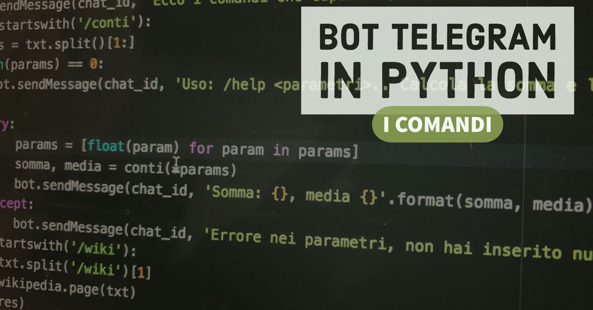
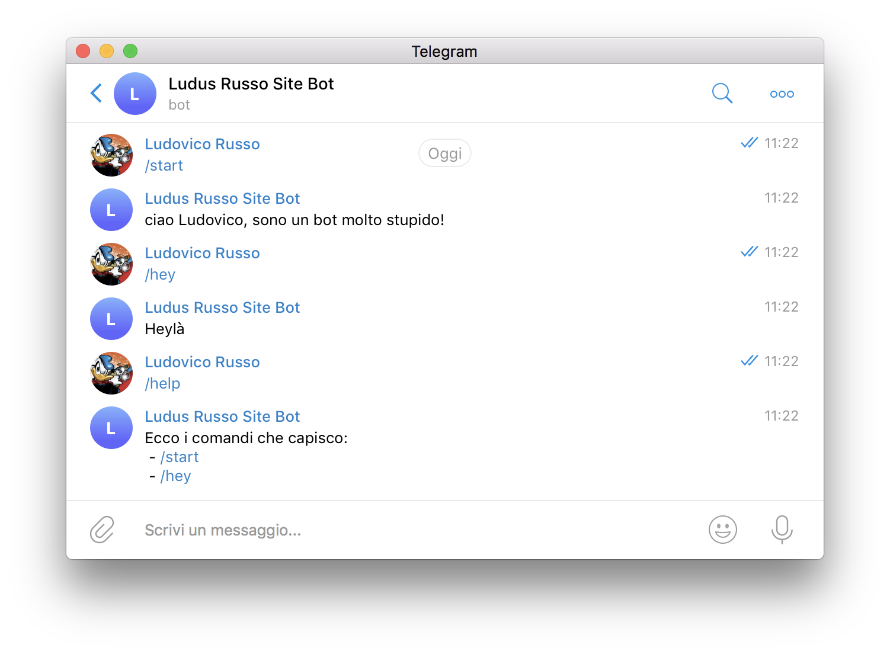
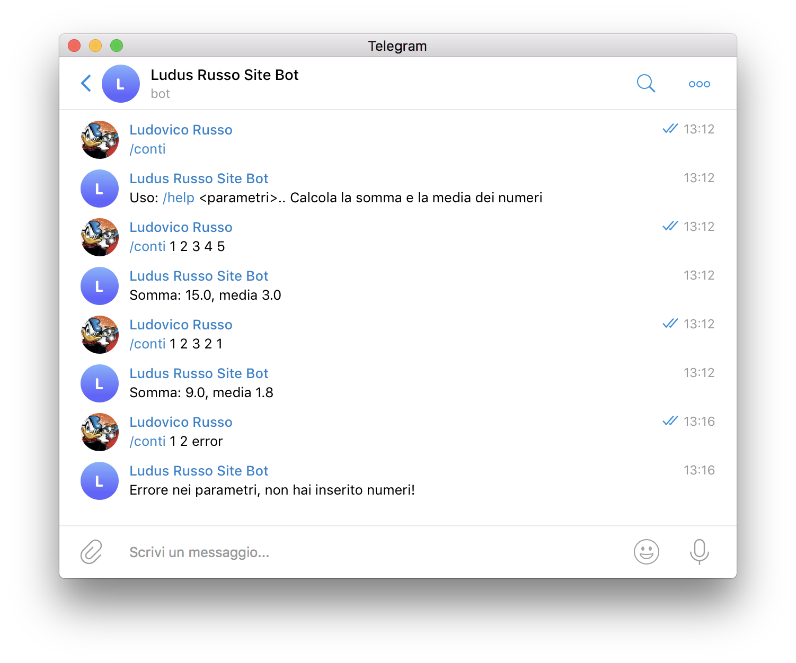

Dato il grande interesse riscontrato sul [mio precedente post](/2017/04/27/implementiamo-un-bot-telegram-con-python/) riguardo lo sviluppo
di bot Telegram usando **Python** e la libreria **telepot**, ho deciso di continuare
a scrivere post riguardo questo argomento.

In questo post vedremo come gestire meglio, usando Telepot, i comandi e i possibili
messaggi che arrivano dall'utente, fruttando alcune funzionalità interessanti di Python.



## Comandi in Telegram

In Telegram, un comando è semplicemente una parola che inizia con il carattere `/`.
I comandi vengono automaticamente riconosciuti dalla Chat Telegram e evidenziati in blu
chiaro, e la chat stessa permette di re-inviarli semplicemente cliccandoci sopra.

Ad ogni modo, accedere ai comandi con Telegram è molto semplice, dobbiamo semplicemente
trattarli come se tutte le normali righe di test, ed avendo già visto come accedere
al messaggio inviato dagli utenti, il tutto risulta essere molto ma molto semplice.

## Rispondere a comandi Telegram con il nostro Bot

Riprendiamo il codice sviluppato nel precedente post, che, per semplicità, riporto quindi in basso:

```python
import telepot

def on_chat_message(msg):
    content_type, chat_type, chat_id = telepot.glance(msg)
    if content_type == 'text':
        name = msg["from"]["first_name"]
        txt = msg['text']
        bot.sendMessage(chat_id, 'ciao %s, sono un bot molto stupido!'%name)
        bot.sendMessage(chat_id, 'ho ricevuto questo: %s'%txt)

TOKEN = '*** inserisci il tuo token qui  ***'

bot = telepot.Bot(TOKEN)
bot.message_loop(on_chat_message)

print 'Listening ...'

import time
while 1:
    time.sleep(10)
```

Il nostro scopo, a questo punto, è accedere al testo del messaggio e controllare
se al suo interno c'è un comando specifico, e nel caso elaborare tale comando.

Abbiamo già visto come accedere al test del messaggio, operazione che facciamo con
questa riga di codice: `txt = msg['text']`. Per controllare che all'interno del testo
esista un comando specifico (ma si noti che il tutto funziona anche con una qualsiasi parola),
possiamo sfruttare l'operatore `in` di Python.

`in`, applicato alle stringhe, ritorna `True` se la stringa a sinistra dell'operatore
è contenuta all'interno della stringa a destra di esso.

Facciamo un esempio:

- `"ciao" in "ciao mondo"` ritorna `True`,
- `"Ehy" in "ciao mondo"` ritorna `False`

Abbinare quindi `in` a dei costrutti `if` - `elif` ci permette di rispondere in modo
differente in base ai comandi ricevuti.

Riscriviamo quindi la funzione `on_chat_message` come segue:

```python
def on_chat_message(msg):
    content_type, chat_type, chat_id = telepot.glance(msg)
    if content_type == 'text':
        name = msg["from"]["first_name"]
        txt = msg['text']
        if '/start' in txt:
            bot.sendMessage(chat_id, 'ciao {}, sono un bot molto stupido!'.format(name))
        elif '/hey' in txt:
            bot.sendMessage(chat_id, 'Heylà')
        else:
            bot.sendMessage(chat_id, 'Mi spiace {}, non capisco'.format(name))
```

Semplice vero?

Aggiungiamo un comando (solitamente `/help`) che risponde con la lista dei comandi
che il bot comprende:

```python
def on_chat_message(msg):
    content_type, chat_type, chat_id = telepot.glance(msg)
    if content_type == 'text':
        name = msg["from"]["first_name"]
        txt = msg['text']
        if '/start' in txt:
            bot.sendMessage(chat_id, 'ciao {}, sono un bot molto stupido!'.format(name))
        elif '/hey' in txt:
            bot.sendMessage(chat_id, 'Heylà')
        elif '/help' in txt:
            bot.sendMessage(chat_id, 'Ecco i comandi che capisco:\n - /start\n - /hey')
        else:
            bot.sendMessage(chat_id, 'Mi spiace {}, non capisco\nUsa /help per sapere cosa posso fare!'.format(name))
```

Lanciando questo bot, otterremo come risultato quanto segue:



Che, come vedete, migliora di molto l'usabilità del nostro bot.

## Gestire messaggi che iniziano con un comando

Il codice di sopra funziona, ma ha un problema: risponde a qualsiasi frase contenente
un comando specifico, anche se questo non è all'inizio del messaggio..

Ad esempio, una messaggio del tipo "Che succede se scrivo /start" è equivalente, per il
bot, al messaggio "/start".

Tuttavia, molto spesso, quello che vogliamo fare è controllare che il messaggio inizi
con il comando dato, non che lo contenga.

Per fortuna, possiamo usare il metodo `.startswith()` del tipo `str` Python, che controlla,
appunto, se una stringa inizia con una stringa che viene passata come parametro.

Possiamo quindi riscrivere il codice precedente come segue:

```python
def on_chat_message(msg):
    content_type, chat_type, chat_id = telepot.glance(msg)
    if content_type == 'text':
        name = msg["from"]["first_name"]
        txt = msg['text']
        if txt.startswith('/start'):
            bot.sendMessage(chat_id, 'ciao {}, sono un bot molto stupido!'.format(name))
        elif txt.startswith('/hey'):
            bot.sendMessage(chat_id, 'Heylà')
        elif txt.startswith('/help'):
            bot.sendMessage(chat_id, 'Ecco i comandi che capisco:\n - /start\n - /hey')
        else:
            bot.sendMessage(chat_id, 'Mi spiace {}, non capisco\nUsa /help per sapere cosa posso fare!'.format(name))
```

In modo da risolvere il problema di cui sopra.

## Comandi con parametri

Ok, iniziamo ora a creare esempi un po' più reali della semplice risposta a comandi
pre impostati: utilizziamo i comandi con parametri...

I parametri non sono altro che informazioni aggiuntive che vengono date a dei comandi,
in modo da aumentarne la loro possibilità! Vi proporrò due esempi, il primo, molto semplice,
per far capire l'utilizzo dei parametri a livello di codice. Il secondo, più interessante,
li utilizzerà per gestire un'applicazione reale e utile, e lo troverete nel prossimo post.

### Un semplice comando com parametri: somma e media di numeri

L'esempio banale (ma solo per l'applicazione, non per il codice) è presto detto:
vogliamo implementare un nuovo comando (chiamato `/conti`) che permette di calcolare
somma e media dei numeri che gli vengono passati come parametri. Il comportamento è questo:

- `/conti` (senza parametri) ritorna l'help della funzione.
- `/conti <serie di numeri>` calcola la media e la somma dei numeri che gli vengono passati, vi porto giù un paio di esempi reali:
- `/conti 1 2 3` risponde: `somma: 6, media 2`
- `/conti 1 2 3 2 1` risponde: `somma: 9, media 1.8`

Vediamo come implementare questa funzione.

Per prima cosa, il mio consiglio è sviluppare una funzione, che riceve una serie di numeri
e ritorna la loro somma e la loro media.

La funzione è semplicemente implementabile come segue, giocando con alcune magie
che può fare Python :D

```python
def conti(*args):
    return sum(args), sum(args)/len(args)
```

> L'operatore `*`, messo davanti all'argomento di una funzione, dice di passare
> alla funzione stessa tutti gli argomenti come tupla. `args` è quindi una tupla contenente
> tutti i valori dati alla funzione.

Per testare questa funzione, ho anche scritto un semplicissimo test automatico (si veda [questo articolo](/2017/10/03/tdd-intro/) se volete approfondire sui test):

```python
def test_conti():
    assert (6, 2) == conti(1,2,3)
    assert (9, 1.8) == conti(1,2,3,2,1)
    assert (1, 1) == conti(1)
    assert (2, 1) == conti(1,1)
```

Bene, a questo punto non dobbiamo far altro che utilizzare questa funzione all'interno
del nostro bot, ma c'è un problema: come tradurre il messaggio che abbiamo ricevuto in
parametri e comando?

Ci sono vari modi di farlo (del resto il messaggio è una stringa). Il modo più semplice,
anche se forse non perfetto, che mi è venuto in mente è quello di usare il metodo `split()`
delle stringhe e di eliminare il primo elemento del risultato (che è il nome del comando stesso).
La lista rimanente conterrà (come stringhe) i parametri passati con il comando stesso.

Andiamo quindi ad implementare la gestione del nostro comando.

```python
#...
elif txt.startswith('/conti'):
    params = txt.split()[1:]
    if len(params) == 0:
        bot.sendMessage(chat_id, 'Uso: /help <parametri>.. Calcola la somma e la media dei numeri')
    else:
        try:
            params = [float(param) for param in params]
            somma, media = conti(*params)
            bot.sendMessage(chat_id, 'Somma: {}, media {}'.format(somma, media))
        except:
            bot.sendMessage(chat_id, 'Errore nei parametri, non hai inserito numeri!')
#...
```

#### Vediamo di capire il codice implementato:

La prima operazione che eseguiamo è `params = txt.split()[1:]`, in questo modo,
dividiamo la stringa `txt`, quindi l'intero comando passato, in una lista di stringhe.
La sintassi `[1:]` serve a prendere tutti gli elementi della stringa a partire del secondo
elemento. Quindi escludendo il primo elemento, che è il comando stesso.

Facciamo degli esempi:

- Se `text = "/conti 1 2 3"`, allora, `params = ["1", "2", "3"]`.
- Se `text = "/conti"`, allora, `params = []`.

Si noti che i parametri non vengono automaticamente convertiti in numeri, ma sono ancora
stringhe.

Dopo aver ottenuto i parametri, facciamo un check per vedere se effettivamente abbiamo
passato dei parametri, e, nel caso in cui la lista di parametri sia vuota, inviamo via
messaggio l'help del comando:

```python
if len(params) == 0:
    bot.sendMessage(chat_id, 'Uso: /help <parametri>.. Calcola la somma e la media dei numeri')
```

Superato questo check, dobbiamo trasformare i parametri in numeri, applicare la funzione
`conti` sui parametri, e ritornare il risultato:

```python
    params = [float(param) for param in params]
    somma, media = conti(*params)
    bot.sendMessage(chat_id, 'Somma: {}, media {}'.format(somma, media))
```

Per ultima cosa, ho inserito le righe sopra all'interno di un costrutto `try` - `except`,
in modo da intercettare errori dovuti dall'inserimento di parametri non numerici.

Se la conversione dei parametri da stringe a numeri, fatta nella riga `params = [float(param) for param in params]` non va a buon fine, un'eccezione viene generata ed intercettata da una linea di codice
che invia un messaggio di errore all'utente.

```python
try:
    params = [float(param) for param in params]
    somma, media = conti(*params)
    bot.sendMessage(chat_id, 'Somma: {}, media {}'.format(somma, media))
except:
    bot.sendMessage(chat_id, 'Errore nei parametri, non hai inserito numeri!')
```

Fatto!

Lanciando il bot, il nuovo comando funziona perfettamente!



Abbiamo implementato il primo comando complesso in grado di gestire diversi parametri.
Per ultima cosa, aggiungiamo il comando all'help. Vediamo quindi il codice completo...

```python
import telepot

TOKEN = '*** inserisci il tuo token qui  ***'

def conti(*args):
    return sum(args), sum(args)/len(args)

def on_chat_message(msg):
    content_type, chat_type, chat_id = telepot.glance(msg)
    if content_type == 'text':
        name = msg["from"]["first_name"]
        txt = msg['text']
        if txt.startswith('/start'):
            bot.sendMessage(chat_id, 'ciao {}, sono un bot molto stupido!'.format(name))
        elif txt.startswith('/hey'):
            bot.sendMessage(chat_id, 'Heylà')
        elif txt.startswith('/help'):
            bot.sendMessage(chat_id, 'Ecco i comandi che capisco:\n - /start\n - /hey\n - /conti')
        elif txt.startswith('/conti'):
            params = txt.split()[1:]
            if len(params) == 0:
                bot.sendMessage(chat_id, 'Uso: /conti <parametri>.. Calcola la somma e la media dei numeri')
            else:
                try:
                    params = [float(param) for param in params]
                    somma, media = conti(*params)
                    bot.sendMessage(chat_id, 'Somma: {}, media {}'.format(somma, media))
                except:
                    bot.sendMessage(chat_id, 'Errore nei parametri, non hai inserito numeri!')
        else:
            bot.sendMessage(chat_id, 'Mi spiace {}, non capisco\nUsa /help per sapere cosa posso fare!'.format(name))

if __name__ == '__main__':
    bot = telepot.Bot(TOKEN)
    bot.message_loop(on_chat_message)

    print('Listening ...')

    import time
    while 1:
        time.sleep(10)
```
