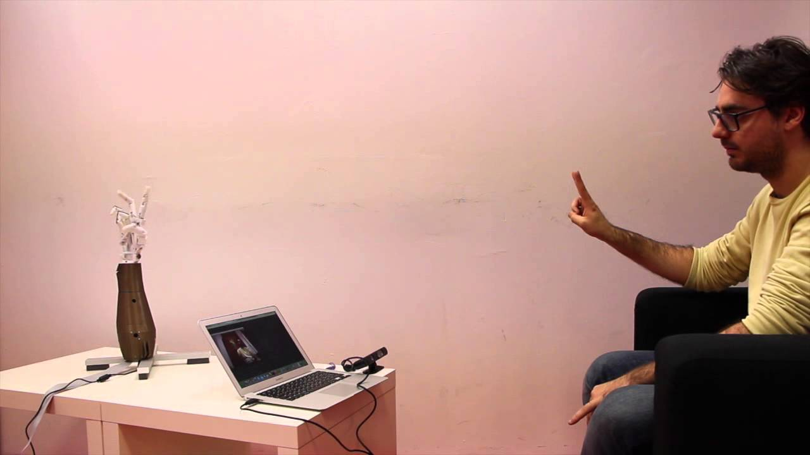
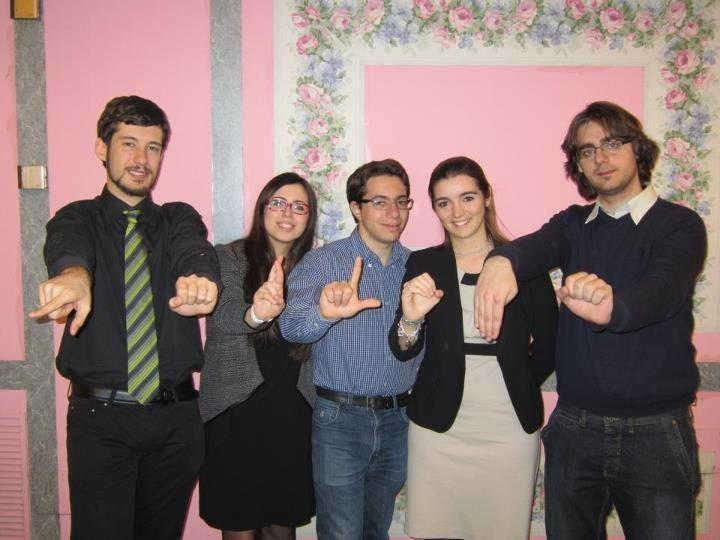
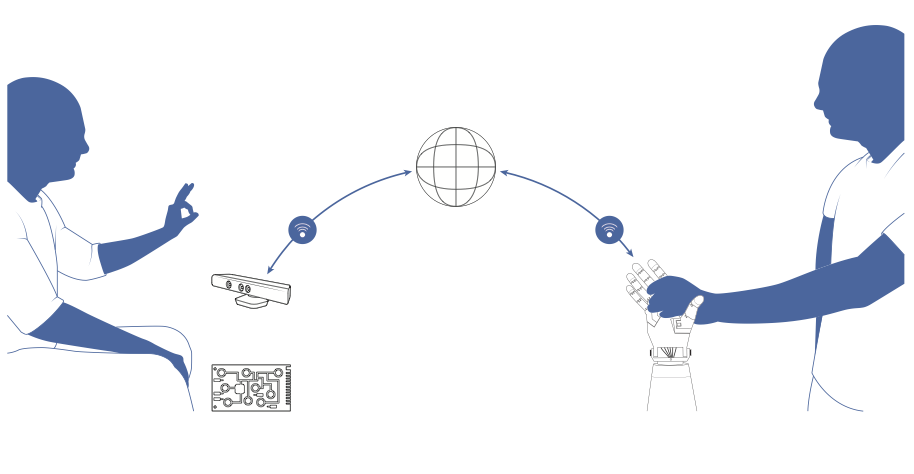
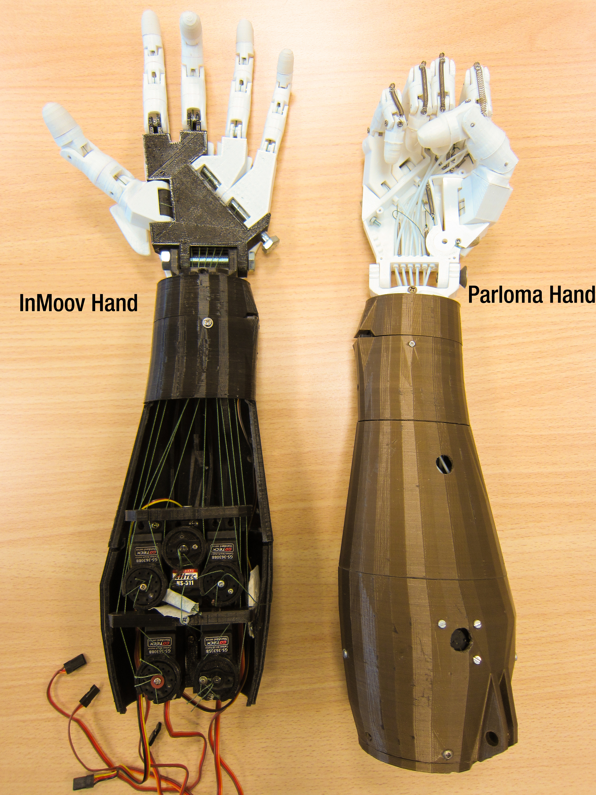
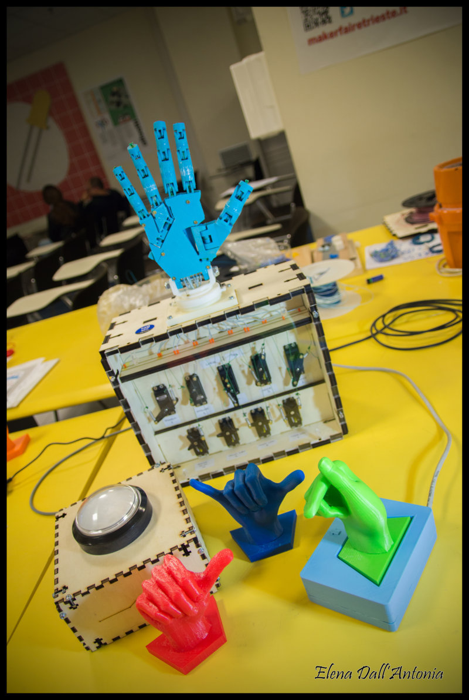
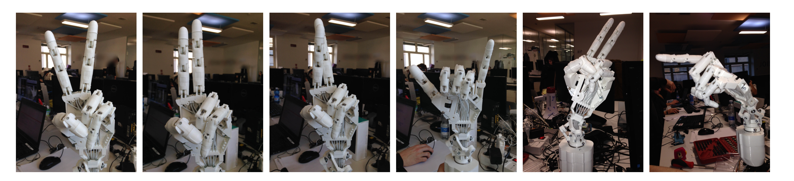

[Parloma](http://parloma.github.io) è un progetto di ricerca su cui lavoro ormai da anni, sin dal periodo
in cui, durante la laurea Magistrale, ho avuto l'onore ed il piacere di essere selezionato
come studente presso l'Alta Scuola Politecnica (ASP).

L'ASP è un progetto congiunto tra Politecnico di Torino e di Politecnico Milano che ha lo scopo di
selezionare e formare alcuni studenti di entrambe le università su tematiche
interdisciplinari. Devo dire che partecipare all'ASP mi ha aperto gli occhi, facendomi
capire che non è solo il mondo ingegneristico ad essere degno di nota (pensiero
condiviso da molti ingegneri), ma lo sono tutte le professionalità come ingegneri, designer e architetti
senza le quali noi ingegneri non potremmo sopravvivere.

L'ASP è stata genericamente un'esperienza veramente formativa, con i suoi pro e i suoi contro.
Tuttavia, all'interno di questo percorso, la cosa che mi ha aiutato di più in assoluto
e che ha influenzato le mie scelta di continuare nel mondo della ricerca e dell'innovazione,
è stato certamente il progetto **PARLOMA**.

Ma andiamo per ordine, voglio raccontarvi la storia e il mio coinvolgimento nel progetto,
non solamente il progetto in se'.

## I progetti dell'Alta Scuola Politecnica

Il percorso dell'ASP si divide in due parti:

- un percorso didattico di 6 _school_ intensive, della durata di 1 settimana, incentrate su un argomento multidisciplinare, che prendono luogo durante i due anni scolastici di laurea magistrale.
- un progetto innovato, da portare avanti in team, che si conclude in una presentazione finale ed in un report conclusivo, che è decisamente equivalente ad una tesi di laurea, se non fosse per il fatto che, per fortuna, deve essere svolto in team.

Qui vi voglio parlare del progetto, che nel mio caso era, appunto, il progetto PARLOMA.

## Come è nata l'idea di PARLOMA?

L'idea del progetto venne a Carlo Geraci, un professore e linguista
dell'Ecole Normale de Paris, la cui ricerca è incentrata sulla Lingua dei Segni.
Carlo, covava da parecchi l'idea di sviluppare un dispositivo che
aiutasse persone sordocieche a comunicare a distanza attraverso la loro "lingua mandre",
chiamata Lingua dei Segni Tattile (LSt). Come vi spiegherò più avanti, il loro modo di comunicare (o uno dei tanti, ma per alcuni il più naturale), è una versione modificata della Lingua dei Segni che usa però il tatto, anzichè la vista, per capire le informazioni contenute nei movimenti.
La LSt ha però un problema molto grosso: non è possibile trasmetterla in remoto.. Mentre esistono soluzioni come il Skype per persone che comunicano con la LS standard, non esiste
un'alternativa che possa remotizzare questo tipo di comunicazione.

Carlo aveva in mente l'idea dagli anni 2000, ma solo negli anni 2010/2011
è riuscito ad iniziare a renderla concreta, grazie al prof. Paolo Prinetto, un professore
del Politecnico di Torino con cui Carlo aveva iniziato una collaborazione.

Paolo è una persona molto aperta alle idee, anche le più stravaganti (e vi assicuro che a me ne
vengono tante, e lui mi da sempre ascolto). Quando Carlo gli parlò della sua idea, lui pensò di
proporla come progetto presso l'Alta Scuola Politecnica. Tramite due suoi dottorandi,
Gabriele Tiotto e Marco Indaco, il progetto venne presentato a noi nuovi studenti,
e venne formato il Team Parloma dell'Ottavo Ciclo ASP.

Piccola nota: il nome Parloma è stato trovato proprio da Paolo: _parloma_ è una parola del dialetto
piemontese, che vuol dire _parliamo_.

## Il Team PARLOMA

Il team Parloma dell'ASP è nato come il team sfigato, eravamo in 6, e diventammo in 5
dopo poche ore di inizio lavori.. Il sesto ragazzo, mai conosciuto, non si presentò
il primo giorno, e venne istantaneamente espulso (le regole dell'ASP sono un po' severe).

Eravamo il team con meno membri, a parte uno, da 6 persone, tutti gli altri team
erano composti da 10 - 12 persone.

Ma avevamo la fortuna di essere pochi, e quindi evitare dispersioni, e di avere
dei tutors molto molto bravi, disponibili, e che credevano veramente nel progetto.

Il team era composto dalle seguenti persone:

- Chiara, capo progetto, rappresentante degli studenti (lato Torino) e capo di tutto in generale. Ingegneressa (si dice?) biomedica
- Alice, anche lei ingegneressa biomedica, anche lei lato Torino,
- Giuseppe, infomatico, sempre Torino,
- Io, Meccatronico, di nuovo Torino,
- Giorgio, ingegnere Fisico, l'unico di Milano, quello che doveva farsi tutti i viaggi!

Ah si, eravamo anche il gruppo più asimettrico (credo) dell'ASP.
Qui sotto trovate una bella foto che ci ritrae

Ad ogni modo, i primi tempi passarono abbastanza velocemente, ci prendemmo un po' di tempo
per capire e studiare il problema (un argomento un bel po' delicato), per distruggere
le idee iniziali che avevamo e pensare ad alternative, per cercare di capire
perché queste persone non possono usare il Braille per comunicare (e no, non possono,
e ve lo spiegherò tra poco).

Durante il primo anno di lavoro, abbiamo principalmente concepito e definito il progetto
da un punto di vista funzionale. Ho imparato, durante questo periodo, che noi ingegneri
e comunque tecnologi, facciamo l'errore di confondere la tecnologia con la soluzione.
Una lezione che poi mi sono portato avanti nel mio lavoro da imprenditore, e che adesso
posso riassumere con la seguente frase: _all'utente non frega niente della tua soluzione_.

Per questo motivo, vorrei parlare prima di tutto degli utenti, e poi del progetto.

## La sordocecità e la Lingua dei Segni Tattile

La sordocecità è una disabilità multisensoriale. Le persone affette da questa disabilità
hanno perso, completamente o in parte, l'uso sia della vista che dell'udito.
Essendo una disabilità che affligge più di un senso, il modo in cui la persona affetta
si relaziona con la sua disabilità dipende tantissimo dalla sua storia.

Una persona normodotata, diventata sordocieca a causa di un incidente o per la vecchia,
ha dei bisogni e delle necessità molto diverse da quella di una persona nata sordocieca,
o di una persona sorda che poi è diventata sordocieca in seguito.

Uno dei problemi principali delle persone sordocieche è, ovviamente, la comunicazione.
Queste persone vivono in uno stato quasi totale di isolamento, ed hanno solo il tatto per comunicare
tra di loro. Ovviamente, modi di comunicare basati sul tatto sono molti, il più
conosciuto probabilmente è l'alfabeto braille, che non è un linguaggio, ma una trasposizione
tattile della lingua scritta... In altre parole, per capire il braille bisogna saper leggere,
la qualcosa cosa necessita, essendo il nostro alfabeto baso sulla lingua parlata,
il saper parlare, ed il conoscere il concetto di fonema...

Ed è qui che arriviamo al punto cruciale del nostro discorso, necessario per capire
bene la disabilità: chi nasce sordo, non avendo mai sentito, difficilmente riesce
a comprendere un concetto tanto lontano dalla sua condizione come i fonemi.. Questo è
il motivo per cui molte persone sorde non parlano (non perché sono muti, come molti erroneamente credono, ma perché, non avendo mai sentito, non riescono a modulare la loro voce).

Ed ecco un'informazione che a me ha stupito tanto: molte persone sorde non sanno leggere,
per lo stesso motivo per cui non sanno parlare.. Non conoscono il concetto di fonema!
Molti infatti pensano che le Lingua dei Segni non siano altro che una trasposizione
a gesti delle lingue parlate, come lo è il braille... In realtà questo è sbagliatissimo:
una lingua dei segni è una lingua a tutti gli effetti, che si sviluppa in modo indipendente
dalle lingue parlate (solitamente in una comunità sorda) nello stesso territorio, che ha una sua grammatica ed una sua sintassi e che è basata non su fonemi (come nel caso della lingua parlata) ma sui segni. Le lingue dei segni
sono molto differenti dalle lingua parlata, vi copio un [estratto da Wikipedia](https://it.wikipedia.org/wiki/Lingua_dei_segni) che fa capire bene questo concetto:

> "_I verbi ad esempio non si coniugano in base al tempo, ma devono concordare sia con il soggetto (come in italiano) sia con l'oggetto dell'azione, come avviene in basco. Esistono forme pronominali numeriche per indicare "noi due, voi due" (come il duale del greco antico) e addirittura "noi cinque, voi quattro, loro tre". La concordanza di verbi, aggettivi e nomi non è basata sul genere (maschile e femminile come in italiano) ma sulla posizione nello spazio in cui il segno viene realizzato. Esistono diverse forme per il plurale "normale" e il plurale distributivo, distinzione sconosciute alle lingue europee, ma note in lingue oceaniche. Il tono della voce è sostituito dall'espressione del viso: c'è un'espressione per le domande dirette («Vieni?», «studi matematica?») una per domande complesse («quando vieni?», «cosa studi?», «Perché piangi?») una per gli imperativi («Vieni!», «Studia!») e altre per indicare le frasi relative («il libro che ho comprato, la ragazza con cui parlavi»)_"

Capito questo concetto, torniamo ai sordociechi: esiste una malattia congenita molto
grave, chiamata [Sindrome di Usher](https://www.legadelfilodoro.it/chi-aiutiamo/sordocecita-e-sindromi/sindromi/sindrome-di-usher), che porta le persone a diventare sordocieche, ed è una delle cause principali di sordociecità.

Non mi voglio dilungare troppo nella malattia, ma alcune persone affette nascono sorde, ma la malattia porta alla diminuzione progressiva ma molto lenta del campo visivo, che si completa in età adulta. Queste persone, quindi, si trovano a vivere in una condizione da sordo, solitamente imparano
la lingua dei segni della comunità di cui fanno parte, e col tempo, quando la ciecità diventa severa,
iniziano a sviluppare un modo di comunicare che rimpiazza il tatto alla vista, chiamato Lingua dei Segni Tattile (LSt).

L'utente primario del progetto Parloma è quindi quello di supportare queste persone,
che per la loro storia, difficilmente potranno imparare ad usare sistemi di comunicazione basati su Braille o simili alternative.

## Il progetto Parloma

Il primo anno di lavoro in Alta Scuola Politecnica, si è incentrato principalmente, come detto
prima, sul capire i bisogni dei nostri utenti (e chi fossero questi utenti) e definire
un'architettura generale del progetto. L'architettura è poi rimasta più o meno invariata da allora,
e l'ho riportata qui sotto.

Lo scopo del progetto è quello di permettere a due persone di comunicare utilizzando la Lingua dei Segni tattile, di cui almeno uno dei due sordocieco. Entrambi devono conoscere la lingua dei segni, e la sua versione tattile. Quindi, come molti credono inizialmente, il sistema non è un traduttore, ma un vero
e proprio telefono, che acquisisce il mezzo nel quale il messaggio è contenuto, lo trasmette tramite internet e lo riproduce senza interpretarlo.

Il sistema è composto da tre parti, o blocchi:

- Blocco di Input, che si occupa di eseguire algoritmi di Hand Tracking per digitalizzare i movimenti della mano e del braccio,
- Blocco di Trasmissione, che si occupa di trasmettere queste informazioni tramite internet,
- Blocco di Output, che si occupa di riprodurre, tramite una mano robotica, il segno inviato.

La cosa interessante è che, nonostante in questi 6 anni di sviluppo molte cose siano cambiate,
molto spesso abbiamo dovuto ricominciare dall'inizio e alcune situazioni al contorno
siano diverse, l'architettura generale è ancora lì, e non si tocca!

## Sviluppo tecnico, mani robotiche e tanto altro

La maggior parte del lavoro tecnico sul progetto è stata fatta durante il secondo anno dell'ASP, in cui
iniziammo a smanettare col codice e ad implementare i primi algoritmi di Hand Tracking basati
su telecamere standard.

Devo ammettere che ai tempi avevamo un po' sopravvalutato le nostre capacità, e le capacità in generale
della tecnologia di visione per eseguire algoritmi di hand tracking. Ci rendemmo conto ad
un certo punto che una semplice telecamere non fornisce abbastanza informazioni
per eseguire un algoritmo di hand tracking fine e che serviva qualcosa di più per lo
sviluppo.

Fortunatamente, abbiamo avuto l'occasione di incontrare un gruppo di ricerca del CNR,
ed in particolare un ragazzo (Daniele) che allora stava lavorando ad un sistema di
Hand Tracking basato telecamere 3D, ed in particolare la tecnologia del Microsoft Kinect.
Daniele ci diede una mano enorme nello sviluppo del primo prototipo di hand tracking,
lavorando con lui al sistema, riuscimmo a tirare su un algoritmo funzionante in grado di
capire come è posizionata una mano nello spazio... Il problema era che il risultato ottenuto,
seppure funzionante, era ancora troppo poco preciso. Decidemmo quindi di sviluppare
un classificatore, in grado di individuare il segno statico (_handshape_) che la mano
stava eseguendo, in modo da migliorarne il funzionamento. Questo è stato il mio primo
serio contributo al progetto.

Come è ovvio, questa soluzione limita tantissimo il risultato richiesto, ma era un
buon inizio ed una buona base di partenza per fare una demo e per mostrare la tecnologia.

L'altro nostro problema era la necessità di avere accesso ad una mano robotica.
Andammo a chiedere aiuto ad un partner ufficiale del progetto, l'istituto di Bio Robotica
del Sant'Anna di Pisa. Loro ci misero a disposizione un prototipo di mano robotica su
cui stavano lavorando, con l'unica condizione di farci andare a lavorare direttamente
nel loro laboratorio. Così, pochi giorni dopo la laurea, io e Giuseppe passammo qualche mese
a fare avanti e indietro tra Torino e Pisa, per lavorare alla mano robotica e preparare
una demo per la presentazione finale ASP, che era schedulata per dicembre 2013.

Quel periodo fu abbastanza impegnativo ma anche divertente. È stato figo essere ufficialmente
all'interno di un istituto tanto prestigioso (con tanto di tesserino), ed è stato
molto interessante lavorare su una vera mano robotica.

Così passammo quel periodo al lavoro sul far funzionare la mano, che aveva tantissimi
problemi: spesso non funzionava (ci diedero un prototipo che non usavano, che giustamente
non era molto messo bene lato hardware).

Io e Giuseppe implementammo un sistema di
controllo della mano in Python (la mia prima esperienza con questo linguaggio), e
in qualche settimana, grazie ad un Raspberry Pi, siamo riusciti a sviluppare un sistema
che, dopo aver riconosciuto i segni tramite il nostro algoritmo, li avia al Rasperry Pi
conesso alla mano, che si occupa di controllarlo in modo adeguato.

Chiara e Alice si occuparono del rivestimento della mano: dai primi test fatti con
una persona sordocieca, era emerso il fatto che la forma della mano non era
facilmente riconoscibile al tatto: c'era, ad esempio, una sporgenza metallica sul
palmo che molte volte veniva scambiata per il pollice chiuso.

Agli inizi di dicembre, comunque, eravamo pronti con la demo per i primi test.
Trovate il primo video dimostrativo da noi realizzato qui:

  <iframe class="embed-responsive-item" src="https://www.youtube-nocookie.com/embed/6MGJb_GqauU?rel=0"></iframe>

Che poi venne presentato, a metà Dicembre 2013, come lavoro finale presso l'Alta Scuola
Politecnica.

  <iframe class="embed-responsive-item" src="https://www.youtube-nocookie.com/embed/TRvEjpxtARM?rel=0"></iframe>

Ad oggi, cosa di cui vado molto fiero, questo progetto è considerato uno dei migliori progetti
usciti dall'ASP, e spesso viene citato nella opening delle nuovi cicli!

## Mani stampante in 3D

Dalla fine dell'ASP, anche se con un po' di rimorso, il progetto è andato in secondo
pieno ed il suo sviluppo è stato messo sempre più in secondo piano, anche se ho
avuto la fortuna, durante il mio percorso di Dottorato, di poterci comunque dedicare un po'
di tempo.

A Gennaio 2014, io e Giueppe avevamo appena iniziato il PhD. Io con Telecom Italia
su una tencologia chiamata _Cloud Robotics_. Giuseppe, insieme al gruppo di Paolo e Marco,
era invece incentrato sulle tecnologie assistive. Parloma era li in mezzo, quindi
entrambe le cose, oppure ne' una ne' l'altra (dipende dai punti di vista). Ad ogni modo,
non ricordo esattamente in che periodo, un mio carissimo amico, Andrea, stava per
intraprendere il percorso di Tesi di chiusura della laurea Magistrale, e chiese a me
se avevo dei consigli da dargli. Andrea si stava dedicando, da qualche anno, alla
stampa 3D, tanto che, parlando con lui mi venne un'idea molto interessante: al posto
di utilizzare come mano robotica una mano progettata per altri scopi (la mano di Pisa è una
protesi), cerchiamo di utilizzare la tencologia della stampa 3D, e il mondo dell'Open Source,
per progettarnarne una a basso costo ed orientata allo riproduzione di segni della lingua
dei segni.

Andrea partì subito con molto interesse e voglia, decidemmo di usare, come base di
partenza, la mano sviluppata da un designer francese per il suo progetto [InMoov](http://inmoov.fr/),
e in poco tempo Andrea riuscì a ricreare in casa la mano robotica di InMoov.

A quel punto, proponemmo a lui un progetto più ambizioso: realizzare una mano robotica,
a partire da quella di InMoov, che fosse in grado di realizzare più gesti nella lingua
dei segni di quelli che InMoov (e comunque tutte le altre mani robotiche in commercio)
potesse fare.

Andrea fu bravissimo: in pochi mesì riuscì a mettere altri 3 motori all'interno della mano,
riprogettare il sistema di tendini ed aggiungere molle all'iterno della mano robotica robotica,
in modo da rendere più efficiente il controllo delle dita.

La nuova mano ha tre gradi di libertà rispetto alle precedenti: può ad esempio,
incrociare indice e medio (gesto molto importante nelle lingue dei segni).

In questo periodo, io mi occupai di sviluppare la parte di elettronica e di controllo
della nuova mano, e di integrare il tutto con ROS.
Ad ogni modo, Andrea ottenne punteggio pieno sulla tesi e la presentazione, ma
volle andare avanti. Alla fine della tesi, abbiamo creato un secondo video demo
che mostra i nostri avanzamenti (e che vede me come attore principale).

  <iframe class="embed-responsive-item" src="https://www.youtube-nocookie.com/embed/EJ5-uBt7rHs?rel=0"></iframe>

Tra le cose più belle che sono successe dopo il [rilascio Open Source](https://www.thingiverse.com/thing:701446) della mano,
è stata quella di essere contattati da Elena dell'Antonia, una ragazza di Treviso
che ha realizzato un gioco didattico per aiutare i bambini ad apprendere la Lingua
dei Segni Italiana, utilizzando la mano progettata da Andrea. Il progetto si chiama
[MANIpolare per comunicare con l'alfabeto LIS](http://manipolarepercomunicare.com/),
ed è veramente interessante.. Dategli un'occhiata.

Conclusa la tesi, come noi, continua a supportare il progetto
proponendo miglioramenti, sempre legati alla meccanica, con lo scopo rendere la
nostra mano, sempre più simile alla mano umana.

Aiutato da altre persone e tesisti, un'altra idea interessantissima su cui ha lavorato
è stata quella di utilizzare una struttura meccanica nota in ingegneria navale, chiamata
"_spalla del pinguino imperatore_", utilizzata come propulsore nella robotica navale. Il
nome deriva dal fatto che imita il funzionamento della spalla dei pinguini che, attaccata
all'ala, gli permette di nuotare in modo molto veloce. Andrea pensò di realizzare
una versione miniaturizzata di questa struttura da usare come polso della mano.

Qui sotto potete vedere le immagini scattate con la mano e il polso in funzione.

