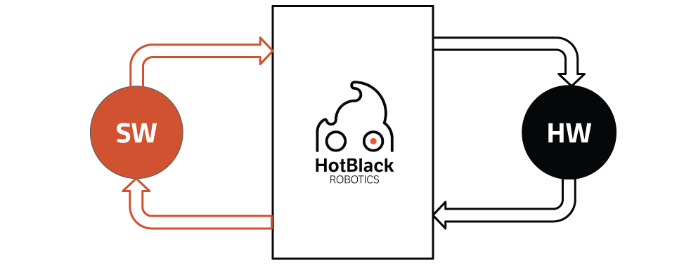

Come sapete, da un po' di tempo (2 anni) mi sto dedicando alla creazione di una
start up in Robotica. In questo articolo, vi riporto la storia di [HotBlack Robotics](http://www.hotblackrobotics.com/),
[scritta qualche mese](http://mars42.org/blog/2017/1/4/hotblack-robotics-story) fa da Gabriele (il mio socio e CEO della Startup) e tradotta
dall'inglese da me.

Vi lascio alle parole di Gabriele.

## _Autore: Gabriele Ermacora, Ph.D., CEO & Co-Founder, HotBlack Robotics_

La storia di [HotBlack Robotics](http://www.hotblackrobotics.com/) inizia nel 2011, quando TIM decise di investire in Ricerca e Sviluppo (R&D) sui nuovi trend tecnologici: Internet of Things e Cloud Robotics.
Dato che l'idea sembrava interessante, nel 2012 TIM decise di collaborare a stretto contatto con le più prestigiose università italiane. Così fondarono nuovi laboratori all'interno del mondo accademico. Questi laboratori si chiamano Joint Open Lab (JOL) e l'idea su cui si fondano è quella di creare team eterogenei di persone con background molto diverso tra di loro, sia ricercatori accademici che impiegati TIM, e farli lavorare insieme all'interno di progetti di innovazione molto ambiziosi.
Il laboratorio dove ho svolto il mio Dottorato (_ed anche il mio, nota di Ludovico_) è il JOL CRAB (Connected Robotics Application laB). La visione su cui è nato questo laboratorio è quella di costruire una piattaforma di Cloud Robotics e trovare nuovi mercati per generare valore utilizzando questa tecnologia. Il laboratorio sviluppò diversi test case per mostrare le potenzialità della piattaforma:

- robot per il monitoraggio energetico di data centers,
- gestione di UAV all'interno di Smart Cities,
- robotica per education ed intrattenimento,
- robotica per agricoltura.

Inoltre, uno degli scopi principali del lab è quello di creare startup in modo da testare ed accelerare il processo di _go to market_. Così, il 23 Giugno 2015, io e il mio collega Ludovico Orlando Russo (_che sarei io, nota di Ludovico_) decidemmo di fondare una startup con la stessa visione del laboratorio e portare i nostri risultati scientifici nel market: così abbiamo fondato [**HotBlack Robotics**](http://www.hotblackrobotics.com/).

Abbiamo deciso di partire dal progetto più maturo creato dal CRAB: un robot per il monitoraggio energetico all'interno di Data Center. Il risultato fu che lo spostamento dal mondo scientifico a quello imprenditoriale fu molto doloroso e pieno di problemi che non ci aspettavamo.

I data center sprecano tantissima energia elettrica, a causa del fatto che necessitano di alimentare e raffreddare continuamente i server. Ci sono varie soluzioni per aumentare l'efficienza energetica, e una delle più usate consiste in una rete di sensori distribuita e densa, i cui costi di installazione e manutenzione sono molto alti. L'idea era questa: perché rimpiazzare gli innumerevoli sensori fissi con un singolo sensore in grado di muoversi in autonomia all'interno del data center? Così sviluppammo un robot, dotato di sensori ambientali, in grado di muoversi autonomamente e collezionare misure dell'intero data center. Funzionava perfettamente dopo 4 anni di sviluppo, utilizzava tutti gli algoritmi allo stato dell'arte ed era decisamente robusto.
Così decidemmo di lanciare il sistema sul mercato, considerando anche di avere alcuni possibili clienti all'interno di TIM. Cosa avevamo dimenticato? Era una soluzione tecnologica in cerca di un problema, cosa molto pericolosa nel mondo del business.

Fortunatamente, abbiamo avuto la possibilità di imparare ed applicare la metodologia Lean Startup in modo molto scientifico. Così intervistammo 31 manager di data center, chiedendo loro come gestivano l'infrastruttura per avere miglio insight sul mercato. Scoprimmo che il mercato dei data center è così composto:

- Nei **Servizi di Housing**, i clienti pagano per uno spazio fisico. Mettono i server di loro proprietà negli spazzi affittati e il provider garantisce deve garantire che questi server siano in condizioni di funzionamento ottimali.
- Nei **Servizi di Hosting**, i clienti pagano per avere accesso a server e data storage remoti.
- I **Servizi Cloud** funzionano come i precedenti, ma i clienti pagano solo per le risorse effettivamente utilizzate, quindi sono molto più flessibili.
- I **data center ad utilizzo interno** sono data center sviluppati all'interno delle aziende che non voglio (o non possono) appoggiarsi a servizi esterni. Quindi questi data center sono solo ad uso interno, non creano il valore dell'azienda, ma ne sono solo una piccola parte.
- I **Servizi di Audi** sono servizi che valutano l'efficienza di un data center e cercano di migliorarla.

Così identificammo il nostro valore competitivo e trovammo il miglior mercato di conseguenza. La nostra soluzione era perfetta per il monitoraggio fisico di server in ambiente molto dinamico, in cui il consumo energetico è considerato un grosso problema. Scoprimmo che i clienti dei provider di servizi di hosting o cloud non erano molto interessati al servizio, non avendo un hardware fisico da monitorare.

I servizi di Housing sembravano potenziali clienti all'inizio. Sfortunatamente scoprimmo che la maggior parte di questi progettava e costruiva nuove infrastrutture sempre più avanzate a livello di efficienza energetica. Così ci spostammo verso i data center ad uso interno. Questi ultimi erano interessanti perché, non essendo direttamente produttori del valore nell'azienda, sono visti sempre come un costo. Per approfondire, intervistammo Fabio Borri, CTO di General Electrics. Ci disse che in realtà la principale causa degli alti costi non è il consumo energetico in sé, ma l'infrastruttura e il team di supporto. In fatti, loro si stavano spostando verso un data center centralizzato realizzato con le stesse tecnologia stato dell'arte sull'efficienza energetica.

Rimanevano solo i servizi di audit. Un potenziale cliente interessato ci disse che l'interesse principale era la dinamicità del sistema. Così pensammo che questo poteva essere il mercato giusto. Sfortunatamente, scoprimmo presto che si trattava di un mercato troppo piccolo per un business. Inoltre, necessitavamo di avere esperienza e skill in questo specifico settore, cosa che era completamente in disaccordo con la nostra visione. Scoprimmo di essere fuori da qualsiasi mercato, con tanti prototipi sviluppati e nessuno interessato ad usare quello che avevamo costruito.

Non ci arrendemmo, ma usammo questa esperienza come una buona lezione da cui imparare per creare qualcosa di nuovo e migliore.

Ci focalizzammo sulle nostre features e skill principali. Con una piattaforma di cloud robotics potevamo:

1.  rendere lo sviluppo di applicazioni robotiche più semplice ed accessibile a tutti,
2.  creare una community di **Sviluppatori Robotici** sfruttando internet,
3.  separare lo sviluppo software da quello hardware, e monetizzare solo con la piattaforma Cloud, invece di sviluppare noi stessi i servizi.

Così finalmente, con la stessa strategia, abbiamo iniziare a creare un mercato per maker e robotics enthusiasts.

Adesso la piattaforma è accessibile dal sito [hotblackrobotics.com](http://hotblackrobotics.com) e aiuta gli utenti ad usare i robot e a scrivere software in modo semplice. La piattaforma è anche un tool online educativo e di intrattenimento che aiuta chiunque voglia autocostruire un robot a farlo in modo semplice grazie al Cloud. Abbiamo sviluppato alcune funzionalità come riconoscimento vocale e riconoscimento facciale. Stiamo creando una community interno alla piattaforma, e ci sono molte altre cose in arrivo.
