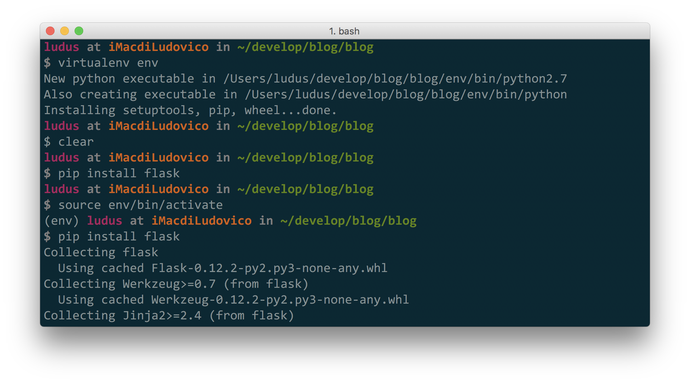

Ho deciso di riesumare un vecchio articolo (uno dei primi) che avevo scritto sul
mio blog, e che si era perso durante la migrazione. Leggengolo, l'ho anche corretto
ed aggiornato un po'!


Oggi l'amico Michele (come dice lui) ha avuto problemi nell'installare alcuni componenti Python sul proprio Mac, per questo motivo ho deciso di scrivere questo tutorial, che presenta
una soluzione ad uno dei problemi classici dello sviluppo software: come faccio ad
evitare conflitti su diversi progetti che utilizzano librerie diverse?

Spesso infatti, quando si sperimenta con qualsiasi linguaggio di programmazione, ci si ritrova a dover utilizzare librerie diverse che hanno dipendenze in conflitto tra di loro.
Molti linguaggi hanno trovato diverse soluzioni per evitare il conflitto dei pacchetti.
In Python, è stata sviluppata una soluzione molto elegante basata sui virtualenv.

## Virtualenv in Python

I Virtualenv (ambienti virtuali, appunto) sono un modo semplice per creare progetti Python isolati, in cui installare diverse librerie che non andranno in conflitto con altre librerie in altri ambienti.

Da un po' di anni (da quando li ho scoperti), ho preso l'abitudine di utilizzare un virtualenv per ogni progetto su cui lavoro, in modo da avere tutto preciso ed ordinato nei miei millemila progetti.

## Installiamo virtualenv

Per installare virtualenv sulla proprima macchina, basta digitare su un terminale il comando

```
$ sudo pip install virtualenv
```

e inserire la password.

Tale procuderura richiede solo l'installazione di `pip`, che solitamente è già installato
nelle ultime versioni di Python.

## Creiamo un Virtualenv

Utilizzare virtualenv è molto semplice.
Supponiamo di voler iniziare un nuovo progetto su un blog, sviluppato in python ed in particolare per mezzo di **Flask**.

Per prima cosa, nella nostra cartella di sviluppo principale, creiamo una nuova
cartella (`blog`) in cui lavorare per il progetto.

```bash
$ mkdir blog
$ cd blog
```

A questo punto, creiamo l'ambiente virtuale, utilizzando il comando

```
$ virtualenv <nome ambiente virtuale>
```

che, nel caso specifico, sarà

```
$ virtualenv env
```

> Il nome dell'ambiente virtuale può essere quello che preferiamo, tuttavia solitamente il nome standard che si da è appunto `env`.

Dopo l'esecuzione del programma, troverete una nuova directory chiamata `env` nella directory `blog`.

## Attiviamo un ambiente virtuale

Una volta creato l'ambiente virtuale, prima di utilizzarlo bisogna attivarlo.
Per farlo, basta fare il _source_ del file `env/bin/activate`, che viene creato
all'interno della cartella **env**.

Cioè, da shell, lanciamo il comando

```
$ source env/bin/activate
```

A questo punto, su ogni riga del prompt dei comandi, apparirà la scritta `(env)` prima della solita stringa del prompt. Questo indica che l'ambiente è attivo. Possiamo quindi installare nuove librerie python (ulizzando pip), che esisteranno solo all'interno del nostro ambiente virtuale. In questo caso, non è necessario utilizzare il comando `sudo`, perchè ci troviamo all'interno di una cartella privata.

```sh
(env)$ pip install flask
```

Ora flask sarà installato all'interno del nostro ambiente virtuale.



## Lavoriamo all'interno dell'ambiente virtuale

Una volta attivato l'ambiente ed installate le librerie, siamo abbastanza liberi su come muoverci per iniziare un progetto. Lavorate come volete voi. Quello che si fa abitualmente è
creare il nostro progetto direttamente nella cartella principale `blog`, ricordandoci
di ignorare, ad esmepio tramite `gitignore`, la cartella env.

## Chiudiamo l'ambiente virtuale

Per chiudere un ambiente virtuale, basta digirare il comando

```
(env)$ deactivate
```

Vedrete che la stringa `(env)` sparirà dal vostro prompt.
