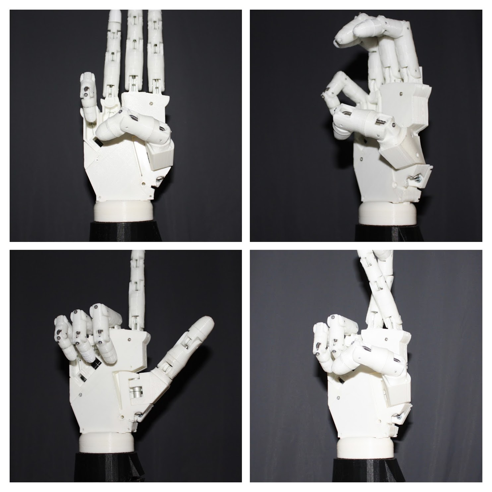

Ciao a tutti,
Come sapete, da domani 1 Dicembre fino a domenica 3 Dicembre a Roma si terrà l'edizione 2017 della Maker Faire Europe. Il più grande evento di Making Europeo che si tiene annualmente nella nostra capitale.

Come ogni anno, io sarò presente con i miei progetti e con i miei amici per mostrare ai presenti su cosa stiamo lavorando.

Quest'anno abbiamo applicato come **Rokers**, (che si trova al Pav. 6 B.01) la community di robot makers tutta italiana fondata da me, Gabriele e Michele Maffucci pochi mesi fa.

Ma non solo, io, Gabriele e Michele fare anche due talk incentrati sul mondo della robotica e sul mondo del lavoro per gli sviluppatori robotici.

Se volete più informazioni, trovate tutto a [questo link](https://rokers.io/makers/educativa/2017/11/28/Rokers-alla-maker-faire-rome-programma.html)!

Fatemi sapere nei commenti se qualcuno riesce a passare, noi vi aspettiamo!

A presto,
Ludovico
