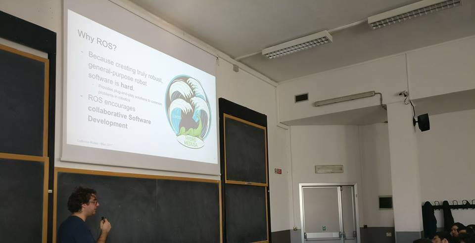

Ciao a tutti,
scrivo un breve post per due motivi.

Il primo, per informavi che nel mio lavoro con [HotBlack Robotics](http://hotblackrobotics.com) sto portando avanti un video corso su come utilizzare ROS (Robot Operating System) completamente in italiano.

Se volete seguire il corso, o comunque ricevere più informazioni a riguardo, iscrivetevi al gruppo facebook appositamente creato, chiamato [robot developers italiani](https://www.facebook.com/groups/493163691070528/?ref=bookmarks) oppure alla newsletter che trovate al fondo di [questo articolo](https://hotblackrobotics.github.io/2017/11/20/slide-del-nostro-intervento-al-politecnico-di-torino-su-ros/).

Il secondo motivo, meno importante ma anche interessante, è perché sto testando un nuovo metodo per pubblicare automaticamente i contenuti che posto su Jekyll sui vari social networks. Vi farò sapere se questo tentativo funziona.

A presto,
Ludovico
