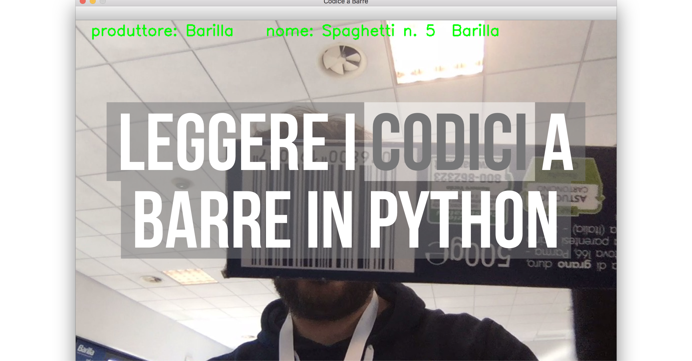
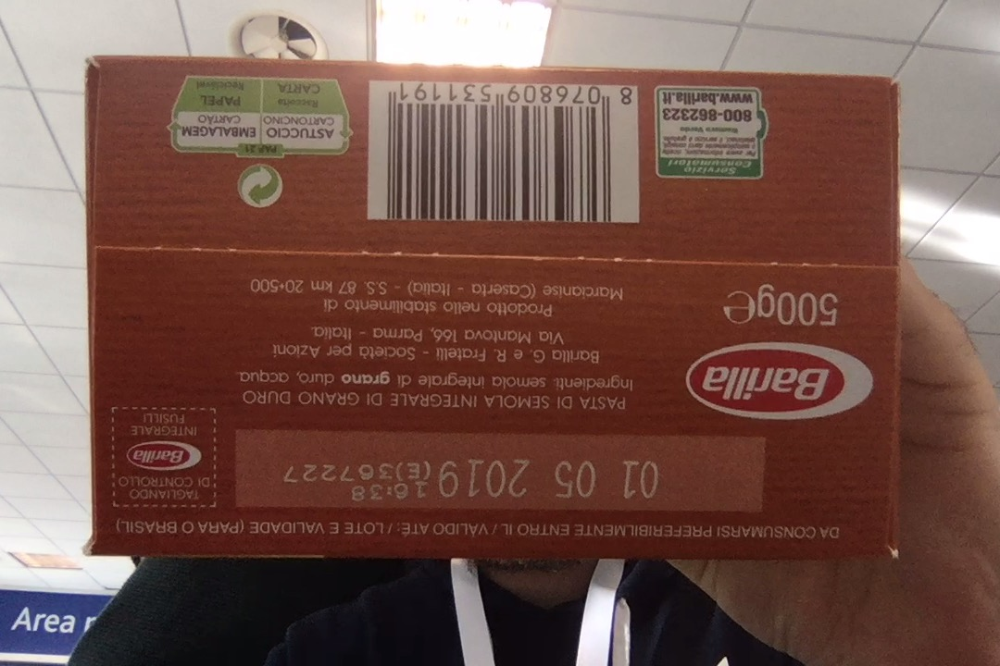
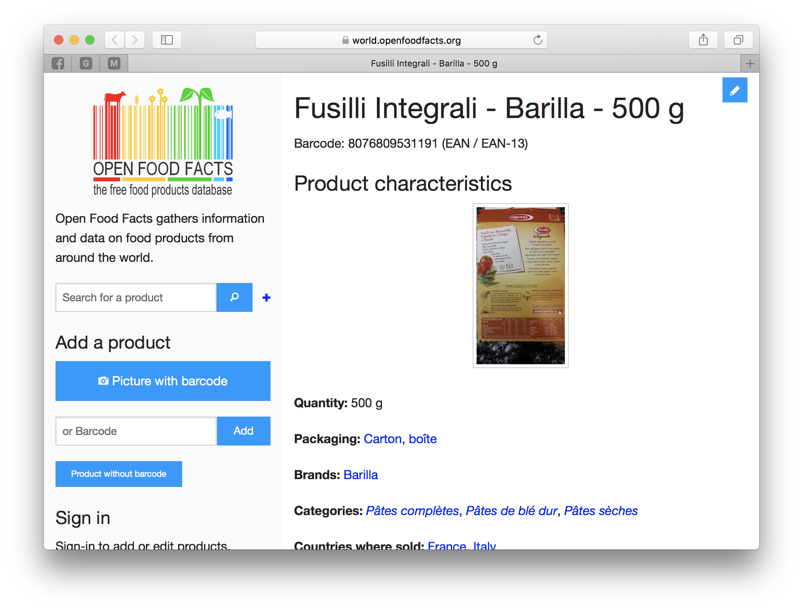
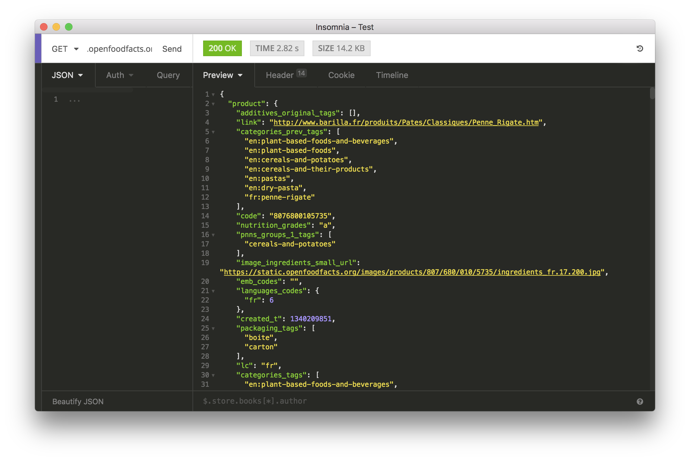
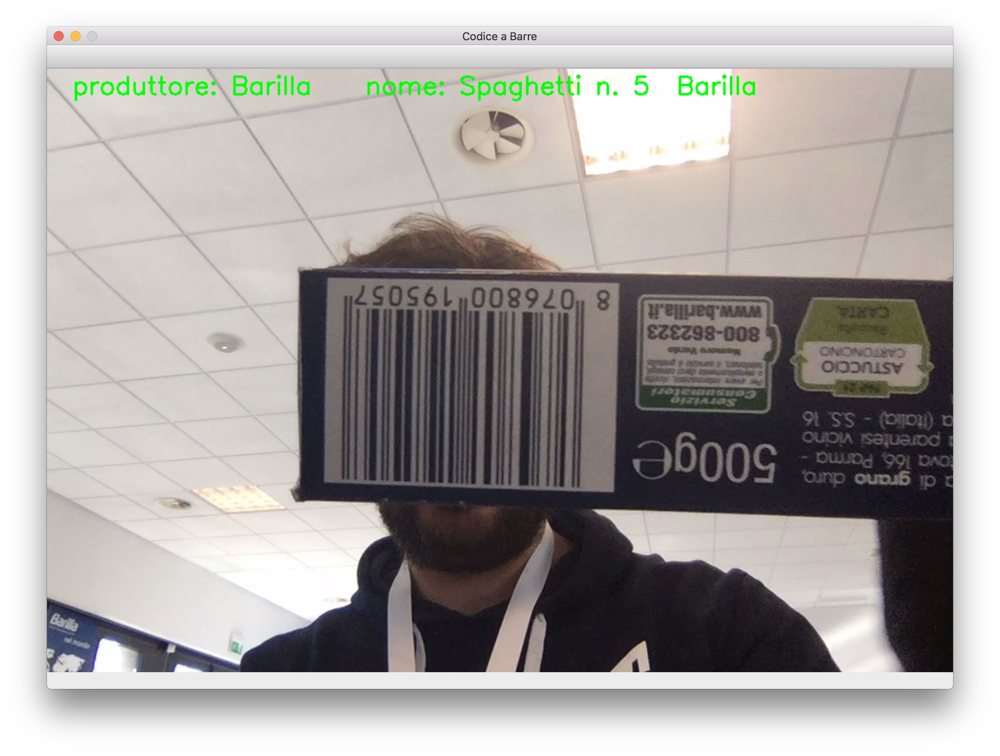

Nell'ultimo weekend si è tenuto l'evento [**Hackability@Barilla**](http://www.hackability.it/hackabilitybarilla/), l'ultimo
dei tanti eventi organizzati dall'associazione Hackability, di cui faccio parte,
che legano il mondo del making e della disabilità.

Come membro del team Hackability, ho partecipato all'evento come _mentor_, con lo scopo di
aiutare i vari tavoli di lavoro a completare i propri concept e prototipi durante
i due giorni iniziali dell'evento.

Tra i vari progetti dei partecipanti, uno di questi aveva il problema di riuscire
ad estrarre informazioni a partire dai codici a barre degli alimenti (le scatole della pasta
Barilla, ad esempio), e tradurre queste informazioni in Braille. Non voglio entrare
nel dettaglio del progetto e dell'idea (che non è mia), ma voglio prendere spunto
da questo mini progetto per scrivere questo tutorial.

## Cosa Faremo?

Lo scopo del tutorial è, quindi, riuscire ad estrarre delle informazioni (metadati) di
alimenti a partire dal codice a barre presente sulla scatola. In particolare, useremo
la libreria [**OpenCV**](https://opencv.org/) per gestire la cattura delle immagini (sia da file che direttamente da
fotocamera come video stream), e la libreria [**zbar**](http://zbar.sourceforge.net/) per la lettura dei codici a barre.

Una volta letto il codice a barre dalle immagini, useremo un servizio molto interessante
trovato su internet, chiamato [Open Food Facts](https://world.openfoodfacts.org/), che mette
a disposizione in database ben fornito (anche se non si trovato tutti i prodotti), con una ricerca
proprio da codice identificato letto da barcode.

Ma andiamo con ordine.

## Lettura del codice a barre con **zbar**

**zbar** è una libreria multipiattaforma che permette in modo veloce la lettura dei
codici a barre delle immagini. Per usarla in Python, dobbiamo installare sia la libreria
originale (**zbar**) che i wrapper di tale libreria in python (**pyzbar**).

Per installare la libreria, in base al sistema operativo, dobbiamo usare i seguenti comandi.

#### Mac OS

```bash
brew install zbar
```

#### Linux

```bash
sudo apt-get install libzbar0
```

Su Windows, la libreria viene automaticamente installata tramite **pyzbar**.

A questo punto, installiamo **pyzbar** all'interno di un nuovo [ambiente virtuale](https://ludusrusso.cc/2017/11/06/virtualenv/)

```bash
(env)$ pip install pyzbar
```

Similmente, installiamo **OpenCV** per la gestione delle immagini, usando il comando

```bash
(env)$ pip install opencv-python
```

A questo punto, siamo pronti per iniziare a scrivere il codice.

### Leggere il codice a barre da un'immagine salvata su file

Il più semplice programma che possiamo fare sarà in grado di leggere il codice a barre
presente all'interno di un'immagine salvata su file. Creiamo un nuovo file, chiamato
`barreader.py` ed iniziamo ad implementare il seguente codice.

```python
from pyzbar.pyzbar import decode
import cv2

filename = "img.jpg"
img = cv2.imread(filename)
gray_img = cv2.cvtColor(img, cv2.COLOR_BGR2GRAY)

barcodes = decode(gray_img)
print(barcodes)
```

Questo programma esegue le seguenti operazioni:

1. importiamo il modulo `decode` di `pyzbar` ed il modulo `cv2` (cioè OpenCV).

```python
from pyzbar.pyzbar import decode
import cv2
```

2. leggiamo l'immagine contenuta nel file `img.jpg` (salvandola nella variabile `img`) e la convertiamo in scala di grigi usando il comando `cv2.cvtColor`.

```python
filename = "img.jpg"
img = cv2.imread(filename)
gray_img = cv2.cvtColor(img, cv2.COLOR_BGR2GRAY)
```

3. leggiamo i codici a barre contenuti nell'immagine e stampiano a scermo le info lette.

```python
barcodes = decode(gray_img)
print(barcodes)
```

Si noti che `barcodes` contiene una lista con tutti i codici a barre trovati all'interno
dell'immagine.

Provando il codice sull'immagine di sotto (che potete scaricare e testare voi stessi),
dovreste ottenere il seguente risultato:

```bash
(env)$ python barreader.py
[Decoded(data=b'8076809531191', type='EAN13')]
```



### Ricavare le informazioni dal codice a barre sfruttando **Open Food Facts**

A partire dal codice a barre letto, possiamo ottenere le informazioni dell'alimento
andando sul sito [world.openfoodfacts.org](https://world.openfoodfacts.org/) ed inserendo
il codice (nel mio caso `8076809531191`) all'interno della barra di ricerca (si veda la figura sotto).



La cosa interessante, è che il sito mette a disposizione delle web API per ricevere le
informazioni contenute nel loro database in formato JSON, quindi facilmente leggibile da
un programma in Python.

Per accedere alle informazioni in formato JSON, basta costruire il seguente URL:
`https://it.openfoodfacts.org/api/v0/product/<INSERIRE CODICE DA CERCARE>.json`

dove il codice da cerca va inserito alla fine dell'URL prima del `.json`. Ad esempio, nel nostro caso, l'url sarà:
`https://it.openfoodfacts.org/api/v0/product/8076800105735.json`

Inserendo l'URL ricavato all'interno del browser (o di un programma di test API come [insomnia](https://insomnia.rest/)), otterremo veramente tante informazioni legate al prodotto in questione.



Le informazioni contenute sono, ad esempio, il produttore, gli ingredienti, gli allergeni, il nome
del prodotto, ecc. Vi riporto un estratto delle info contenute qui sotto:

```json
{
  "status": 1,
  "product": {
    "...": "...",
    "nutriments": {
      "saturated-fat_value": "0.5",
      "proteins_value": "13",
      "proteins_100g": "13",
      "carbohydrates": 65.7,
      "...": "..."
    },
    "allergens_tags": ["en:gluten"],
    "brands": "Barilla",
    "product_name": "Fusilli Integrali",
    "...": "..."
  },
  "...": "..."
}
```

Si noti che, nel caso in cui non venga trovato nessun elemento nel database, otterremo il
seguente json:

```json
{
  "status": 0,
  "status_verbose": "product not found",
  "code": "34983423424930242342"
}
```

Basta quindi controllare il valore di `status` per vedere se è stato trovato qualcosa.

### Leggere le info di **Open Food Facts** da Python con **requests**

Per leggere queste informazioni da Python, possiamo sfruttare la libreria [**requests**](http://docs.python-requests.org/en/master/). Ma prima di tutto, dobbiamo
installarla usando il comando

```bash
(env)$ pip install requests
```

A questo punto, dobbiamo semplicemente costruire l'url di ricerca ed usare `requests.get`
per leggere i dati.

1. Importiamo la libreria ` requests`` con il comando `:

```python
from pyzbar.pyzbar import decode
import cv2
import requests
...
```

2. Una volta elaborata l'immagine, accediamo al primo elemento della lista `barcodes` (supponiamo che ci sia sempre e solo un codice a barre nelle foto) e costruiamo l'url usando il metodo `format` di string

```python
# ...
barcodes = decode(gray_img)
code = barcodes[0].data
url = "https://it.openfoodfacts.org/api/v0/product/{}.json".format(code)
# ...
```

3. A questo punto, usando `requests` possiamo fare una query verso il database, controllare
   che il prodotto sia stato trovato (sfruttando il campo status) e stampare a video alcune informazioni

```python
# ...
data = requests.get(url).json()
if data["status"] == 1:
    product = data["product"]
    brand = product["brands"]
    print("produttore:", product["brands"])
    print("nome:", product["product_name"])
# ...
```

Di sotto, il codice completo, arricchito di vari `if` - `else` per gestire i possibili errori:

- Codice a barre non trovato nell'immagine
- Prodotto non trovato nel database

```python
from pyzbar.pyzbar import decode
import cv2
import requests

filename = "img.jpg"
img = cv2.imread(filename)
gray_img = cv2.cvtColor(img, cv2.COLOR_BGR2GRAY)

barcodes = decode(gray_img)

if len(barcodes) == 1:
    code = barcodes[0].data
    url = "https://it.openfoodfacts.org/api/v0/product/{}.json".format(code)
    data = requests.get(url).json()
    if data["status"] == 1:
        product = data["product"]
        brand = product["brands"]
        print("produttore:", product["brands"])
        print("nome:", product["product_name"])
    else:
        print("Prodotto non trovato!")
else:
    print("Codice a barre non trovato!")
```

Lanciando il programma, otterremo questo risultato:

```bash
(env)$ python barreader.py
Produttore: Barilla
Nome: Fusilli Integrali
```

### Leggere il codice direttamente da webcam del computer

Per finire, vediamo come ricavare queste informazioni direttamente da webcam del
computer, invece che da file immagine.

Fortunatamente, OpenCV mette a disposizione un metodo molto semplice per leggere
lo streaming video proveniente da una webcam. Per farlo, infatti, basta utilizzare
l'oggetto `cv2.VideoCapture` nel seguente modo:

```python
cap = cv2.VideoCapture(0)
while(True):
  ret, frame = cap.read()
```

In questo modo, abbiamo creato un ciclo infinito che legge l'immagine dalla webcam
e la salva nella variabile `frame`. Il numero inserito all'interno del comando
`cv2.VideoCapture(0)` rappresenta l'id della webcam da utilizzare. Se il computer è dotato di una
sola webcam, questa avrà id `0` (come nel nostro caso). Se ne abbiamo 2, possiamo accedere ad una o
all'altra utilizzando `cv2.VideoCapture(0)` e `cv2.VideoCapture(1)`, e così via.

Solitamente, viene anche comodo visualizzare l'immagine appena letta a video.
Questo si fa usando il seguente codice:

```python
cap = cv2.VideoCapture(0)
while(True):
  ret, frame = cap.read()
  cv2.imshow('Codice a Barre', frame)
  code = cv2.waitKey(30)
  if code == ord('q'):
      break
```

In particolare, la funzione `cv2.imshow('Codice a Barre', frame)` crea una finestra (chiamata `Codice a Barre`)
in cui viene mostrata l'immagine contenuta nella variabile `frame`.

La funzione `cv2.imshow` deve sempre essere accompagnata dalla funzione `cv2.waitKey(time)`.
Quest'ultima fa in modo che le finestre OpenCV vengano effettivamente renderizzate (senza non si vedrebbe niente), e blocca il programma per un tempo (in millisecondi) pari alla variabile che gli viene
passata. La funzione ritorna normalmente `-1`, a meno che non venga premuto un tasto sulla tastiera. In questo caso, ritorna il codice ASCII corrispondente al tasto premuto.

Le ultime due righe del ciclo controllano che sia stato premuto il tasto `q` da tastiera, e, in caso positivo, terminano il ciclo while.

```python
if code == ord('q'):
    break
```

Lanciando il codice su, quindi, dovrebbe aprirsi una finestra che mostra la vostra telecamera,
come in figura sotto:


### Mettiamo tutto insieme

A questo punto, non ci resta che mettere tutto insieme per leggere i dati del codice
a barre contenuto in frame.

Per prima cosa, modifichiamo il codice che legge le info del codice a barre implementato sopra
in modo che diventi una funzione, che prende l'immagine da analizzare e restituisce il testo.

```python
def get_barcode_info(img):
    gray_img = cv2.cvtColor(img, cv2.COLOR_BGR2GRAY)
    barcodes = decode(gray_img)

    if len(barcodes) == 1:
        code = barcodes[0].data
        url = "https://it.openfoodfacts.org/api/v0/product/{}.json".format(code)
        data = requests.get(url).json()
        if data["status"] == 1:
            product = data["product"]
            brand = product["brands"]
            return "produttore: {}    nome: {}".format(product["brands"], product["product_name"])
        else:
            return "Prodotto non trovato!"
    else:
        return "Codice a barre non trovato!"
```

Come vedete, il codice non è cambiato molto. La più grande differenza è che, adesso, invece
di stampare a video le informazioni vengono ritornate come stringa.

A questo punto, non ci resta che passare la variabile `frame` alla funzione appena sviluppata,
ricavare le informazioni e stamparle sull'immagine.

```python
while(True):
  ret, frame = cap.read()
  info = get_barcode_info(frame)
  # ...
```

Per fare questo, usiamo la funzione `cv2.putText()` di OpenCV, che prende, nell'ordine,
i seguenti parametri:

1. L'immagine in cui inserire il testo `frame`,
2. Il testo da inserire `info`,
3. La posizione (in pixel), in cui inserire il testo `(100, 20)`,
4. Il font `cv2.FONT_HERSHEY_SIMPLEX`,
5. La dimensione del testo `1`,
6. Il colore in RGB (nel mio caso ho scelto verde) `(0,255,0)`,
7. Lo spessore della linea `2`.

Il codice da inserire sarà quindi:

```python
  cv2.putText(frame, info, (30,30), cv2.FONT_HERSHEY_SIMPLEX, 1, (0,255,0), 2)
```

A questo punto, possiamo visualizzare l'immagine `frame e concludere il programma`.

```python
cap = cv2.VideoCapture(0)
while(True):
  ret, frame = cap.read()
  info = get_barcode_info(frame)
  cv2.putText(frame, info, (30,30), cv2.FONT_HERSHEY_SIMPLEX, 1, (0,255,0), 2)

  cv2.imshow('Codice a Barre', frame)
  code = cv2.waitKey(30)
  if code == ord('q'):
      break
```

Lanciandolo, dovremmo ottenere dei risultati come sotto:




Per concludere, vi riporto il codice completo sviluppato in questo Tutorial.

```python
from pyzbar.pyzbar import decode
import cv2
import requests

def get_barcode_info(img):
    gray_img = cv2.cvtColor(img, cv2.COLOR_BGR2GRAY)
    barcodes = decode(gray_img)

    if len(barcodes) == 1:
        code = barcodes[0].data
        url = "https://it.openfoodfacts.org/api/v0/product/{}.json".format(code)
        data = requests.get(url).json()
        if data["status"] == 1:
            product = data["product"]
            brand = product["brands"]
            return "produttore: {}    nome: {}".format(product["brands"], product["product_name"])
        else:
            return "Prodotto non trovato!"
    else:
        return "Codice a barre non trovato!"

cap = cv2.VideoCapture(0)
while(True):
  ret, frame = cap.read()
  info = get_barcode_info(frame)
  cv2.putText(frame, info, (30,30), cv2.FONT_HERSHEY_SIMPLEX, 1, (0,255,0), 2)

  cv2.imshow('Codice a Barre', frame)
  code = cv2.waitKey(30)
  if code == ord('q'):
      break
```
