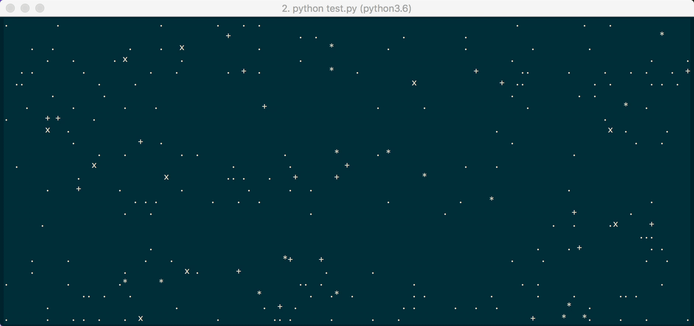

Le UI da terminale sono molto retrò, ma è sempre divertente sviluppare programmi che le utilizzano, e possono
essere molto utili su progetti da adottare su un Raspberry Pi.

In questa guida, vi voglio introdurre alla libreria Python [`Asciimatics`](https://github.com/peterbrittain/asciimatics), un tool open source e multipiattaforma che sviluppare UI per terminale in modo semplice e veloce!

## Primi test con la libreria

Per prima cosa, installiamo la libreria, meglio se all'interno di un [ambiente virtuale](), con il comando

```bash
(env) pip install asciimatics
```

Questo è abbastanza per utilizzare la libreria! Andiamo ad implementare ora un semplice esempio per vedere come funziona sviluppando uno screen automatico che gira su terminale.

Prendendo spunto dal un esempio di test, ho realizzato questo semplice programma

```python
from asciimatics.effects import Cycle, Stars
from asciimatics.renderers import FigletText
from asciimatics.scene import Scene
from asciimatics.screen import Screen

def demo(screen):
    effects = [
        Cycle(
            screen,
            FigletText("ludusrusso.cc", font='big'),
            int(screen.height / 2 - 8)),
        Cycle(
            screen,
            FigletText("Impara asciimatics!", font='small'),
            int(screen.height / 2 + 3)),
        Stars(screen, 500)
    ]
    screen.play([Scene(effects, 500)])

Screen.wrapper(demo)
```

Che, una volta lanciato, genera questa bellissima animazione



Il codice è anche molto semplice.
Per prima cosa, creiamo una funzione `demo` che prende un oggetto chiamato `screen`. Questa funzione
si occuperà di renderizzare la nostra schermata, tramite la sua ultima riga: `screen.play([Scene(effects, 500)])`.

`effects` non è altro che un vettore contenente i vari **effetti** che vogliamo aggiungere al nostro screen. In questo caso ne ho inseriti tre:

- Il primo e il secondo sono un effetto `Cycle`, che non fa altro che ciclare il colore del testo che gli viene passato. Si noti che con `FigletText` possiamo utilizzare diversi [fliglet font](http://www.figlet.org/)! Fate un po' di prove.
- Il terzo effetto è `Stars`, che non fa altro che disegnare `500` (o il numero che volete voi) stelle luccicanti sullo sfondo!

Per finire, basta passare la funzione a `Screen.wrapper` per lanciare l'applicazione!

## Conclusioni

La libreria è davvero divertente, e si possono anche fare alcune cose interessanti!
Voi avete idee o suggermenti in che modo poterla usare? Se si, scrivetela nei commenti qui sotto!!

## Aiutatemi

Vi chiedo un piccolo aiuto da parte di voi lettori: infatti, ho sempre meno tempo per mantere e migliorare questo blog, che al momento faccio senza nessuna retribuzione, e quindi nel tempo libero nel weekend.
Vi chiedo perciò di fare alcune, per aiutarmi a far crescere il blog per permettermi di dedicarci sempre più tempo:

1. Iscrivetevi alla newsletter (trovate form nel footer di questo blog),
2. Lasciate dei commenti sotto questo post (e sotto i vari post che ritenete utili). Vorrei sapere da voi come credete possa migliorare il blog, e se avete idee per futuri articoli o qualcosa che vorreste approndire, **questo è uno dei migliori modi con cui potete aiutarmi**!
3. Mettete un Like alla mia [pagina facebook](https://www.facebook.com/ludusrusso.cc), aggiungetemi [su linkedin](https://www.linkedin.com/in/ludusrusso/) e seguitemi su [twitter](https://twitter.com/ludusrusso) e [github](https://github.com/ludusrusso).
4. Condividete i miei post!
