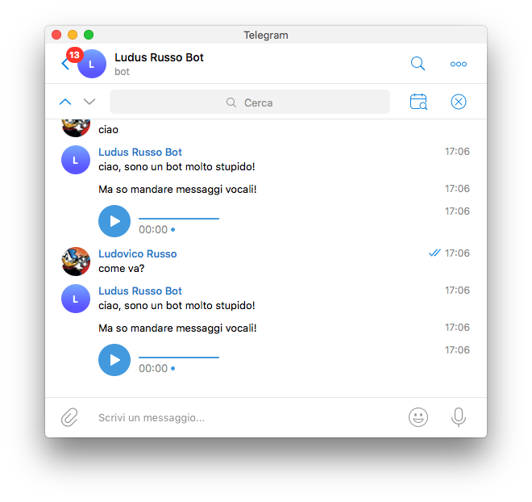
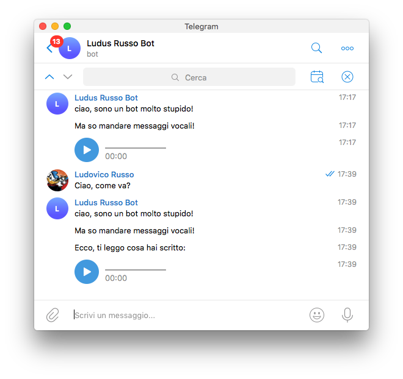

In un [precedente Articolo](/2018/04/06/google-text-to-speech-per-generare-file-audio/) ho utilizzato le API messe a disposizione da Google per la sintesi vocale. In particolare, in quell'articolo abbiamo visto come usare gTTS per
generare file vocali a partire da una stringa di testo.

In questo articolo, vediamo come utilizzare questa funzionalità per fare in modo che sia un bot Telegram ad
inviare, tramite messaggio vocale, l'output delle API gTTS.

## Configurare il tutto

Ormai non vi sto a tediare sulla fase di configurazione. Ricordiamoci però di creare un ambiente virutale (in Python 3) e di installare i pacchetti `Telepot` e `gTTS`, come visto nei miei precedenti tutorial.

Prima di cominciare, però, vi propongo una _best practice_ molto veloce per configurare il bot telegram (ed in particolare il Token), di cui non vi ho mai parlato ma che sto utilizzando molto.

Creiamo, per inizializzare il bot, due file: `bot.py` che conterrà il nostro bot vero e proprio ed un file `config.py`, in cui andremo ad inserire tutte le informazioni di configurazione (nel caso di bot semplici, solo il TOKEN), in modo
che queste siano facilmente reperibili.

Il file di configurazione, quindi, avrà la seguente forma:

```python

# config.py

TOKEN = "*** inserisci il tuo token qui ***"
```

A questo punto, nel bot principale, non dovremo far altro che importare `config` e usare `config.TOKEN`.
Questo semplifica di tanto la vita nel momento in cui il progetto diventa grande e servono altre variabili di configurazione, o quando volete tenere lo scheletro del vostro progetto ed utilizzarlo con diversi TOKEN.

## Primo test: messaggio vocale statico

Per prima cosa, implementiamo un semplice bot che sia in grado di inviare, come messaggio vocale, un file audio generato precedentemente da noi, come visto nel tutorial precedente. Nel mio caso, utilizzerò il file `saluti.mp3`.

Spostiamo il file nella stessa cartella in cui si trova il robot. A questo punto, possiamo utilizzare il metodo `.sendVoice()` che `telepot` mette a disposizione, la cui funzione è molto simile al classico `.sendMessage()`, con l'unica differenza che il primo prende in ingresso un oggetto di tipo file invece che un stringa, ed invia un messaggio vocale con il contenuto di questo file.

Per utilizzarlo, andiamo ad implementare un semplicissimo bot (riprendo l'esempio del mio [primo articolo sul tema](https://ludusrusso.cc/2017/04/27/implementiamo-un-bot-telegram-con-python/)), come di seguito:

```python
# file bot.py

import config
import telepot
import io

def on_chat_message(msg):
    content_type, chat_type, chat_id = telepot.glance(msg)
    if content_type == 'text':
        bot.sendMessage(chat_id, 'ciao, sono un bot molto stupido!')
        bot.sendMessage(chat_id, 'Ma so mandare messaggi vocali!')
        with open('saluti.mp3', 'rb') as file:
            bot.sendVoice(chat_id, file)


bot = telepot.Bot(config.TOKEN)
bot.message_loop(on_chat_message)

import time
while True:
    time.sleep(10)
```

In particolare, le linee di codice che contengono novità sono queste:

```python
# file bot.py

# ...
def on_chat_message(msg):
        # ...
        with open('saluti.mp3', 'rb') as file:
            bot.sendVoice(chat_id, file)

# ...
```

Queste due linee aprono il file `saluti.mp3` e lo caricano il lettura nell'oggetto `file`, che poi viene inviato tramite
`bot.sendVoice(chat_id, file)` all'utente.

Il risultato è mostrato in figura:



## Generare messaggi dinamicamente

A questo punto, non ci resta che generare messaggi vocali in modo dinamico, per rendere più interattivo il robot.
Per farlo, dobbiamo sfruttare la libraria `gTTS` come [visto qui](/2018/04/06/google-text-to-speech-per-generare-file-audio/).

Il modo più semplice per farlo è il seguente:

1. Generare un file audio e salvarlo su disco,
2. Leggere il file da disco ed inviarlo tramite `.sendVoice()`

Tuttavia in questo caso abbiamo un overhead non indifferente per la lettura e consequenziale scrittura su disco,
inoltre, nel caso il bot venga lanciato in modalità multithread per la gestione di molti utenti, la gestione contemporanea di due (o più) utenti potrebbe creare problemi, in quanto andrebbero a scrivere contemporaneamente sullo stesso file.
Per questo motivo, la soluzione migliore è quello di gestire il tutto in RAM.

Ho già discusso questo problema in alcuni miei precedenti posto:

1. Nel post [Sviluppiamo un bot Telegram che legge i codici a barre degli alimenti](https://ludusrusso.cc/2018/01/31/telegram-opencv-barcode/) ho discusso il problema inverso (che si risolve allo stesso modo), in cui l'utente invia un file (in quel caso un'immagine) al bot, e questo deve processare l'immagine senza salvarla su disco.
2. Nel mio posto [Implementiamo un bot Telegram in Python per leggere e creare QRCode](http://www.allafinedelpalo.it/implementiamo-un-bot-telegram-in-python-per-leggere-e-creare-qrcode/) ospitato nel blog **Alla Fine del Palo**, ho discusso di un problema simile per la creazione e l'invio di immagini da parte del bot verso l'utente.

La soluzione, come già visto, è sfruttare la libraria `io` di Python3, ed in particolare l'oggetto `BytesIO`, che non fa altro che emulare un file gestito completamente in memoria RAM, quindi come una normale variabile.

Per farlo, implementiamo una funzione in grado di creare un file audio e salvarlo dentro una variabiale di tipo BytesIO:

```python
# ...
import io
from gtts import gTTS

def generate_vocal_msg(text):
    tts = gTTS(text=text, lang="it")
    vocal_file = io.BytesIO()
    tts.write_to_fp(vocal_file)
    vocal_file.seek(0)
    return vocal_file

# ...
```

Come vedete, questa funzione prende una stringa `text` e la converte in voce sintetizzata tramite la libraria `gtts`.
La novità è che, una volta ottenuto l'oggetto `tts`, sfruttiamo il [metodo `write_to_fp`](http://gtts.readthedocs.io/en/latest/module.html) per salvare i dati all'interno di un oggetto di tipo file. Questo oggetto è `vocal_file`, che è proprio un simil-file creato da `io.BytesIO`.

Per ultimo, è nessario "riavvolgere" l'oggetto `vocal_file` create tramite il metodo `vocal_file.seek(0)`, in questo modo, chi lo leggerà lo vedrà dall'inizio, come se fosse stato appena aperto.

A questo punto, possiamo utilizzare la funzione `generate_vocal_msg` per generare dinamicamente il nostro messaggio vocale. Nel semplice esempio di seguito, converto in vocale il messaggio che arriva dall'utente:

```python
# ...

def on_chat_message(msg):
    content_type, chat_type, chat_id = telepot.glance(msg)
    if content_type == 'text':
        bot.sendMessage(chat_id, 'ciao, sono un bot molto stupido!')
        bot.sendMessage(chat_id, 'Ma so mandare messaggi vocali!')
        bot.sendMessage(chat_id, 'Ecco, ti leggo cosa hai scritto:')
        bot.sendVoice(chat_id, generate_vocal_msg(msg['text']))

# ...
```

Proviamo quindi il bot, vedrete che sarà in grado di "leggere" quello che gli scrivete! Provare per credere!!



## Conclusioni

Come pensate possa essere utilizzata in modo utile questa capacità dei bot di generare messaggi vocali? Ditemelo nei commenti.

Intanto, trovate sotto il codice completo che ho sviluppato!

```python
# file bot.py

import config

import telepot
import io
from gtts import gTTS


def generate_vocal_msg(text):
    vocal_file = io.BytesIO()
    tts = gTTS(text=text, lang="it")
    tts.write_to_fp(vocal_file)
    vocal_file.seek(0)
    return vocal_file

def on_chat_message(msg):
    content_type, chat_type, chat_id = telepot.glance(msg)
    if content_type == 'text':
        bot.sendMessage(chat_id, 'ciao, sono un bot molto stupido!')
        bot.sendMessage(chat_id, 'Ma so mandare messaggi vocali!')
        bot.sendMessage(chat_id, 'Ecco, ti leggo cosa hai scritto:')
        bot.sendVoice(chat_id, generate_vocal_msg(msg['text']))


bot = telepot.Bot(config.TOKEN)
bot.message_loop(on_chat_message)

import time
while True:
    time.sleep(10)
```
