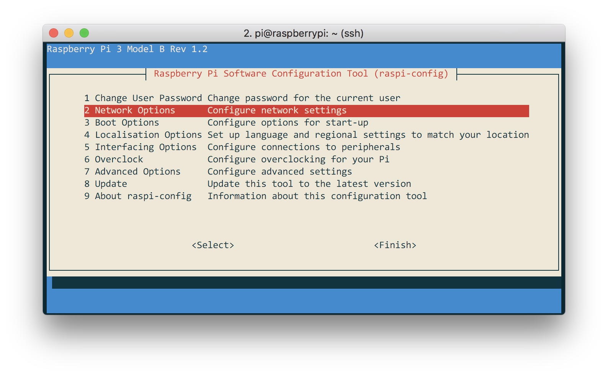
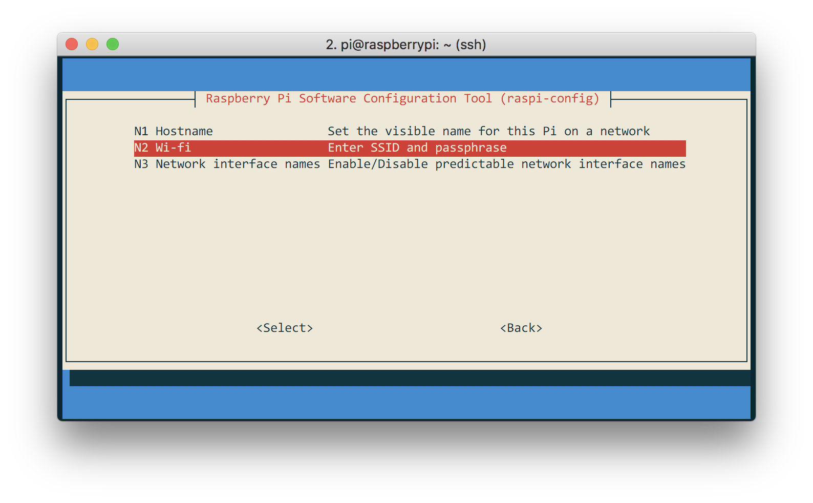
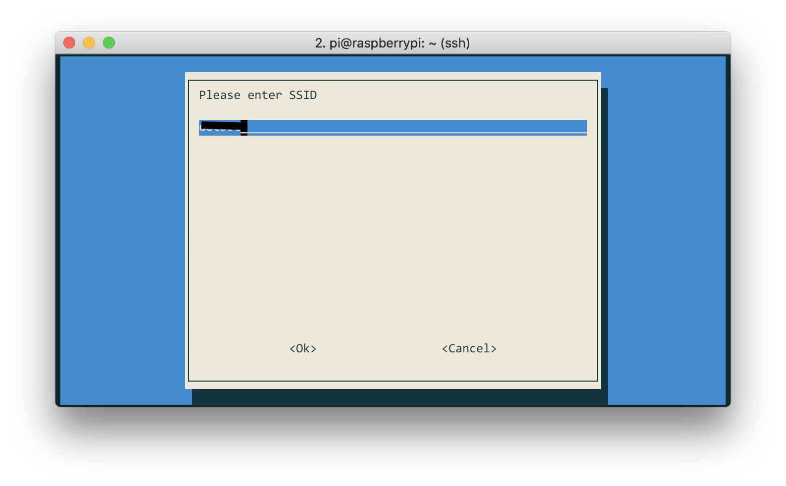
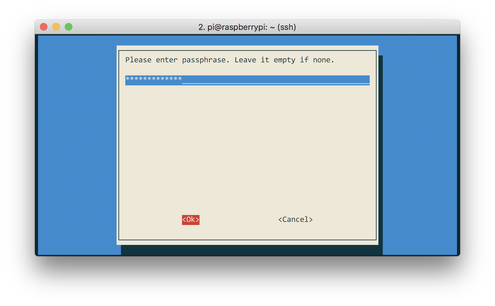

Da tanto tempo ormai sono abituato a lavorare con Raspbian (Lite), la distro ufficiale del Raspberry Pi senza interfaccia grafica, che molto si adatta a sviluppare applicazioni come piccoli robot o progetti IoT, che spesso non sono dotati di schermo.

Uno dei problemi più spesso riscontrati è la gestione del WiFi in queste condizioni. Solitamente
il Raspberry Pi deve connettersi ad una rete wifi nota per poi poter eseguire il proprio compito.
Quindi è necessario istruire il Raspberry in modo che si connetta ad una rete WiFi prima di iniziare a fare qualsiasi cosa.

Fino ad ora, usavo il tool `wpa_cli`, che ha due grossi problemi:

1. E' molto scomo da utilizzare e
2. Non è installato di default su Raspbian.

Il punto (2) comporta un'ulteriore scomodità: prima di inizare a lavorare con una nuova scheda, è necessario connetterla fisicamente alla rete ethernet per poter scaricare i pacchetti necessari ad utilizzarla.

Per fortuna, ieri ho scoperto che raspbian monta al suo interno un tool super semplice che ci permette di collegare il raspberry al WiFi in 2 min. Vediamo come fare.

Per prima cosa, accediamo a `raspi-config` con il comando:

```bash
$ sudo raspi-config
```

A questo punto, andiamo su `Network Options` -> `Wi-Fi`. Inseriamo nome e password della rete a cui vogliamo conneterci, chiudiamo il tool e riavviamo il raspberry con il comando

```bash
$ sudo reboot
```

Al riavvio, il raspberry sarà connesso alla rete (ovviamente se i dati inseriti sono corretti).





