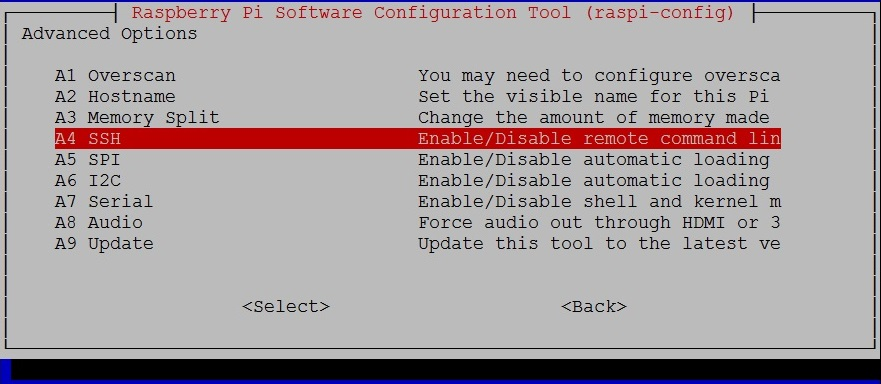
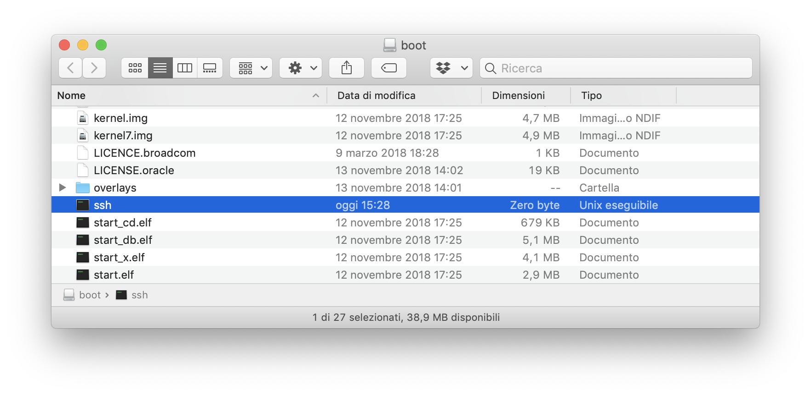

Per chi lavora e sviluppa su Raspberry Pi, sa bene che utilizzare la GUI del Raspberry per lo sviluppo risulta molto scomodo e lento.
Il mio workflow abituale consiste, infatti, nello sviluppare [principalmente con Docker](https://ludusrusso.cc/2018/06/29/docker-raspberrypi/) e trasferire le immagini su Raspberry solo per test e quando il sistema è finito.

Mi sono quindi abituato a lavorare senza interfaccia grafica né monitor, avendo il Raspberry semplicemente connesso (via ethernet o wifi) al router e accedendoci via SSH, utilizzando come sistema operativo principale [Raspbian Lite](https://www.raspberrypi.org/downloads/raspbian/), cioè la versione di Rasbian senza interfaccia grafica installata.

Purtroppo sorge continuamento lo stesso problema ogni volta che mi trovo a lavorare su un nuovo progetto: **Come faccio ad accedere via SSH al mio Raspberry Pi con SD appena creata?** Infatti, da ormai qualche anno, l'SSH è disabilitato di default per ragioni di sicurezza su Raspbian, e per abilitarlo risulta necessario trovare un monitor ed una tastiera, accedere al Raspberry ed utilizzare il comando `raspi-config` per abilitare il server SSH.

La cosa è scocciante ma non crea grossi problemi finchè non capita di non aver a disposizione un monitor e/o una tastiera nel momento della configurazione, cosa che mi è capitata giusto qualche giorno fa mentre lavoravo ad un progetto. Per fortuna, ho scoperto che gli sviluppatori del Raspberry Pi hanno pensato ad una soluzione per questo tipo di problemi.

### Come abilitare SSH all'avvio se non possiedo un Monitor?

Il procedimento è molto semplice. Una volta creata la nostra SD a partire dall'immagine ufficiale, dobbiamo collegarla al nostro computer principale.

All'interno della SD, ci sarà una partizione chiamata `/boot`. Dobbiamo andare a creare un file vuoto all'interno di questa partizione chiamato `ssh`. A questo punto, possiamo inserire la SD nel Raspberry e, una volta collegato al router tramite ethernet, avviarlo. A questo punto, possiamo tranquillamente collegarci al nostro Raspberry utilizzando SSH.

