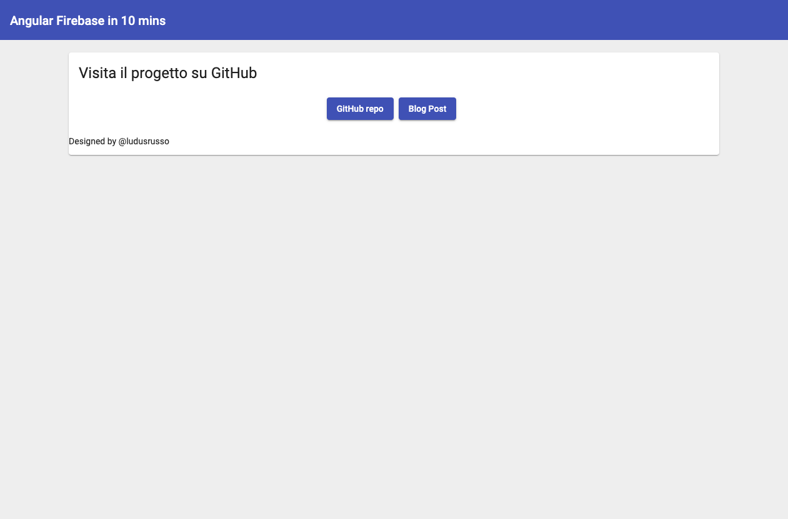

In questo articolo, voglio fare una veloce introduzione a [Firebase Hosting](https://firebase.google.com/),
il servizio di google all'interno di **Firebase** che ci permette in pochissimo tempo di pubblicare
la nostra applicazione sul web e renderla disponibile a tutti.

Per il progetto utilizzerò [Angular](https://angular.io/), creeremo un'applicazione in **Angular 10** e
la deployeremo online in pochissimo tempo, ovviamente pensando anche (almeno un po') alla grafica
tramite [**Angular Material**](https://material.angular.io/).

## Prerequesiti

Ovviamente non si può fare tutto in pochissimo tempo se non si ha almeno un po' di prerequesiti, ecco
quali sono quelli necessari (almeno per me)!

1. Avere installato nella nostra macchina [**nodejs**](https://nodejs.org/it/) e [il client Anglular](https://angular.io/cli)
2. Avere installato [il client firebase](https://firebase.google.com/docs/cli)
3. Avere un minimo di familiarità con il terminale
4. Avere un account google (con cui accedere a Firebase).

### 1. Creiamo un progetto firebase!

Partiamo con le cose più semplici. Ci serve accedere [alla console firebase](https://console.firebase.google.com) e creare un nuovo progetto. Il processo è super semplice, dobbiamo scegliere un nome, abilitare google analytics (se vogliamo) e aspettare qualche secondo!

Firebase è (ovviamente) a pagamento, ma esiste un piano grautito molto generoso che ci permette di testarlo completamente, com poche limitazioni. Se le quote gratuite vengono superate il progetto semplicemente si blocca senza farci pagare nulla fino al mese successi, ma vi assicuro che per progetti hobbistici è molto difficile arrivare a questo!


### 2. Si crea l'app Angular!

Spostiamo ci sul termina ed iniziamo a smanettare un po' con la shell.

Per prima cosa dobbiamo loggarci con il client firebase (lo avete installato vero) al nostro account, per poter accedere al progetto e configurare l'app.

Per farlo, digitate sul terminale

```bash
$ firebase login
```

Firebase vi aprirà una finestrea del browser in cui vi dovrete loggare con lo stesso account google con cui avete creato il progetto.

Possiamo quindi creare la nostra applicazione Angular, nel nostro workspace, digitiamo il comando

```bash
ng new <nome progetto>
```

<script id="asciicast-aMKnWHeicTOAWuoEvzieR6RPh" src="https://asciinema.org/a/aMKnWHeicTOAWuoEvzieR6RPh.js" async></script>

Apriamo il progetto appena creato con un editor di testo (io uso VSCode ormai) ed installiamo (tramite il tool `ng add`) [Angular Material](https://material.angular.io/) per avere una UI leggermente carina in modo semplice.

```bash
$ ng add @angular/material
```

<script id="asciicast-6Wd52K6z8yHc743OV3Q9xZlp1" src="https://asciinema.org/a/6Wd52K6z8yHc743OV3Q9xZlp1.js" async></script>

Seguiamo e completiamo il wizard che angular ci propone.

A questo punto possiamo installare [`@angular/fire`](https://github.com/angular/angularfire), la libreria angular ufficiale di Firebase.

```bash
$ ng add @angular/fire
```

Notare che il wizard che appare ci chiederà di selezionare un progetto firebase. Scegliamo il nostro e andiamo avanti!

<script id="asciicast-6Be0gm8tXsJMSXQokSV20nK5a" src="https://asciinema.org/a/6Be0gm8tXsJMSXQokSV20nK5a.js" async></script>

Fatto! Come vedete è stato semplicissimo! Tutto pronto per il deploy!

### 3. Abbelliamo un po' il progetto!

Prima di deployare facciamo in modo che l'app siamo un po' decente :D
Per prima cosa svuotiamo completamente il file `src/app/app.component.html`, che angular riempe con del codice di esempio che non ci interessa!

All'interno del file `app.module.ts` importiamo un po' di moduli di angular material che ci serviranno per abbellire l'app. In particolare, useremo [MatToolbar](https://material.angular.io/components/toolbar/overview), [MatButton](https://material.angular.io/components/button/overview) e [MatCard](https://material.angular.io/components/card/overview).

Dobbiamo importarli dalle relative librerie e poi inserirli all'interno della tupla `imports` di `@NgModule`.

```ts
// app.module.ts

import { NgModule } from "@angular/core"
import { BrowserModule } from "@angular/platform-browser"
import { BrowserAnimationsModule } from "@angular/platform-browser/animations"
import { AppRoutingModule } from "./app-routing.module"
import { AppComponent } from "./app.component"

import { MatButtonModule } from "@angular/material/button"
import { MatCardModule } from "@angular/material/card"
import { MatToolbarModule } from "@angular/material/toolbar"

@NgModule({
  declarations: [AppComponent],
  imports: [
    BrowserModule,
    AppRoutingModule,
    BrowserAnimationsModule,
    MatCardModule,
    MatToolbarModule,
    MatButtonModule,
  ],
  providers: [],
  bootstrap: [AppComponent],
})
export class AppModule {}
```

A questo punto, mettiamo un po' di contenuti dentro `app.component.html`

```html
<!-- app.component.html -->

<mat-toolbar color="primary">
  <span> Angular Firebase in 10 mins </span>
</mat-toolbar>

<mat-card>
  <h1 mat-card-title>Visita il progetto su GitHub</h1>

  <mat-card-actions align="center">
    <a
      href="https://github.com/ludusrusso/firebase-10-minutes"
      target="_blank"
      mat-raised-button
      color="primary"
    >
      GitHub repo
    </a>
    <a
      href="https://ludusrusso.cc/2020/03/31/pubblicare-una-app-angular-in-10-minuti-con-firebase-hosting/"
      target="_blank"
      mat-raised-button
      color="primary"
    >
      Blog Post
    </a>
  </mat-card-actions>

  <mat-card-footer>
    <p>Designed by @ludusrusso</p>
  </mat-card-footer>
</mat-card>
```

e aggiustiamo un po' gli stili

```scss
// app.component.scss

:host {
  display: block;
  min-height: 100vh;
  background-color: #eee;
}

mat-card {
  margin: auto;
  display: grid;
  margin: 20px auto;
  width: 80%;
}
```

La nostra app è pronta. Per testarla in locale, digitiamo il comando

```bash
$ ng serve --open
```

Che compilerà l'app e ci aprirà una finestra del browser all'url `http://localhost:4200` con la nostra applicazione!

### 4. Deploy

Ok, se abbiamo fatto tutto bene, basterà digitale sul terminale

```bash
$ ng deploy
```

per deployare la nostra applicazione.

<script id="asciicast-wjSdIKxgFJ8DsiGzkTKb5xAiS" src="https://asciinema.org/a/wjSdIKxgFJ8DsiGzkTKb5xAiS.js" async></script>

Questo comando compila la nostra app in produzione e la deploya su firebase! Se tutto va liscio senza errori, alla fine del processo avremo l'url con cui raggiungere la nostra app! Nel mio caso [https://fir-10-minutes.web.app](https://fir-10-minutes.web.app)!



## Conclusioni

Come avete visto, il processo di deploy di Firebase è veramente semplice, ed in pochissimo tempo possiamo avere online un'app accessibile da tutti!

Ovviamente firebase è molto di più! Voi cosa ne pensate? Lo usate già?

PS: Trovate [a questo link](https://github.com/ludusrusso/firebase-10-minutes) la repo del progetto su github!
