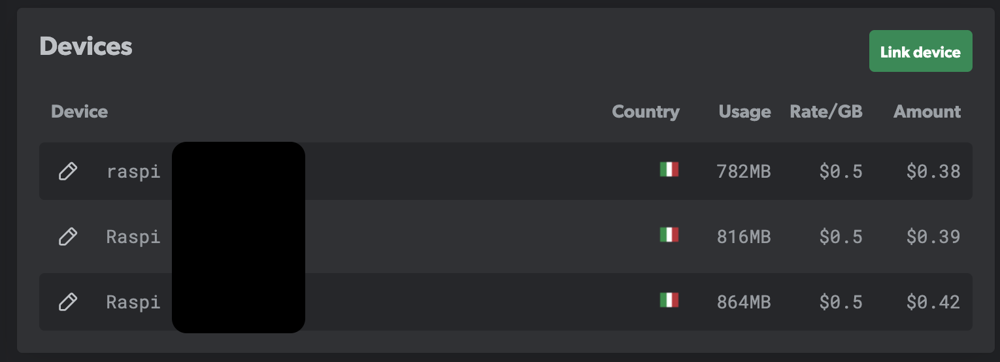
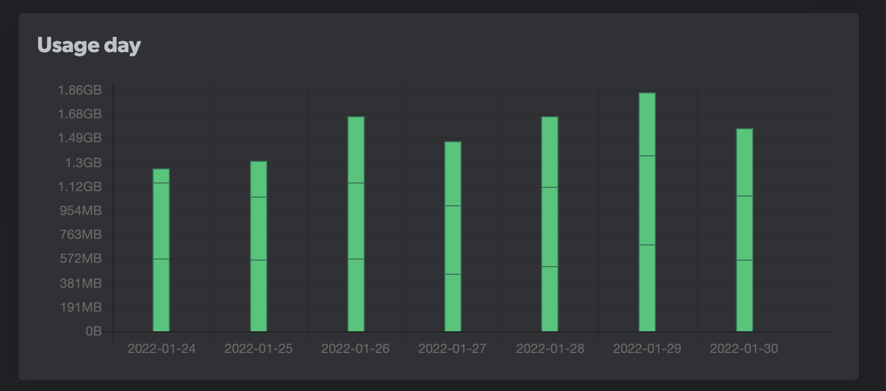

In questo momento della mia vita, in cui sono riuscito (con un po' di fatica) ad ottenere un lavoro che mi piace
e mi permette di stare bene economicamente, ho deciso di dedicarmi a costruire un po' di sorgenti di _passive income_
per permettermi, in futuro, di essere libero finanziariamente.

## Cosa intendo per passive income?

Quando mi sono per la prima volta avvicinato a questo termine pensavo che si intendesse essenzialmente avere la
possibilità di guadagnare soldi senza lavorare, da qui il passive. In realtà le cose sono un po' diverse, e di fatto
e quasi impossibile permettersi di sostentarsi interamente senza fare il minimo sforzo. Però è possibile lavorare
per ottenere sorgenti di guadagno che sono essenzialmente slegate dal tempo che impieghi per metterle su e per mantenerle.

Un esempio di lavoro che ho fatto lo scorso anno, che mi è costato tantissimo a livello di tempo ma che ha iniziato ad avere
un ritorno in questo periodo è stato lo sviluppo di un [Corso di introduzione a NodeJS](https://lacerba.io/node-js-tutorial-italiano)
che ho sviluppato per [Lacerba](https://lacerba.io/).

Ora, il tempo che ho dedicato per progettare e registrare il corso non è stato per niente poco.
Di fatto ci ho dedicato ogni weekend
per circa 5 mesi per completarlo, e vi assicuro che alla fine non avevo veramente più voglio di sentir parlare di corsi
per un po' di tmepo. Questo è anche il motivo per cui da dalla scorsa estate fino a poco prima di Natale ho smesso
di fare contenuti online su Twitch e Youtube. E non è nemmeno vero che una volta fatto il corso mi porterà guadagni a vita,
dato che le cose nel nostro mondo cambiano velocemente e prima o poi diventerà obsoleto. Ma essenzialmente una volta
messo online non ci sto più dedicando troppo tempo (se non 10 min a settimana circa per rispondere ai commenti) e il guadagno
che mi arriva da questo corso è slegato dal tempo che gli ci dedico.

Però qualche giorno fa ho provato (e testato) un servizio che di fatto mi permette di avere un piccolo guadagno dopo averci dedicato
più o meno 10 min di tempo per metterlo su, che di fatto possiamo considerare "avere un guadagno senza fare nulla".

Ovviamente il guadagno è irrisorio (sono circa 5€/settimana dai miei calcoli), ma considerando che posso essenzialemnte lasciarlo
acceso e dimenticarmene avere un guadagno di circa 250€/anno non è una cosa troppo malvagia.

## Passive income con un Raspberry Pi

Se cercate su internet _passive income con raspberry pi_ la maggiorparte degli articoli che vi vengono fuori sono basati sulle
cryptovalute. Non sono mai stato un grandissimo fan delle crypto anche se ultimamente ho iniziato a studiare qualcosa e mi
si è aperto un mondo (tecnologicamente è tutto molto interessante). Il problema è che le crypto e i raspberry pi non vanno molto
d'accordo: infatti, un rapsberry pi è in teoria possibile fare _mining_, cioè "prestare" potenza di calcolo ad un certo protocollo crypto
e avere in cambio un piccolo guadagno nella valuta di riferimento. Peccato che, a meno che non abbiate accesso ad una fonte
di elettricità mooolto economica, di fatto fare mining non convine e a priori, e il raspberry pi, comunque, non avrebbe abbastanza
potenza di calcolo per fare più di qualche euro all'anno (ottimisticamente).

La soluzione che ho trovato però non si basa sulle crypto e non consuma CPU, ma invece si basa sull'idea di condividere
la nostra connessione internet (banda) che non usiamo e di venderla ad aziende terze che defono crawler su internet per ragioni di marketing.

Questa cosa è possibile grazie ad un progetto chiamato **eanrapp**, vediamo di che si tratta e come funziona.

## Earnapp: guadagna condividendo la banda internet che non usi

L'idea di [**ernapp**](https://earnapp.com/i/dlns1ts) è semplice: quasi tutti noi ormai a casa abbiamo una connessione internet ultraveloce che non
sfruttiamo mai a pieno, io ad esempio ho un abbonamento fastweb via fibra ad **1Gb/s** teorici che nel pratico arriva
tranquillamente a **900Mb/s** senza troppi problemi (**800Mb/s** nei giorni così così). Di fatto è impossibile usare tanta banda,
e perchè non possiamo vendere quella che non usiamo?

Quindi come funziona? Semplice, basta installare questa piccola applicaizone, registrarsi e connettere il proprio
dispositivo al nostro account per iniziare a guadagnare. In base alla regione in cui ci troviamo abbiamo delle tariffe
diverse (in italia sono di **0.5$/GB**, anche se da Febbraio questa tariffa scenderà a **0.25$/GB**).

### Si, ma è sicuro? Non è che mi sballa la connessione internet?

Su questo ho indagato un po', anche perchè all'inizio non mi fidavo tantissimo. Earnapp è sviluppata da [Bright Data](https://brightdata.com/),
una società che aiuta i propri clienti a collezionare dati dal web, principalmente per fini di marketing.

I clienti di earnapp sono servizi che si occupano di fare analisi di dati dal web come i tantissimi comparatori di prezzi che
possiamo trovare al momento. Il problema di questi servizi è che fare web scraping in modo sostenuto è difficile
perchè è molto facile che il vostro IP finisca in blacklist (provate a fare un bot che fa scraping su amazon per capire cosa intendo :D).

Utilizzando un grosso pool di IP residenziali dai dispositivi connessi ad earnapp,
è virtualmente impossibile per un servizio distinguere il traffico di uno scraper dal normale traffico di utilizzo degli utenti
di quel servizio, ed questo il valore che earnapp vende ai propri clienti ed il motivo per cui noi veniamo pagati.

### Ma conviene?

Di fatto non si guadagna tanto, ma il vantaggio è che non facendo girare processi CPU internsive, il programma non da minimanete
fastidio e non ci costa quasi nulla in energia elettrica. Dai conti che ho fatto mi permette di ripagarmi quasi interamente
la bolletta di fastweb, e questo non fa malissimo :D

### Ok, cosa mi serve?

Ci server intanto una connessione internet (abbastanza veloce) con IP residenziale, non va bene un IP aziendale (per i motivi spiegati sopra), per questo è
un'ottima soluzione da installare a casa.

Inoltre, possiamo installare earnapp dove vogliamo (anche se sul mac non funziona bene), ma io avendo già a casa dei raspberry
pi accesi per altri motivi (ho un articolo _coming soon_), ho deciso di installarlo li sopra.
Il vantaggio è che i raspberry pi possiamo lasciarli accessi e farci altro (un serverino web, una VPN, installarci sopra kubernetes, ecc. ecc.)
e come detto prima earnapp non da minimanete fastidio a livello di CPU o altro.

### Capito! Cosa devo fare?

Per prima cosa è necessario iscriversi al servizio. Potete farlo dal link di referral che trovate qui sotto.
Iscrivendomi dal link di referral mi fate un favorone in quanto earnapp mi darà anche parte del guadagno che fa
grazie al vostro dispositivo (senza togliere nulla a voi). Se non volete iscrivervi dal link di referrale vi lascio
anche quello normale!

- [😍 Earnapp Link Referral](https://earnapp.com/i/dlns1ts)
- [😭 Earnapp Link Non Referral](https://earnapp.com)

Fatto questo possiamo iniziare a configurare i nostri dispositivi.

### Come installare earnapp sul vostro Raspberry PI

L'installazione di earnapp è facilissima, una volta creato un account ed essere entrati nella dashboard.

A questo punto, all'interno del terminale del vostro Raspberry Pi, basta eseguire questo comando:

```bash
wget -qO- https://brightdata.com/static/earnapp/install.sh > /tmp/earnapp.sh && sudo bash /tmp/earnapp.sh
```

Il terminale vi chiederà di accettare i _terms and conditions_ di earnapp prima di proseguire, e una volta digitato yes avrete
il servizio earnapp in funzione.

```
Installing EarnApp CLI
Welcome to EarnApp for Linux and Raspberry Pi.
EarnApp makes you money by sharing your spare bandwidth.
You will need your EarnApp account username/password.
Visit earnapp.com to sign up if you don't have an account yet

To use EarnApp, allow BrightData to occasionally access websites through your device. BrightData will only access public Internet web pages, not slow down your device or Internet and never access personal information, except IP address - see privacy policy and full terms of service on earnapp.com.
Do you agree to EarnApp's terms? (Write 'yes' to continue): Do you agree to EarnApp's terms? (Write 'yes' to continue): yes
Installing...
System directory already exists
Fetching armv7
--2022-01-30 18:58:44--  https://brightdata.com/static/earnapp/armv7
Resolving brightdata.com (brightdata.com)... 3.92.97.199, 3.90.158.189
Connecting to brightdata.com (brightdata.com)|3.92.97.199|:443... connected.
HTTP request sent, awaiting response... 302 Found
Location: /static/earnapp/armv7?md5=70618761-a6f4642a [following]
--2022-01-30 18:58:44--  https://brightdata.com/static/earnapp/armv7?md5=70618761-a6f4642a
Reusing existing connection to brightdata.com:443.
HTTP request sent, awaiting response... 200 OK
Length: 70618761 (67M) [application/octet-stream]
Saving to: ‘/tmp/earnapp’

/tmp/earnapp                         100%[====================================================================>]  67.35M  1.82MB/s    in 24s

2022-01-30 18:59:09 (2.78 MB/s) - ‘/tmp/earnapp’ saved [70618761/70618761]

65b74656fbf9dc481be9f06576d9c715  /tmp/earnapp
running /tmp/earnapp install
✔ Moving /tmp/earnapp to /usr/bin
✔ Service earnapp enabled
✔ Service earnapp_upgrader enabled
✔ EarnApp is installed and running.
✔ IP detected
✔ EarnApp is active (making money in the background)

See usage options by running earnapp

⚠ You must register it for earnings to be added to your account.
⚠ Open the following URL in the browser:
  https://earnapp.com/r/sdk-node-xxxxx
```

Alla fine, verrà stampato un link alla dashboard di earnapp
per linkare il dispositivo.

Aprite il link da un browser quasiasi, loggatevi a earnapp con il vostro account e vedrete il nuovo
dispositivo tra la lista dei devices



Potete anche dargli un nome, come ho fatto io, se ne volete configurare più di uno.

### Quanti dispositivi conviene avere?

Earnapp consiglia di avere uno o massimo due dispositivi per abitazione (indirizzo IP). Dato che
loro vendono di fatto il vostro indirizzo IP, avere tanti dispositivi connessi allo stesso indirizzo
non vi permette di scalare i guadagni. Uno è ok, due vi permette in media di guadagnare un po' di più (ma non il doppio),
oltre i due non avete nessuna convenienza. Ovvio che se avete accesso a più abitazioni potete configurare
più di spositivi mettendoli in abitazione diverse. Come ho fatto io.

In particolare io ho configurato 3 rapsberry pi, due sono nella mia casa (ed arano già accesi per altro), mentre il
terzo l'ho messo nell'abitazione di una mia parente!

### Quanto ho guadagnato?

In una settimana esatta ho ottenuto **6,23$**, cioè circa **5,59€**, di questi, i primi **5$** mi sono già stati
accreditati tramite paypal!

Ecco le mie statiche della prima settimana di utilizzo.



### Conclusioni

Non diventerò ricco con questa soluzione ma sicuramente
mi permette di guadagnare qualche soldi che posso reinvestire
in altri miei progetti personali. Sicuramente sono
soddisfatto di questo servizio e in futuro troverò altre
piccole sorgenti di guadagno, con l'idea che, negli anni, a fuoria di
accumulare sorgenti di guadagno, possa permettermi il lusso di lavorare
perchè voglio farlo e non perchè devo farlo, e raggiungere l'indipendenza finanziaria!

PS: Se volete leggere un libro su come essere indipendenti finanziariamente, vi songilio
[Padre Ricco, Padre Povero](https://amzn.to/3qhfkvm), di cui ho parlato in questo [blog post](/2022/01/migliori-libri-2021)
