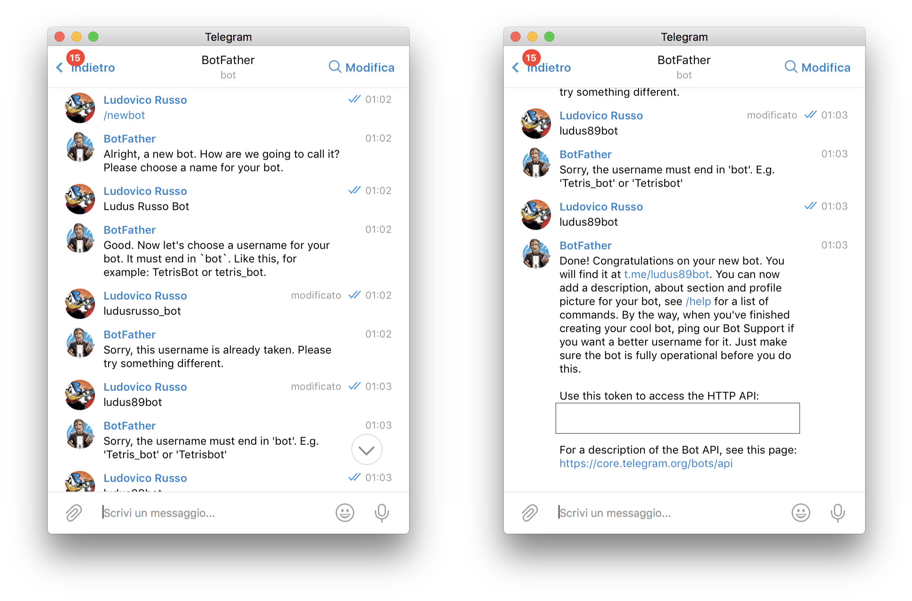
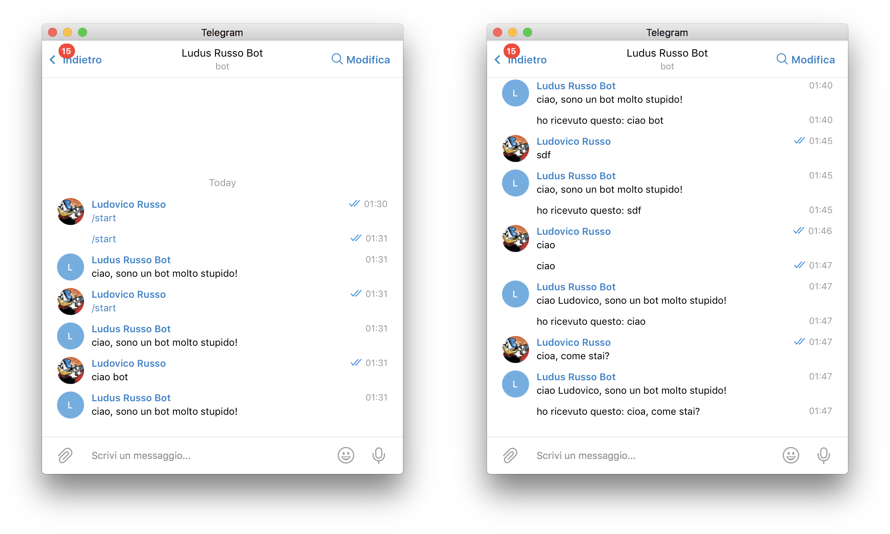

Uno degli articoli ancora più cliccati di questo sito, scritto ormai nel lontano 2017 è
[Implementiamo un bot Telegram con Python](https://www.ludusrusso.dev/2017/04/27/implementiamo-un-bot-telegram-con-python).

Per un bel periodo di tempo mi sono divertito a creare bot telegram per lavoro e per diletto,
poi i miei interessi si sono allontanati dal mondo Python e mi sono avvicinato sempre
di più almeno dello sviluppo web e cloud.

Nel frattempo varie cose sono cambiate, la libreria Python Telepot a quanto pare [non è più
mantenuta](https://github.com/nickoala/telepot) dal creatore, ed alcune cose del mio post
sono diventate obsolete.

In questi giorni, per lavoro, ho dovuto sviluppare un nuovo telegram bot, e
mi è sembrata l'occasione perfetta per riaggiornare il mio vecchio post e scriverne una nuova serie
su NodeJS. Questo è il primo blog post di una serie che ho in mente di scrivere sempre legato al
tema telegram e Node.JS. Sarà un articolo introduttivo alla fine del quale dovremmo essere
in grado di far funzionare il nostro bot in locale.

### La libreria `telegraf`

Come sempre, esistono svariati modi e soluzioni per creare un bot telegram in NodeJS. La libreria più
usata (almeno da quello che mi risulta, ma non ho indagato a fondo) è [`telegraf`](https://github.com/telegraf/telegraf).
Questa libreria è molto semplice da usare ed è quella che attualmente sto usando per creare i miei progetti.
La cosa che mi piace di più è che è una libreria TypeScript e quindi integra
i tipi.

### Creiamo il nostro bot Telegram

Per creare un bot in telegram, possiamo sfruttare il bot Telegram (scusate il gioco di parole) @BotFather,
a cui si può accedere cercando semplicemente @BotFather tra le chat telegram.

Una volta connessi al bot, ci basterà scrivere il comando `/newbot` e seguire le sue istruzioni per avere a disposizione il
nostro bot. In particolare, dovremmo fornire al bot le seguenti informazioni:

- Nome del bot
- username (che deve essere unico e finire con la parola "bot")

Una volta completata la procedura, il avremmo a disposizione un nostro
TOKEN univoco (attenzione, non pubblicatelo altrimenti chiunque potrà usarlo) da utilizzare per sviluppare il nostro programma.



### Setup ambiente di sviluppo

Partiamo col creare un nuovo progetto nodejs:

1. Creiamo una nuova cartella nella nostra area di lavoro ed inizializziamo nodejs e typescript:

```bash
$ mkdir ludusrusso-bot && cd ludusrusso-bot
$ npm init -y
$ tsc --init
```

2. Installiamo la libreria `telegraf`

```bash
$ npm i telegraf
```

3. Installiamo `ts-node-dev` per poter lavorare sul nostro progetto con l'autorefresh

```bash
$ npm i -D ts-node-dev
```

4. Creiamo un file `src/main.ts` dove lanciare il nostro bot con il seguente contenuto:

```ts
import { Telegraf } from "telegraf";

const bot = new Telegraf("<INSERITE IL VOSTRO TOKE QUI>");

bot.on("message", (ctx) => {
  ctx.reply("Ciao, sono un bot molto stupido!");
});

bot.launch();
```

5. Prepariamo lo script per lanciare il bot. All'interno della sezione script dentro il file `package.json`
   aggiungiamo il seguente codice:

```json
"scripts": {
  "start": "ts-node-dev src/main.ts"
}
```

6. Lanciamo il programma con

```bash
$ npm run start
```

E a questo punto dovremmo essere in grado di interagire con il nostro bot.

> Per spegnere il nostro bot dobbiamo semplicemente premere i tasti `ctrl + c`.

### Analizziamo il codice

Come vedete il codice è molto semplice da gestire. Le prime due righe importano la libreria `telegraf`
e crea un oggetto `bot` che rappresenta il nostro bot.

```ts
import { Telegraf } from "telegraf";

const bot = new Telegraf("<INSERITE IL VOSTRO TOKE QUI>");
```

Al bot dobbiamo semplicemente passare il TOKEN che ci ha fornito il botfather per farlo funzionare.

A questo punto possiamo registrare le nostre callback per interagire con il robot.
Questo si fa con la funzione `bot.on()` che prende in ingress due parametri. Il
primo è il tipo di evento a cui il bot deve rispondere, noi metteremo `text` per
fare in modo che il bot risponda solo ai messaggi di tipo testuali che gli arrivano.

Il secondo è la funzione di callback da chiamare ogni volta che il bot riceve un messaggio.

```ts
bot.on("text", (ctx) => {
  ctx.reply("Ciao, sono un bot molto stupido!");
});
```

Alla funzione di callback viene fornito il parametro `ctx` che contiene alcune informazioni utili sul messaggi (sender, contenuto, ecceta)
nonchè delle funzioni utili per rispondere al messaggio. In particolare noi usiamo la funzione `ctx.reply()` per rispondere direttamente
alla chat del messaggio in questione.

Per finire, lanciamo il bot con il comando `bot.launch()`, che metterà li bot in ascolto ad ogni nuovo messaggio che riceve.

### Leggere il messaggio e le informazioni dell'utente!

A questo punto abbiamo un bot molto semplice, ma possiamo usare l'oggetto `ctx` per avere informazioni ulteriori
sul messaggio, come il nome dell'utente che l'ha inviato o il suo contenuto. Aggiorniamo la funzione di callback
in modo da usare queste informazioni.

```ts
bot.on("text", (ctx) => {
  const msg = ctx.message;
  ctx.reply(`Ciao ${msg.from.first_name}, sono un bot molto stupido!`);
  ctx.reply(`Ho ricevuto questo: ${msg.text}!`);
});
```

In questo modo estrapoliamo delle informazioni dal contenuto del messaggio che arriva al bot, come il nome dell'utente (`msg.from.first_name`)
e il contenuto del messaggio `msg.text`, e li usiamo per dare un po' più di _intelligenze_ al nostro bot.



### Consa abbiamo imparato

In questa guida abbiamo visto come creare un bot con telegram e come interagire con esso. In particolare:

1. Come creare un bot telegram personale con `@botfather`.
2. Come usare la libreria `telegraf` in npm per creare bot.
3. Come leggere le informazioni del messagio per interagire con gli utenti.

Se vi interessa questo tema fatemelo sapere nei commenti!

Intanto vi lascio qui il codice completo se lo volete provare:

```ts
import { Telegraf } from "telegraf";

const bot = new Telegraf("<INSERITE IL VOSTRO TOKE QUI>");

bot.on("text", (ctx) => {
  const msg = ctx.message;
  ctx.reply(`Ciao ${msg.from.first_name}, sono un bot molto stupido!`);
  ctx.reply(`Ho ricevuto questo: ${msg.text}!`);
  console.log(msg);
});

bot.launch();
```
