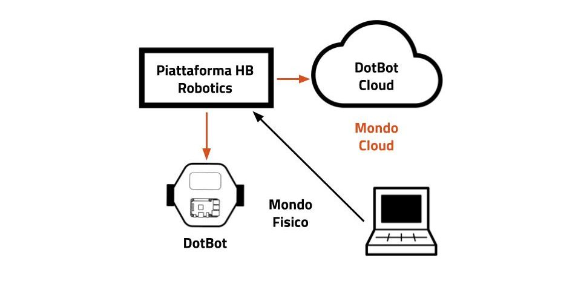
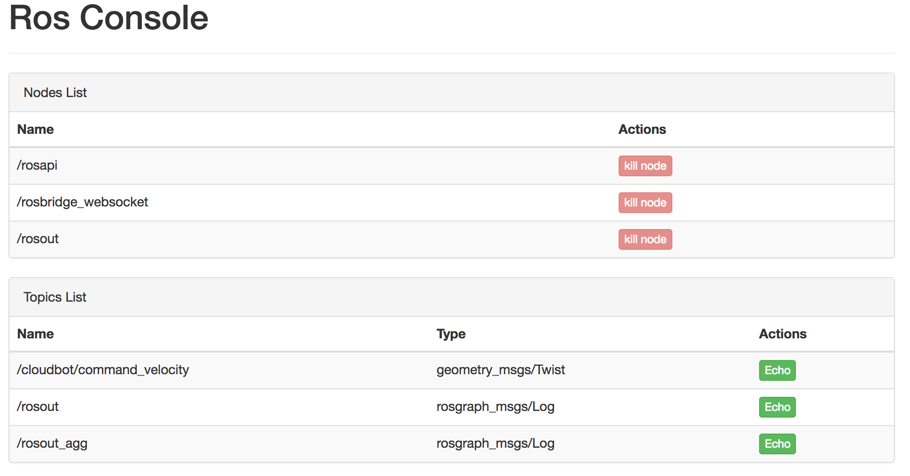

Molti di voi vorrebbero iniziare subito a programmare in ROS tramite la piattaforma cloud ma sono bloccati (purtroppo) da rognosi problemi hardware. Probabilmente la scheda motori non funziona correttamente o state aspettando ancora il Raspberry Pi o un componente da qualche fornitore.

Perchè quindi non saltate questo passaggio e iniziate a programmare subito in ROS con un robot remotizzato in cloud? Cosa significa esattamente lo affronteremo in questo post. In pratica potete iniziare ad usare la piattaforma soltanto con il vostro pc e una qualsiasi connessione internet (senza Raspberry Pi e altri dispositivi)! E... tutto ciò che abbiamo visto su come configurare una rete per Dotbot? Beh, ora abbiamo accesso ad un Dotbot in cloud!

In pratica tutto quello che avete visto funzionare su Dotbot è da oggi disponibile in piattaforma cloud e accessibile tramite browser. Vi spiego com'è possibile, sul Raspberry Pi di Dotbot c'è una versione di Linux con installato ROS che è configurato per collegarsi alla nostra piattaforma cloud. Quello che abbiamo fatto è prendere un computer Linux accessibile da Internet ed installarci sopra tutto il software che solitamente installiamo su Dotbot. Per i più tecnici in pratica abbiamo comprato un'istanza cloud da Amazon Web Services ed installato l'immagine Dotbot esattamente come facciamo su Raspberry, questa si che è cloud robotics!



Lo schema sopra riassume questi concetti e vi mostra come i due mondi si interfacciano tramite la piattaforma. La cosa che più mi affascina della filosofia cloud è che si confonde la differenza tra mondo "fisico", ovvero ciò che possiamo "toccare", con quello cloud. Infatti a qualcuno verrebbe da pensare che in sostanza abbiamo creato soltanto un sofisticato simulatore.. no, niente di più sbagliato! Il robot in cloud, DotbotCloud, esiste davvero ed è esattamente come Dotbot. L'unica differenza è che il computer Linux di DotbotCloud è una macchina virtuale remotizzata da Amazon e nessuno con certezza può sapere fisicamente dove si trovi. Inoltre ovviamente non può avere nessun tipo di interazione con il mondo fisico. In pratica è come se DotbotCloud vivesse in un mondo parallelo. Quello che possiamo fare è usarlo come fosse un robot normale per poi riportare il nostro software su un robot "concreto" e il funzionamento sarà lo stesso! Vediamo subito cosa ci possiamo fare.

## Primi passi con Dotbot in cloud

Entriamo in piattaforma (effettuando il login) e cerchiamo il robot in cloud con il tasto "cerca robot". Nel mio caso ho un indirizzo ip così _54.191.14.121:8080_(**contattatemi per ottenere la vostra istanza** ) .


Ora andiamo nella "ROS console" e vediamo cosa succede. Notiamo subito che ci sono i nodi attivi di "default" nella sezione "Node List" ( `/rosapi, /rosbridge_websocket, /rosout`) e "Topic List" (`/rosout` e `/rosout_agg` )


Poi se apriamo la Web App in un altro tab [http://hotblackrobotics.github.io/cloud/webgui/turtle](http://hotblackrobotics.github.io/cloud/webgui/turtle) ritornando su "ROS Console" un nuovo topic nella sezione "Topic List" apparirà (command_velocity).



Ovviamente non potendo "vedere" un robot in cloud abbiamo implementato una Web App, ereditata da ROS che si chiama Turtlesim, per visualizzare i movimenti del robot in tempo reale. Il robot prende la forma di una tartaruga su uno sfondo blu.


Scriviamo allora un semplice nodo ROS per far muovere il robot! Usiamo il topic di cui vi accennavo in precedenza `command_velocity` pubblicando le posizioni geometriche per fargli percorrere un percorso a spirale.

```
import dotbot_ros
import sys
import os
from geometry_msgs.msg import Twist
import math
import rospy

class Node(dotbot_ros.DotbotNode):
    node_name = 'cloud_robot_pub'

    def setup(self):
        self.loop_rate = dotbot_ros.Rate(10)
        self.pub_position = dotbot_ros.Publisher('command_velocity', Twist)
        self.msg = Twist()
        self.count = 0.0

    def loop(self):
            print 'Spirale' , self.count
            self.msg.linear.x =  self.count
            self.msg.angular.z = 5
            self.pub_position.publish(self.msg)
            self.count = self.count + 1
            sys.stdout.flush()
            if self.count > 500:
                print 'DONE' , self.count
                rospy.signal_shutdown("fine")
```

Il codice è sostanzialmente un publisher del messaggio `Twist` sul topic `'command_velocity'`. Il messaggio Twist è un messaggio standard di ROS (da geometry_msgs) che può risultare all'inizio difficile da comprendere. In realtà noi siamo interessati a solo due parametri `msg.linear.x`, che fa avanzare il robot se positivo, e `msg.angular.z` che lo fa girare in verso antiorario se positivo. Vi chiederete perchè "z"? E' soltanto una convenzione, in ROS il messaggio Twist per chi fosse interessato è composto così

```
Vector3  linear
Vector3  angular
```

dove _linear_ e _angular_ sono lo spostamento e la rotazione sui relativi assi x,y,z. L' asse z esce dal piano del computer (in questa visualizzazione), x va da destra a sinistra e y dall'alto in basso.

```
float64 x
float64 y
float64 z
```

In realtà tutte queste convenzioni non sono così importanti nella nostra applicazione perchè tanto operiamo solo sui parametri "avanti" e "gira". Facciamo partire il programma e il robot (visualizzato come tartaruga) inizierà a muoversi!

Il robot in cloud è on-line in piattaforma e se volete provarlo non esitate a contattarci a **info@hotblackrobotics** oppure scrivete direttamente a me **ermacora.gabriele@gmail.com**! Mi farebbe moltissimo piacere sentirci su Skype per spiegarvi i primi passi con la cloud robotics e sentire le vostre opinioni a riguardo il mio id è gabriele.ermacora86 (ho visto che molti hanno problemi nella fase iniziale).
Per le istanze però dovete sapere che purtroppo paghiamo un abbonamento cloud su Amazon e dobbiamo chiedervi di pagare una fee di iscrizione di **2 Euro** (da cui in realtà non facciamo lucro ma è solo per rientrare un minimo nelle spese).

Buona cloud robotics! ;)
