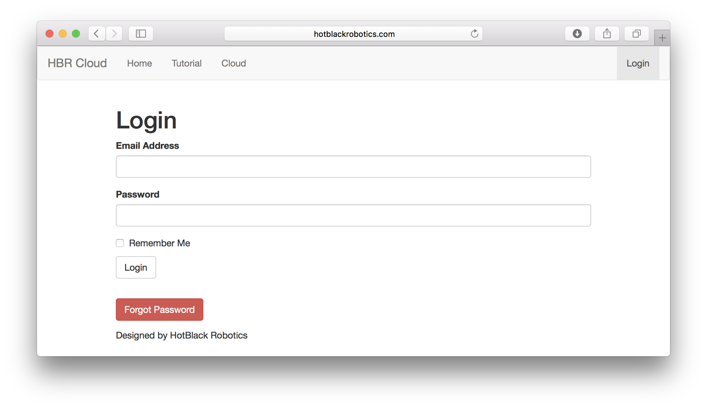
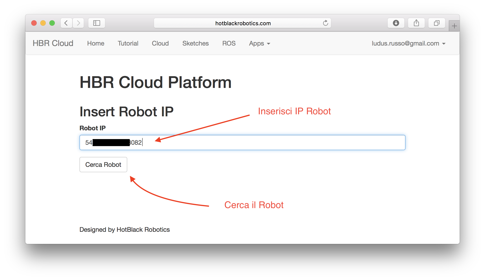
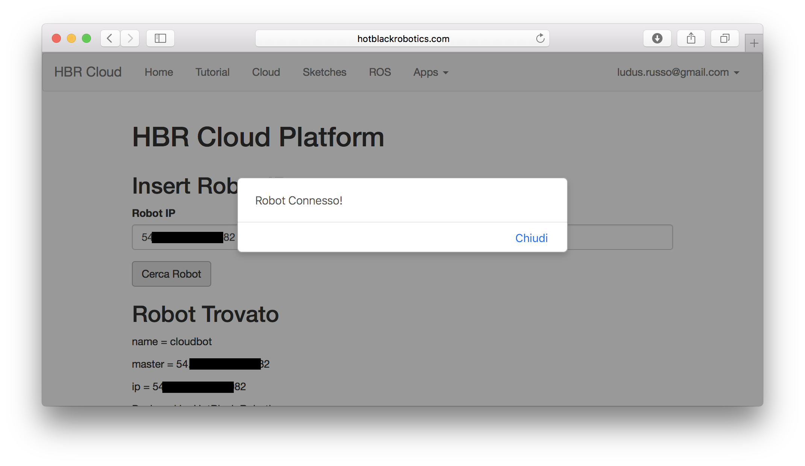
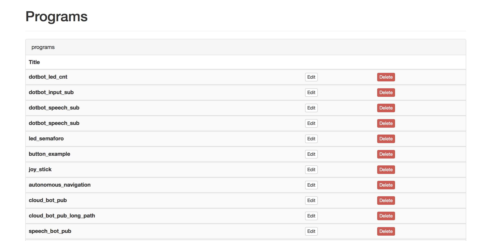
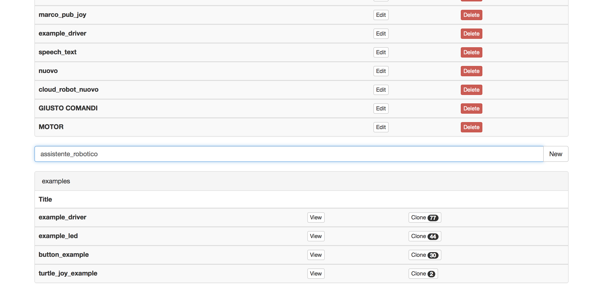
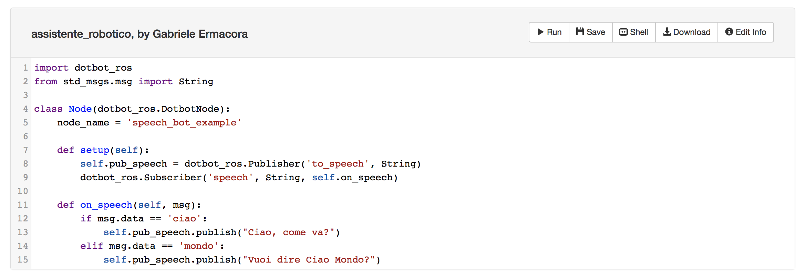
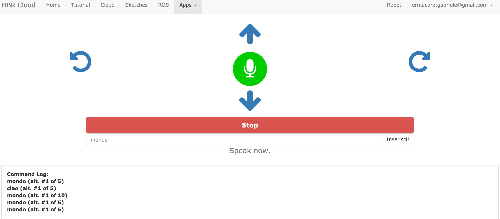

Ciao a tutti, iniziamo con questo post una serie di tutorial più completi per lo sviluppo di semplici applicazioni Robotiche. In particolare, in questo tutorial vedremo come sfruttare la nostra piattaforma per sviluppare un'applicazione che permetta di inviare comandi al robot tremite voce e ricevedere informazioni vocali dal robot stesso.

## Cosa serve?

Per sviluppare questo progetto, vi servirà essere iscritti alla nostra piattaforma ed avere a disposizione un robot [reale](http://hotblackrobotics.github.io/blog/posts/2017-02-08-dotbot-tutorial-hardware) o [virtuale (tramite la cloud)](http://hotblackrobotics.github.io/blog/posts/2017-02-03-avete-problemi-hardware-ce-il-robot-in-cloud-accessibile-da-remoto-tramite-il-vostro-pc-o).

In questo tutorial, per semplicità, useremo un robot virtuale ma ovviamente si può benissimo utilizzare il robot reale!

Se volete utilizzare un robot virtuale scriveteci a info@hotblackrobotics.com!

## Iniziamo: accediamo alla piattaforma e colleghiamoci al Robot

Accediamo al sito [hotblackrobotics.github.io](http://hotblackrobotics.github.io) ed effettuiamo il Login


Effettuiamo il Login con le nostre credenziali


Accediamo alla piattaforma premendo sul tab _cloud_


A questo punto, possiamo collegarci al robot.. Insieriamo il nome o l'indirizzo IP del robot e connettiamoci.



Una volta cliccato "Cerca Robot", se tutto va bene, otterremo il seguente messaggio!



## Creiamo il nostro programma

Una volta connesso il robot, siamo pronti ad iniziare a sviluppare il programma! A questo punto andiamo sul tab _sketches_.



Creiamo un nuovo programma chiamato "assistente robotico" e successivamente premiamo il bottone "new".



Apriamo il file con il tasto "edit" e scriviamo il seguente programma.

```python
import dotbot_ros
from std_msgs.msg import String

class Node(dotbot_ros.DotbotNode):
    node_name = 'speech_bot_example'

    def setup(self):
        self.pub_speech = dotbot_ros.Publisher('to_speech', String)
        dotbot_ros.Subscriber('speech', String, self.on_speech)

    def on_speech(self, msg):
        if msg.data == 'ciao':
            self.pub_speech.publish("Ciao, come va?")
        elif msg.data == 'mondo':
            self.pub_speech.publish("Vuoi dire Ciao Mondo?")
```



Nel programma stiamo definendo un _Publisher_ di nome `pub_speech` che pubblica sul topic `to_speech` e invia un messaggio di tipo "String" ed un _Subscriber_ che richiama la call back `on_speech` chiamata ogni volta che sul topic `speech` arriva un messaggio di tipo "String". Ora aprendo la Web App "Speech Rec" e abbilitando il microfono del vostro computer, tramite il tasto centrale, quando pronuncicamo la parola "ciao" il robot ci risponderà "Ciao, come va?" e pronunciando "mondo" il robot risponderà "Vuoi dire ciao mondo?".

NB: ovviamente dovrete inserire nella casella "inserisci" le parole "ciao" e "mondo" altrimenti il robot non riconoscerà le parole!



Provate ad inserire altre parole e personalizzate il vostro assistente robotico!
