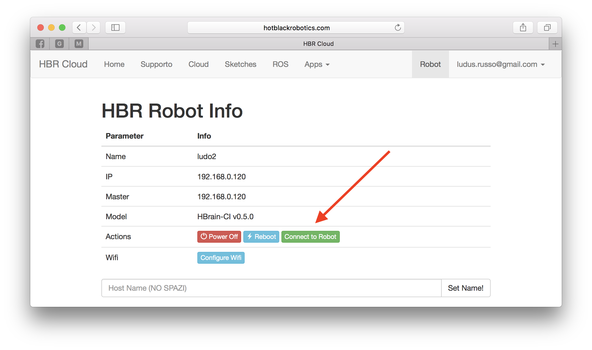
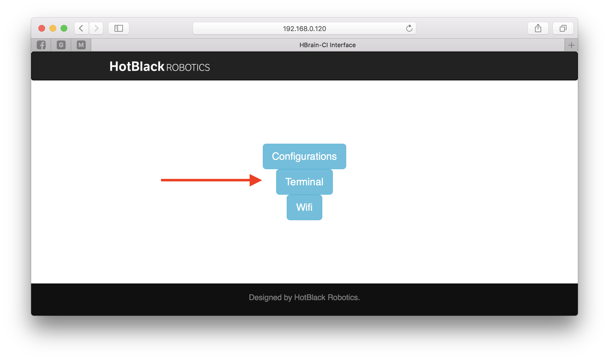
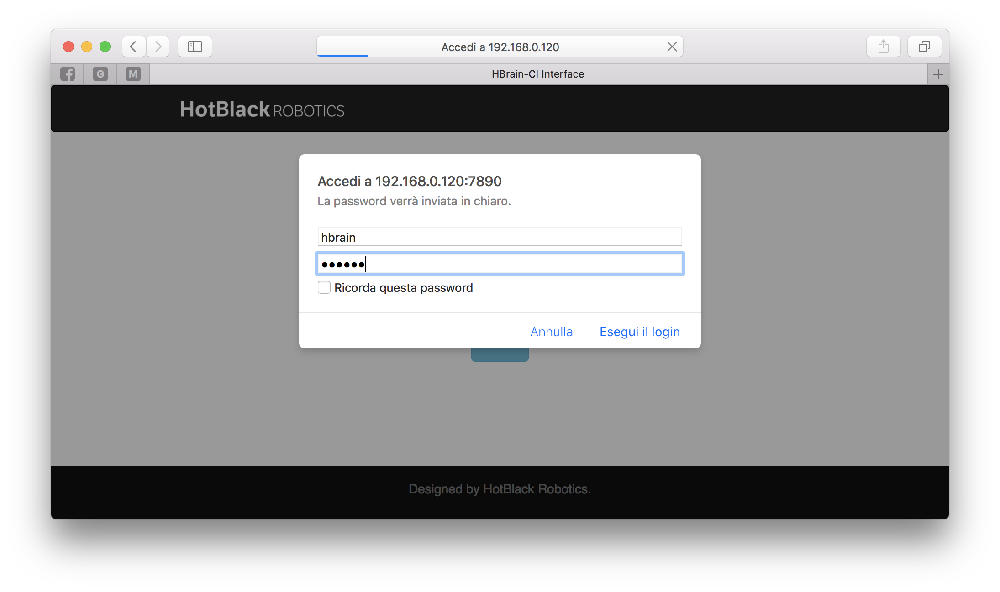
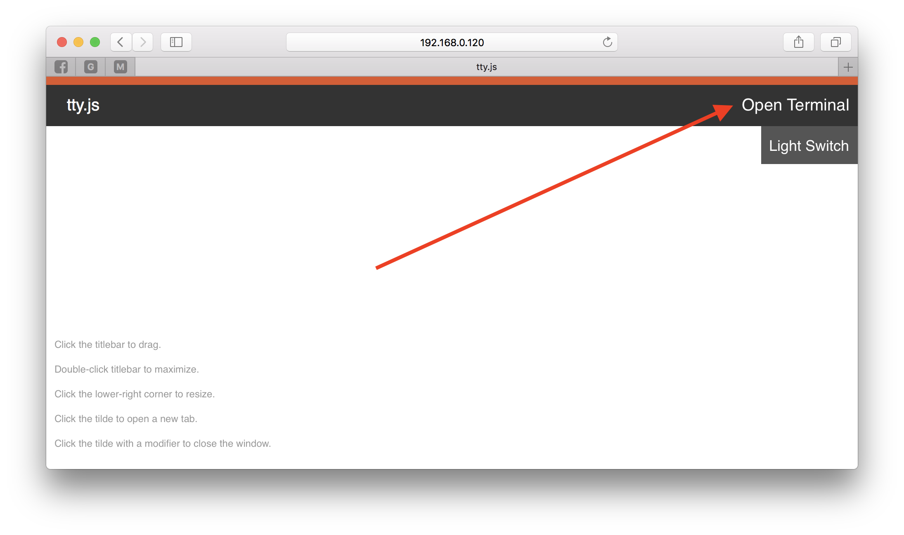
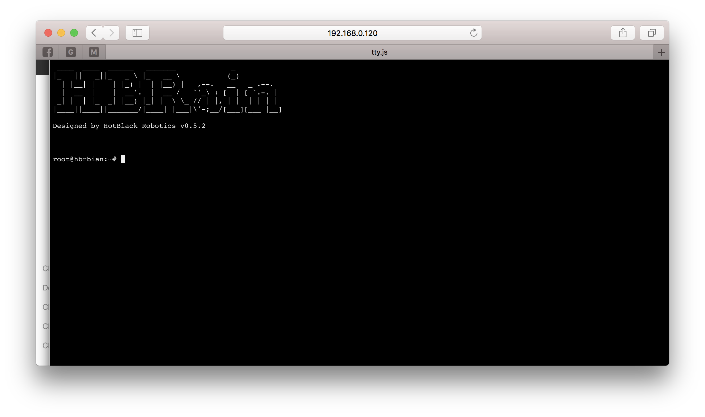

Dalla versione 0.5.2, come annunciato, è disponibile una nuova funzione che permette agli utenti di accedere al terminale linux di HBrain direttamente da browser, vediamo come fare.

Per prima cosa, è necessario scaricare l'ultima versione di HBrain (o una versione superiore o uguale alla 0.5.2) ed installarla sul raspberry seguendo [questo tutorial](http://hotblackrobotics.github.io/blog/posts/2017-03-24-immagine-sd-per-la-cloud-e-configurazione).

Una volta fatto, accediamo alla pagina di [HBR Cloud](http://hotblackrobotics.github.io/cloud/index) e connettiamoci al Robot.

A questo punto, accediamo al tab _Robot_ in alto a sinistra e quindi accediamo al server interno del robot premendo il tasto **Connetti al Robot**.

Premiamo quindi sul pulsante al centro **Terminal**.

Inseriamo Nome utente (_hbrain_) e password (_dotbot_).

Premiamo il pulsante _Open Terminal_

E quindi potremmo accedere al terminale shell linux di HBrain.

