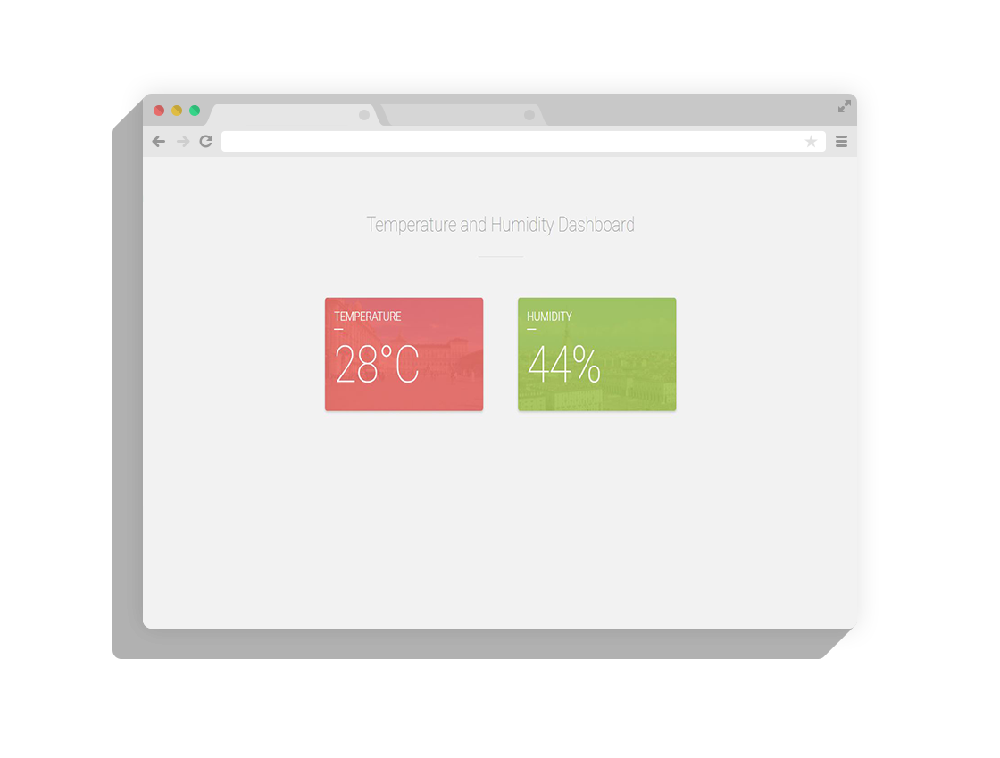
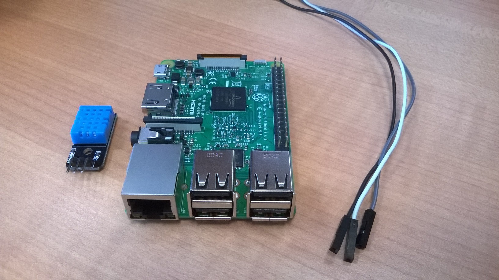
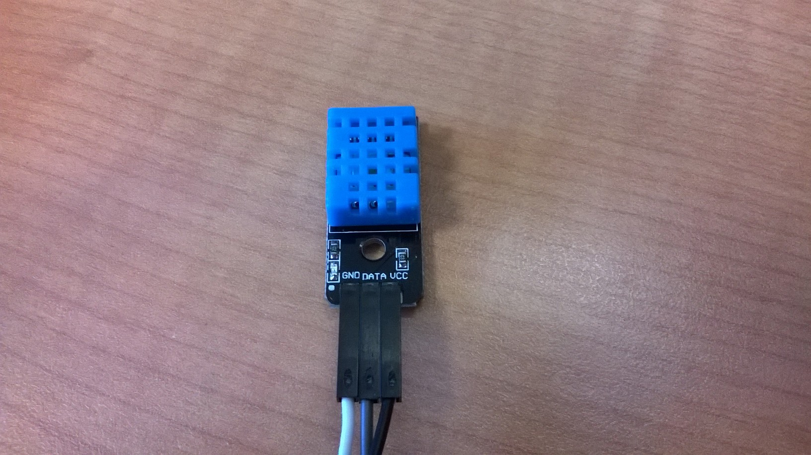
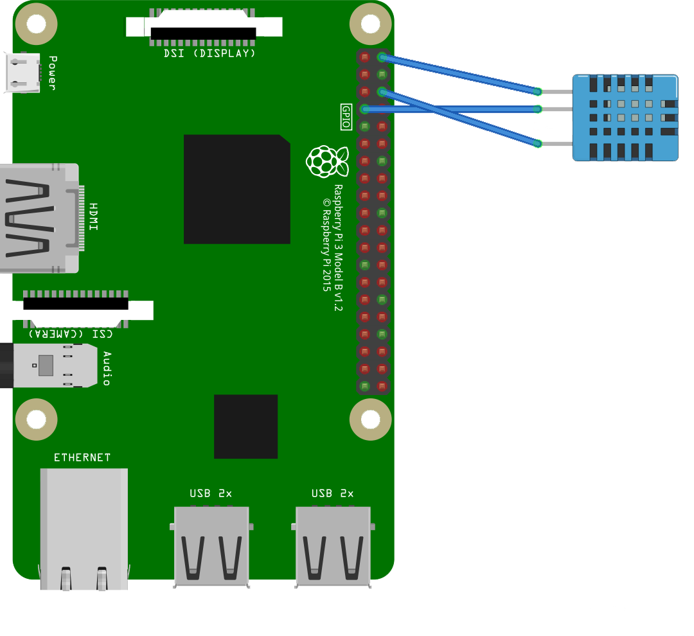
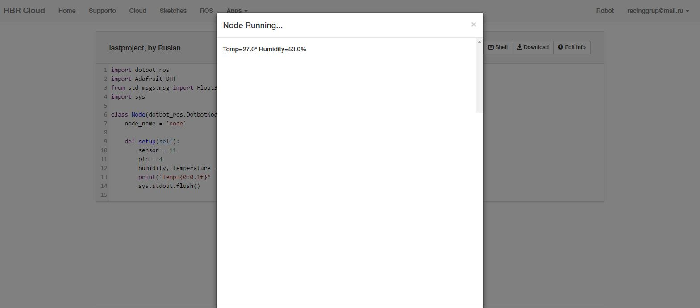

In questo tutorial vedremo:

- come collegare un sensore DHT11 (temperatura e umidità) sul Raspberry Pi 3
- come sviluppare lo sketch in ROS per pubblicare dati sulla
  WebApp - Python
- sviluppare la WebApp - Html/Javascript

## Di cosa abbiamo bisogno

1.  Un Raspberry Pi 3 oppure un Pi 2
2.  Tre cavi GPIO femmina/femmina
3.  Un sensore DHT11



## Collegamenti

Come prima cosa prendete il Raspberry Pi 3 e accendetelo collegandola alla corrente. Una volta collegato in cloud, colleghiamo il sensore.



Il sensore DHT11 è un sensore di temperatura e umiditàe composta da 3 Pin: G (GND) – V (VCC) – D (Data)

In questa figura potete vedere come collegare i PIN del sensore sul Raspberry



Ora che abbiamo connesso il sensore , procediamo con l'installazione delle librerie necessarie.
Per installare le librerie dobbiamo usare un programma client SSH (Per esempio: Putty oppure la shell sul browser).

**Eseguiamo questi commandi:**
Installa alcune dipendenze sul Raspberry:

```bash
    sudo apt-get update
    sudo apt-get install build-essential python-dev python-openssl
```

Usare Git per clonare il software direttamente sul Raspberry utilizzando il terminale:

```bash
    git clone https://github.com/adafruit/Adafruit_Python_DHT.git
    cd Adafruit_Python_DHT
```

Ora, per installare la libreria eseguire:

```bash
      sudo python setup.py install
```

## Sketch ROS

Scriviamo ora un semplice sketch in ROS che ci stampa la temperatura e l'umidità.
Importiamo ora le librerie:

```python
    import dotbot_ros #libreria di default ROS
    import Adafruit_DHT #libreria per il funzionamento del sensore
    import sys #libreria per forzare la stampa sulla shell
```

**Codice Completo**

```python
    import dotbot_ros
    import Adafruit_DHT
    import sys

    class Node(dotbot_ros.DotbotNode):
        node_name = 'node'

        def setup(self):
            sensor = 11
            pin = 4
            humidity, temperature = Adafruit_DHT.read_retry(sensor, pin)
            print('Temp={0:0.1f}*  Humidity={1:0.1f}%'.format(temperature, humidity))
            sys.stdout.flush()
```

## Analizziamo il codice:

Nella funzione **setup** abbiamo la dichiarazione delle variabili sensor e pin.
_Sensor_ è il tipo di sensore utilizzato , nel nostro caso è 11 (DHT11).
_Pin_ è in numero del pin GPIO sul quale è collegata l'uscita _DATA_ del sensore.

Una volta che le variabili sono state inizializzate , viene lanciata queste funzione che si occupa di leggere i dati ricevuti dal sensore.

```python
    humidity, temperature = Adafruit_DHT.read_retry(sensor, pin)
```

Successivamente per visualizzare la temperatura e l'umidità , stampiamo questi dati.

```python
    print('Temp={0:0.1f}*  Humidity={1:0.1f}%'.format(temperature, humidity))
    sys.stdout.flush()
```

**Lanciamo il codice:**
Se tutto è andato a buon fine, dobbiamo visualizzare questo output:


Webapp per ricevere i dati dal sensore.
Come prima cosa andiamo a sviluppare l'applicazione web , il codice completo lo trovate [qui](https://github.com/ganduras/dht11/blob/master/index.html).

**Analizziamo il codice HTML:**
All'interno abbiamo la prima parte del codice , scritto in JavaScript che permette alla WebApp di comunicare con il nostro robottino (riga 136).

```html
<script type="text/javascript">
  start_ros(
    "192.168.0.108",
    "cyberbot",
    "192.168.0.108",
    "192.168.0.108/bridge/"
  );
</script>
```

IMPORTANTE: ricordate di modificare i campi '192.168.0.108' e 'cyberbot' inserendo l'IP e il nome del robot.

La seconda parte di questo file JavaScript si occupa di sottoscriversi al topic "temperature_status" e ricevere la temperatura espressa in Float32 (riga 140).

```html
<script>
  var listener = new ROSLIB.Topic({
    ros: ros,
    name: "/" + robot.name + "/temperature_status",
    messageType: "std_msgs/Float32",
  });
  listener.subscribe(function temperatura(message) {
    document.getElementsByClassName("data")[0].innerHTML = message.data + "°C";
  });
</script>
```

La terza parte del codice JavaScript , si sottoscrive al topic "humidity_status" , riceve un messaggio di tipo Float32, e lo stampa sulla pagina HTML (riga 155).

```html
<script>
  var listener = new ROSLIB.Topic({
    ros: ros,
    name: "/" + robot.name + "/humidity_status",
    messageType: "std_msgs/Float32",
  });
  listener.subscribe(function umidita(message) {
    document.getElementsByClassName("data")[1].innerHTML = message.data + "%";
  });
</script>
```

## Sketch ROS:

Importiamo le librerie

```python
    import dotbot_ros #libreria ROS
    import Adafruit_DHT #libreria necessaria per il funzionamento del sensore
    from std_msgs.msg import Float32 #serve per pubblicare dati di tipo Float32 sul topic
```

Nella funzione principale **setup** , inizializziamo il sensore e il pin , ed creiamo 2 Publisher.

```python
    self.sensor = 11
            self.pin = 4
            self.loop_rate = dotbot_ros.Rate(5)
            self.umedita = dotbot_ros.Publisher('humidity_status', Float32)
            self.temperatura = dotbot_ros.Publisher('temperature_status', Float32)
```

Oltre a ciò la funzione setup, chiama la funzione loop passandole la frequenza di esecuzione _dotbot_ros.Rate(5)_.

```python
    def loop(self):
            humidity, temperature = Adafruit_DHT.read_retry(self.sensor, self.pin)
            self.umedita.publish(humidity)
            self.temperatura.publish(temperature)
```

La funzione loop riceve i dati dai sensori e successivamente li pubblica sui Topic.

## Codice Completo:

Ecco il codice completo del nostro programma:

```python
      import dotbot_ros
        import Adafruit_DHT
        from std_msgs.msg import Float32

        class Node(dotbot_ros.DotbotNode):
            node_name = 'node'

            def setup(self):
                self.sensor = 11
                self.pin = 4
                self.loop_rate = dotbot_ros.Rate(5)
                self.umedita = dotbot_ros.Publisher('humidity_status', Float32)
                self.temperatura = dotbot_ros.Publisher('temperature_status', Float32)


            def loop(self):
                humidity, temperature = Adafruit_DHT.read_retry(self.sensor, self.pin)
                self.umedita.publish(humidity)
                self.temperatura.publish(temperature)
```
