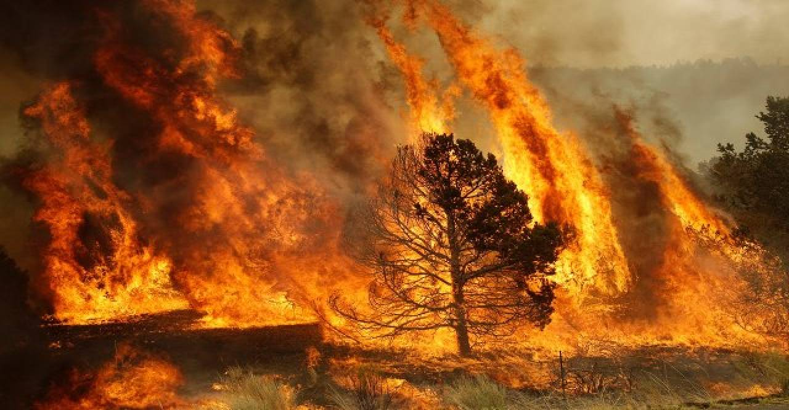

In occasione dell'alternanza scuola-lavoro all'ITIS Pininfarina di Torino, dove lo scopo è inventare applicazioni robotiche in ambito agricolo, stavo pensando di inventare qualcosa per risolvere il problema del rilevamento incendi. Allora mi è venuto in mente di implementare una semplice applicazione di visione artificiale che rilevi le sfumature di rosso e ci comunichi quando il robot "vede" una fiamma.

Il problema ovviamente può essere affrontato in modo molto più complesso e con molti altri sensori (temperatura, gas, ecc), però per iniziare in modo low-cost e con poche righe di codice mi sembra un'applicazione carina!



# 1. Ingredienti

Ci serve:

- una Raspicam (io uso la V2)
- un Raspberry Pi con l'immagine HBrain sull'SD

# 2. Collegare la raspicam al Raspberry

Seguite il tutorial scritto in precedenza che trovate [qui](http://hotblackrobotics.github.io/it/blog/2017/04/10/utilizzare-la-raspicam-in-streaming-con-la-piattaforma-cloud/).

Una volta che è tutto funzionante possiamo procedere con il codice. Andiamo nella sezione della piattaforma cloud adibita a creare nuovi "sketches" e iniziamo a scrivere un nodo!

## 2.1 Rilevare il colore rosso - Il codice

Il codice completo è qui sotto, copialo nello sketch, salva e premi "run".

```python
import dotbot_ros
import cv2
import sys
import rospy
import numpy as np
from sensor_msgs.msg import Image
from cv_bridge import CvBridge, CvBridgeError

class Node(dotbot_ros.DotbotNode):
    node_name = 'fire_detection'

    def setup(self):
        self.image_sub = dotbot_ros.Subscriber("/camera/image",Image,self.on_image)
        self.image_pub = dotbot_ros.Publisher("image_back", Image)
        self.img = None
        self.bridge = CvBridge()
        print "ci sono e sono vivo!"
        sys.stdout.flush()

    def on_image(self,data):

        img = self.bridge.imgmsg_to_cv2(data, "bgr8")

        # significa in RGB ROSSO
        lower = np.array([17, 15, 100])
        upper = np.array([50, 56, 200])

        tol = 0
        mask = cv2.inRange(img, lower, upper)
        output = cv2.bitwise_and(img, img, mask = mask)
        gray = cv2.cvtColor(output,cv2.COLOR_BGR2GRAY)

        if (gray>tol).any():
            print "Allarme Incendio !!!"
        else:
            print "---"

        sys.stdout.flush()
        self.image_pub.publish(self.bridge.cv2_to_imgmsg(gray, "mono8"))

```

Se è tutto ok, vedrai nella sezione "console" il nodo in esecuzione e facendo echo sui due topic "/camera/image" e "< nome-del-tuo-robot >/image_back" vedrai da una parte lo streaming dalla telecamera e dall'altra l'immagine solo se ha "qualcosa di rosso". NB: L'immagine la vedrete con i colori invertiti probabilmente per un problema sul Raspberry e l'immagine salta continuamnente da RGB a BGR e viceversa. Per questo ogni tanto il colore blu appare come rosso ;)

# 3. Analizziamo meglio il codice

A parte le prime righe dove si aggiungono i componenti Python necessari al programma, si instanzia una classe e si dichiara il nome del nodo come "fire_detection", vediamo in dettaglio il resto del codice.

Nella funzione setup, dichiariamo un _subscriber_ che si sottoscrive al topic **/camera/image**, con un tipo di messaggio **Image** e associa una funzione di callback di nome **on_image**. Questa funzione verrà richiamata ogni volta che nel topic viene pubblicato un messaggio di tipo **Image**. Nella riga sotto dichiariamo un _Publisher_ che ha l'obiettivo di pubblicare l'immagina processata. In questo modo così possiamo vedere l'effetto del filtro colore che stiamo per applicare. Alla fine della funzione mettiamo un _print_ "ci sono e sono vivo!" per comunicare in console che il programma è in esecuzione correttamente.

```python

def setup(self):
    self.image_sub = dotbot_ros.Subscriber("/camera/image",Image,self.on_image)
    self.image_pub = dotbot_ros.Publisher("image_back", Image)
    self.img = None
    self.bridge = CvBridge()
    print "ci sono e sono vivo!"
    sys.stdout.flush()

```

Vediamo ora la funzione **on_image** dove accade il vero e proprio filtraggio.

```python
def on_image(self,data):

    #convertiamo l'immagine da opencv nel formato idoneo a ROS
    img = self.bridge.imgmsg_to_cv2(data, "bgr8")

    # significa in RGB ROSSO
    lower = np.array([17, 15, 100])
    upper = np.array([50, 56, 200])
```

Con _lower_ e _upper_ definiamo le soglie di colore rosso minime e massime, Ovvero in BGR (Blue Green Red) il colore che andremo a filtrare da ogni frame della telecamera. Se sei curioso di sapere esattamente che colore è, [qui](https://www.w3schools.com/colors/colors_rgb.asp) c'è un calcolatore RGB. NB: i colori nel codice Python sono in BGR quindi significa ad esempio per lower Blue = 17, Green = 15, Red = 100.

```python
    # tolleranza
    tol = 0
    # maschera per sogliare il colore rosso
    mask = cv2.inRange(img, lower, upper)
    # immagine output dove rimane solo il rosso e tutto il resto nero
    output = cv2.bitwise_and(img, img, mask = mask)
    #converto questa in bianco e nero
    gray = cv2.cvtColor(output,cv2.COLOR_BGR2GRAY)

    # se c'è anche solo un pixel rosso mando un allarme!
    if (gray>tol).any():
        print "Allarme Incendio !!!"
    else:
        print "---"

    sys.stdout.flush()

    # pubblico l'immagine processata su image_back
    self.image_pub.publish(self.bridge.cv2_to_imgmsg(gray, "mono8"))
```

Qui facciamo qualche operazione più complicata. Bisogna innanzitutto dire che un'immagine è una matrice di numeri. Quindi in questo caso andiamo a definire una maschera _mask_, poi filtriamo nei range di colore definito e salviamo il risultato in un'altra immagine di nome _output_. Dopo convertiamo questa in bianco e nero e salviamo in un'altra immagine ancora di nome _gray_. Facciamo questa operazione perchè se la telecamera non vede niente di rosso (e nessun colore nel range definito prima) il nostro risultato sarà completamente nero, potete verificarlo in ROS console osservando il topic /image*back, il che significa che tutti i numeri della matrice sono 0 o praticamente 0.
Quindi per capire in automatico se la telecamera "vede" una zona rossa basterà con *(gray>tol).any()_ andare a vedere se uno tra i tanti pixel dell'immagine NON è nero. Ovvero si traduce nell'osservare tutti gli elementi della matrice e vedere se ce n'è uno che è maggiore di una piccola tolleranza (in questo caso tol = 0 quindi il sistema sarà parecchio sensibile).
Infine con \_self.image_pub.publish()_ pubblichiamo il risultato sultopic /image_back.

# 4. Esercizi

Collegate un LED al Raspberry o fate inviare tramite un bot Telegram un messaggio di allarme sul vostro cellulare.

Migliorate l'applicazione con tecniche più fini di riconoscimento immagini, non solo un pixel ma una regione minima di spazio che possa essere effettivamente una fiamma!

**Ciao ciao!** :robot:
