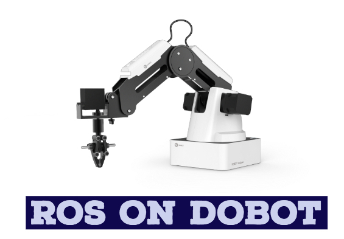
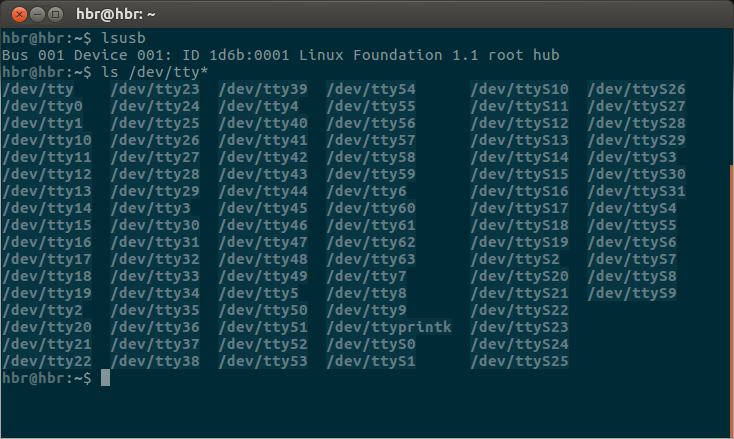
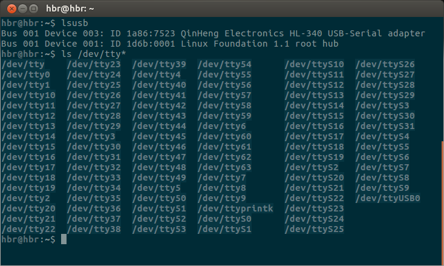
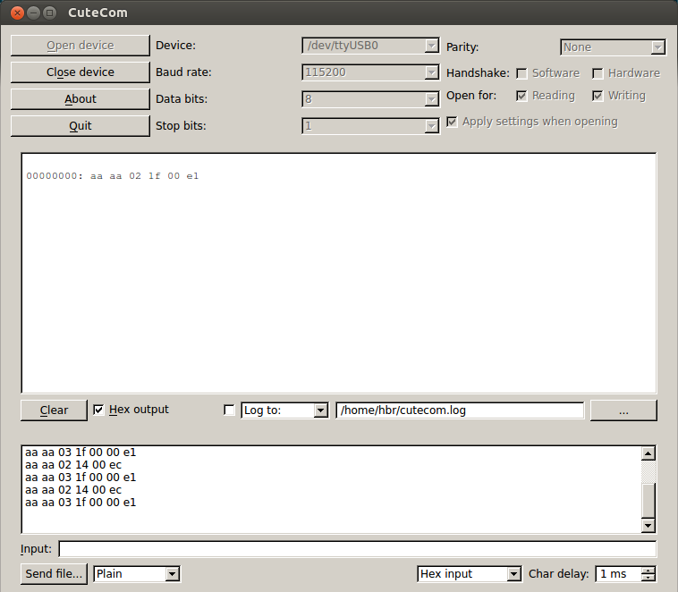

Ciao! In questo (primo) tutorial vi spiegherò come interfacciare ROS con Dobot e scrivere una semplice applicazione per disegnare. Un grazie speciale va all'azienda [Alumotion](http://www.alumotion.eu/), distributore italiano di Dobot, che ci ha donato il robot per progetti di ricerca e sviluppo su ROS (no no non li ho assolutamente messo pressione data la mia passione per la fabbricazione digitale :P ).

Prima vediamo a grandi linee cos'è, e perchè mi piace un sacco!

## Dobot

Dobot è un braccio robotico multifunzione prodotto dall'azienda cinese Shenzhen Yuejiang Technology Co. L'azienda naque nel 2015 a seguito di una campagna Kickstarter di grande successo (raccolsero più di 650 mila dollari). Da allora hanno già prodotto 5 modelli di robot diversi.

<YouTube videoId="ggT4hz5tM_0" frameborder="0" allow="autoplay; encrypted-media" />

Dobot è un prodotto nato per l'education concepito sia per chi vuole muovere i primi passi nel coding fino ad arrivare anche ai più esperti. Non richiede alcun assemblaggio da parte dell'utente e nel kit ci sono un sacco di accessori per offrire funzionalità divertenti e che richiedono una precisione non banale come ad esempio: disegnare su carta, incidere al laser, stampare in 3D, posizionare piccoli oggetti. Si può programmare in Blockly (simil Scratch), in Python e da ora grazie al mio fantastico tutorial anche in ROS!

Tutto ciò ad un prezzo imbattibile (attorno ai 1500 Euro). Se volete altre informazioni vi consiglio di dare un'occhiata [qui](http://www.dobot.it/prodotti/dobot-magician/). Personalmente credo che sia un braccio molto divertente, anche con solo 4 assi si possono fare delle cose carine. La cosa che mi ha stupito di più è che con un costo così basso si possano fare veramente, ed in modo davvero semplice, delle applicazioni che richiedono un minimo di precisione (disegnare). Per contro però devo dire che la community open source è gestita molto male e ci sono tantissimi problemi sia nel software che nella documentazione (inesistente).

# ROS e Dobot: iniziamo

Cosa ti serve:

- un computer con installato Ubuntu e ROS (io uso Kinetic su una VirtualBox Ubuntu da Mac)
- un Dobot ;)

Prima testiamo se funziona correttamente il robot e comunica via USB col computer.
Apri un terminale e controlla i dispositivi connessi alle USB con i comandi `lsusb ` e `ls /dev/tty*`.

Poi inserisci nella presa USB il cavo di Dobot (acceso) e, se non hai problemi di driver, dovresti vedere QinHeng Electronics HL-340 USB-Serial adapter ed un nuovo device, nel mio caso /dev/ttyUSB0 digitando gli stessi comandi.

Ora installiamo il software _cutecom_ con ` sudo apt-get install cutecom` per testare il protocollo in seriale. Eseguilo da administratore con `sudo cutecom` . (questo è opzionale ma se non funzionasse ti aiuta a testare bene il protocollo di comunicazione)

Imposta in “Device” la porta USB corretta (nel mio caso è /dev/ttyUSB0) flagga “Hex Output” e seleziona nel menù a tendina in fondo “Hex Input”. Ora Premi su “Open Device” , se hai problemi potrebbe essere un problema di diritti sulla porta. Allora digita `sudo chmod 777 /dev/ttyUSB0` .
Ora digita nella casella di "input" `aa aa 02 14 00 ec ` a cui dovrebbe rispondere una stringa esadecimale e poi manda ancora `aa aa 03 1f 00 00 e1`, dovresti veder il DoBot muoversi!

Ok ora iniziamo ad usare veramente **ROS**!
Scarichiamo il pacchetto ROS Demo for DoBot Magician dal mio repository personale [qui](https://github.com/sgabello1/ros-dobot/tree/master). In realtà è quasi lo stesso del [sito ufficiale](https://www.dobot.cc/downloadcenter/dobot-magician.html?sub_cat=72#sub-download) però nel mio caso ci ha messo un sacco di tempo a scaricare e poi ho aggiunto due script per l'applicazione finale.

Crea un workspace in ROS (se non sai farlo è spiegato [qui](http://wiki.ros.org/catkin/Tutorials/create_a_workspace)). Copia il mio pacchetto in `catkin/src ` e compila con ` catkin_make` .
Ora fai partire

`roscore`

in un altro terminale (questo vale se la tua porta è ovviamente /dev/ttyUSB0)

`rosrun dobot DobotServer /dev/ttyUSB0`

in un altro terminale ancora il nodo che ho scritto

`rosrun dobot DobotClient_topic `

ed infine in un altro terminale ancora un semplice nodo che pubblica solo i punti che dovrà seguire il Dobot.

`rosrun dobot talker`

E come risultato finale avremo questa fantastica spirale!

<YouTube videoId="eXZgVXh3Phg" />
