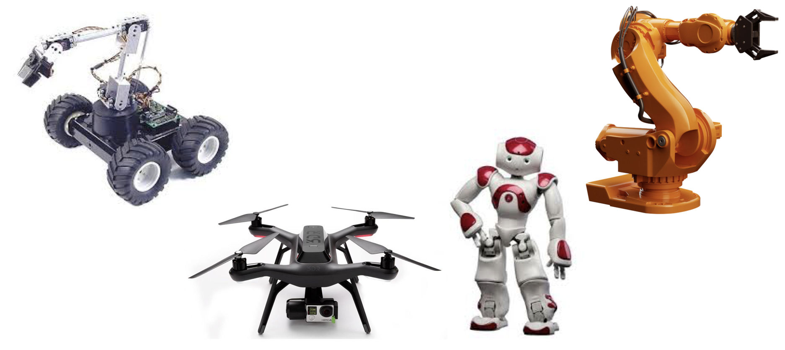

Negli ultimi anni il dibattito sulla robotica si è molto acceso ed è diventato comune anche tra l'opinione pubblica.
I robot creano nelle persone sentimenti contrastanti, sia di interesse verso questa tecnologia ma anche di paura
per il nostro futuro.

Le paure sono da una parte causate da un grosso filone della fantascienza che racconta mondi in cui i robot prendono
il sopravvento sull'uomo come nuova specie dominante del pianeta, ma dall'altro dalla paura (a mio avviso non tanto concreta) dell'innovazione che distruggerà tantissimi posti di lavoro nel futuro prossimo.

In questo post non voglio addentrarmi troppo in queste discussioni (anche se certamente dedicherò alcuni post futuri su questa rubrica a discorsi etici, morali e sociologici della robotica), ma voglio invece iniziare ad intraprendere un discorso con voi su cosa è la robotica, e cosa dobbiamo aspettarci da questa scienza nel prossimo futuro!

## Cosa è un robot?

Per preparaci al meglio, cerchiamo prima di tutto di rispondere alla domanda "cosa è un **robot**?"! Come fa notare la professoressa Carrozza nel suo libro [**I Robot e Noi**](https://amzn.to/2sVkCOt), cercando di rispodnere a questa domanda ci troviamo di fronte ad un grande **paradosso**, in cui per noi risulta molto facile riconoscere un robot vedendolo, ma altrettanto difficile darne una definizione
omnicomprensiva che permetta, in modo semplice e schematico, di definire questa classe di macchine.

I robot, infatti, hanno differenti forme e funzioni, e vanno da Robot Industriali, enormi macchine meccaniche in grado di spostare anche oggetti pesantissimi, passando per droni e robot su ruote, fino ai semplici sistemi educativi che, da qualche tempo, vanno molto di moda nelle scuole.

I robot, quindi, hanno diverse forme, dimensioni, funzioni e scopi nel nostro mondo, e diventa sempre più complesso darne una definizione che accontenta tutti! Nel mio piccolo, piace definire i robot secondo un paio di parametri che accomunano
quasi tutti i robot con cui ho lavorato: la **multifunzionalità**, l'**autonomia** e la **programmabilità**. Secondo la mia definizione, infatti, i robot sono **macchine multifunzionali**, progettati cioè per compiere una vasta gamma di compiti più o meno complessi, in grado di **agire in modo (semi)autonomo** attraverso dell'intelligenza gestida da un **programma software**.

Analizziamo un po' meglio questi aspetti insieme.

##### I robot sono macchine multifunzionali

Cioè progettati per compiere azioni diverse in base alle necessità. Un braccio robotico industriale, ad esempio, è progettato per muoversi con grande precisione, velocità e destrezza. In questo modo, è in grado di compiere vari tipi di operazioni dal prendere e spostare gli oggetti, ad eseguire lavori come la saldatura, montare pezzi, etc. Similmente, un drone è progettato per volare in modo snello e veloce, e questo gli permette di compiere operazioni di ripresa e monitoraggio o di spostare piccoli oggetti in modo autonomo e veloce.

##### I robot sono macchine (semi)autonome

Cioè in grado di prendere decisioni, anche complesse, in base alle necessità, con diversi gradi di interazione con una persona umana.
L'autonomia nei robot varia in base alle situzione ed alla applicazione. Si passa da robot con un bassissimo grado di autonomia, specialmente in applicazioni industriali di manifattura o robot a controllo remoto, fino a robot completamente autonomi, come ad esempio robot per l'esplorazione spaziale o i robot di servizio moderno, passando per diversi gradi intermedi.

##### I robot sono programmabili

L'intelligenza del robot è demandata ad un programma più o meno complesso che gira sui computer o microcontrollori a bordo del robot.
Data l'elevata multifunzionalità dei robot, questi programmi devono essere sviluppati da tecnici ed ingegneri esperti con linguaggi di programmazione moderni.

## La Robotica: La scienza per studiare i robot

I robot sono quindi sistemi complessi sotto diversi punti di vista. Progettare e costruire robot non è semplice, ma spesso si considera la **robotica** come una semplice branca dell'ingegneria.

In realtà, lo studio e lo sviluppo dei robot è una **scienza** a tutti gli effetti, che ha come particolare caratterica quella di far confluire al suo interno diversi saperi delle classiche scienze tradizionali (matematica, ingegneria, biologia, fisica, neuroscienze, etc.) e scienze umane (in particolar modo la fisolofia e l'etica). La robotica è una scienza particolare, non settoriale spesso associata al concetto di **multidisciplinarietà**, ma recentemente definita dalla prof.ssa Carrozza come scienza **antidisciplinare**, nel senso che lo scienziato robotico deve padroneggiare diversi campi del sapere, in contratto con i classici approcci multidisciplinari in cui diversi esperti, padroni di una determinata disciplina, lavorano insieme ma mantenendo separate le loro competenze.

Lo studio della robotica come scienza, infatti, è influenzato ed influenza diverse scienze. Pensate, ad esempio, che lo studio dei movimenti di un robot umanoide ha permesso di comprendere meglio la biomeccanica nel movimento degli animali ed esseri umani.

Nel mio piccolo, capisco e mi ci ritrovo nel mondo dell'antidisciplinarietà come ingegnere robotico, che è stato fortemente presente nella mia carriera da studente. Fin dall'inizio ero deciso ad intraprendere degli studi nel mondo della robotica, tanto da aver studiato **meccatronica** presso il **Politecnico di Torino**, un corso di studi già di per se multidisciplinare.
Ma la mia scelta di andare sempre più in direzione della robotica mi ha spesso portato allo stravolgimento del mio corso di studi, in modo da aggiungere corsi (non previsti) legati più al mondo dell'informatica e dello sviluppo software.
È un fatto i miei studi si siano spostati sempre di più verso lo studio di algoritmi di intelligenza artificiale e visione artificiale, non presenti nel corso di Meccatronica standard.

Proprio a causa di questa natura antidisciplinare, esistono diversi campi applicativi della robotica, spesso molto diversi tra di loro. Di seguito vi riporto un elenco di alcune delle applicazioni moderne della robotica, che verranno poi riprese ed esplose nei prossimi post di questa rubrica:

1. Robotica Industriale
2. Robotica per l'esplorazione spaziale
3. Robotica per la Chirurgia
4. Biorobotica e Neurorobotica
5. Robotica Educativa
6. Robotica di Servizio
7. Robotica collaborativa
