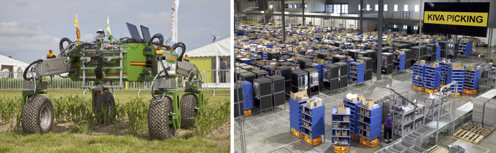
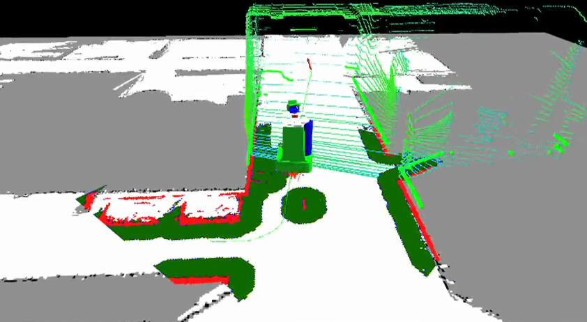

Questo post riprende in parte un post scritto tempo fa per la community Rokers, che adesso purtroppo non è più online per il poco tempo che io, Gabriele e Basilio avevamo per dedicarci.

Essendo il post (almeno secondo me) veramente ben fatto, mi dispiaceva che non fosse più pubblicato. Ho quindi deciso di riesumarlo e megliorlarlo.

## La Robotica di Servizio

Partiamo dal concetto di **Robotica di Servizio**.
Quando si parla di Robotica, si pensa principalmente a tre differenti aspetti:

- La robotica industriale, che è quel campo della robotica a cui tecnologicamente e realisticamente siamo più abituati. E il prof. Basilio Bona, su questo argomento, vi sta già tediando abbastanza :D
- La robotica nella fantascienza, in cui solitamente si parla di Robot Umanoidi non tanto distinguibili dagli essere umani (e che molto spesso tentano di distruggere la razza umana)!
- La robotica educativa/hobbistica, che ha invaso le scuole e i Fablab negli ultimi anni, in cui vediamo piccoli robottini con pochissima autonomia, realizzati per scopi didattici o per puro divertimento.

Tuttavia, negli ultimi anni, un nuovo campo di applicazione della robotica sta sempre più prendendo piede, sia dal punto di vista della ricerca, ma anche con applicazioni reali sul mercato: si tratta della **robotica di servizio**. Questo campo della robotica riunisce tutte quelle tecnologie robotiche pensate per aiutare gli essere umani a svolgere compiti nel loro quotidiano.

Ora, definire esattamente cosa è la robotica di servizio è molto difficile, in quanto esistono tantissime applicazioni pratiche molto diverse tra di loro (e con hardware molto diversi). Tuttavia, cercherò di dare la mia personalissima definizione (che non comprende tutte le definizione e/o i campi di applicazione, come è ovvio che sia):

> Un **sistema robotico** di **servizio** è un sistema robotico in grado di aiutare gli esseri umani a svolgere un certo compito in modo **(semi)autonomo**, **senza essere programmato** dall'utente.

Dal mio personalissimo punto di vista, un sistema robotico (ho scelto appositamente questo termine _sistema robotico_, e non _robot_) di servizio deve avere una specifica caratteristica per essere definito tale:

- Non necessitare di una programmazione dell'utente per svolgere il suo lavoro.

Questo è infatti ciò che distingue, sia da un punto di vista tecnologico che da un punto di vista applicativo, un sistema di robotica di servizio dai classici sistemi di robotica industriale. In quest'ultimo caso, infatti, l'utente del robot (l'utilizzatore), è anche colui che programma il robot, al contrario, nella robotica di servizio è il costruttore del robot (o chi lo vende) a doverlo programmare, mentre l'utente è un puro utilizzatore passivo del sistema.

Applicativamente, infatti, un utente non deve essere "esperto" in robotica per poter usare il sistema. Pensate per esempio al Roomba (o ai vari robot per pulire i pavimenti): il loro utilizzo è quasi come quello di un'applicazione per uno smartphone: apri la scatola, accendi, fine. Il robot, con le dovute limitazioni, è quasi completamente autonomo nel pulire i pavimenti.

Il problema è tecnologico: infatti sviluppare un robot con un alto grado di autonomia risulta essere molto complesso.
Limitiamoci al caso specifico di robot su ruote: i programmatori non possono fare "assunzioni" su cosa succederà intorno al robot, come avviene invece nei robot industriali. Il robot deve essere autonomo, sicuro e deve durare, e questo implica che questa debba essere in grado di eseguire alcuni compiti complessi, che sono (principalmente) quelli che trovate qui sotto:

- **mapping**: Il robot deve essere in grado di costruire una "mappa" (cioè un modello matematico) dell'ambiente in cui si trova.
- **localization** Il robot deve essere in grado di determinare la propria posizione all'interno dell'ambiente (utilizzando la mappa di cui sopra).
- **path planning** Il robot deve essere in grado di pianificare una traiettoria da seguire per raggiungere un punto specifico della mappa.
- **path following** Il robot deve essere in grado di seguire una traiettoria pianificata nel punto sopra, considerando la possibilità di trovare ostacoli non previsti come persone in movimento o oggetti non presenti in fase di costruzione della mappa.

Queste 4 capacità vengono solitamente raggruppate sotto il noto problema del **robot navigation**, problema ancora tecnologicamente aperto e non completamente risolto.

Si noti inoltre che le 4 capacità sopra citate sono anch'esse non ben definite, e dipendono molto dalla specifica applicazione. Per un robot che si muove in esterno le prime due sono quasi gratuite: basta sfruttare un qualsiasi servizio che fornisce mappe terrestri e dei GPS (anche se ci sarebbe un grosso discorso da fare sulla precisione degli stessi); ma il **path following** diventa molto delicato. Al contrario, in un robot che si muove all'interno di un edificio, **mapping** e **localizzazione** spesso sono problemi che devono essere risolti contemporaneamente (il robot mentre costruisce la mappa deve sapere la posizione di se stesso nella mappa in costruzione): in questo caso, si parla di un noto e importante problema nella robotica chiamato **SLAM** (_Simultaneous Localization and Mapping_).

A tale complessità, si aggiungono altri problemi quando si sviluppano le applicazioni robotiche:

- Interazione con la persona
- Limiti di batteria
- Costo dell'hardware e del software

Capite quindi che, per un ingegnere robotico (come me), il tutto è un grosso problema. E alla base di tutto questo c'è il progetto ROS.

## ROS: The Robot Operating System

> Why ROS? Because creating truly robust, general-purpose robot software is hard. From the robot's perspective, problems that seem trivial to humans often vary wildly between instances of tasks and environments. Dealing with these variations is so hard that no single individual, laboratory, or institution can hope to do it on their own. \[[ros.org/about-ros/](http://www.ros.org/about-ros/)\]

Provo a tradurre:

> Perché ROS? Perché sviluppare software robusti e _general-purpose_ per robot è difficile. Dal punto di vista di un robot, problemi che sembrano banali agli essere umani spesso variano molto per le funzioni e gli ambienti. Affrontare queste variazioni è così difficile che nessun singolo individuo, laboratorio o istituto possa sperare di farlo da solo.

La volontà e l'intuizione degli ideatori di ROS era quindi quella di fornire un ecosistema per spingere vari gruppi di ricerca in tutto il mondo a collaborare per risolvere questi problemi tanto complessi unendo le forze.

Dopo circa 10 anni dalla prima versione realizzata di ROS, posso certamente affermare che lo scopo principale (quello di creare una community a livello mondiale), è stato realizzato, ed infatti, all'interno del mondo ROS, è possibile trovare pacchetti che risolvono (o tentano di risolvere, in quanto la tecnologia ancora non è perfetta) praticamente tutti i problemi tecnologici legati alla robotica di servizio.

### Ma quindi, cosa cavolo è 'sto ROS???

Mi aspetto che chi è riuscito a leggere questo articolo fino a qui si sia fatto questa domanda. Vediamo di capire esattamente cosa è. Ma prima sfatiamo un mito: a dispetto del nome, ROS **non è un sistema operativo per robot**. ROS, invece, è:

- Un framework per lo sviluppo di applicazione robotiche (connesse).
- Un set di Librerie, strumenti di sviluppo e convenzioni che forniscono una base tecnologica robusta da cui partire per lo sviluppo di tali applicazioni.
- Una grossissima community di ricercatori, scienziati e appassionati di tutto il mondo.

ROS è quindi una grossissima ed importantissima fonte per chiunque voglia iniziare a sviluppare applicazioni robotiche. Si basa su Linux (in particolare Ubuntu e Debian), ma è possibile installarlo su una vasta quantità di macchine.

Dal punto di vista tecnico, tra le caratteristiche più importanti di questo progetto, le più interessanti (secondo me, poi qualcuno potrebbe non essere d'accordo), sono le seguenti:

- Astrazione dell'hardware;
- Sistemi Multimacchina.

ROS permette di _Astrarre l'hardware_, cioè fa sì che gli sviluppatori non debbano pensare troppo al sistema reale su cui la propria applicazione deve girare. Il tutto ha alcuni svantaggi di performarce, ma certamente enormi vantaggi sul piano applicativo: un esempio è il seguente, il sistema di telecontrollo di un robot in ROS funziona, senza problemi, sia per controllare Robot su ruote che per controllare Robot umanoidi, e con alcune accortezze, permette di controllare droni.
In altre parole, grazie a ROS, sotto opportune limitazioni, possiamo sviluppare applicazioni generiche e farle girare su sistemi robotici di vario tipo, un po' come fanno gli sviluppatori per Android, che quando sviluppano l'app per cellulare, non stanno a chiedersi se poi quest'app sarà scaricata su un Samsung, su un Nexus o un One Plus.

Inoltre, ROS permette di sviluppare sistemi _Multimacchina_, in cui l'intelligenza non è centralizzata su un unico computer (di solito sul robot), ma può essere distribuita (tramite una rete di comunicazione), tra più computer connessi tra di loro. Il bello è che il tutto è trasparente allo sviluppatore e al codice. Io, sviluppatore, posso implementare un Nodo ROS (cioè un programma ROS), e poi decidere se farlo girare sul robot o su una macchina remota, senza dover cambiare una riga del codice originale.

Queste due caratteristiche di ROS, aprono la strada ad un grandissimo cambio di paradigma, avvenuto negli ultimi temi, nel mondo della robotica di servizio: la **Cloud Robotics**.

## Cloud Robotics: anche i robot usano DropBox

Nel 2010, James Kuffner fece un ragionamento molto semplice ma anche disruptive:

> i robot sono (essenzialmente) computer con delle ruote, i computer trovano un enorme beneficio nell'essere connessi ad internet: che succede se attacco un robot ad internet?

Da questa semplice considerazione, che per certi versi ho banalizzato, ma spero che renda l'idea, è nato quindi il paradigma della **Cloud Robotics**, o **Robotica in Cloud**.

Badate bene, l'idea di connettere robot a internet è arrivata molto prima: tralasciando tutta la letteratura fantascientifica, già dagli anni '80 riusciamo a trovare lavori di vario tipo che prevedono di connettere e controllare Robot tramite internet. Lo stesso progetto [**RoboEarth**](http://roboearth.ethz.ch/), che è ampiamente riconosciuto come il primo progetto di ricerca ad applicare fortemente il concetto di Cloud Robotics, è nato nel 2009 (quindi un anno prima la presentazione di Kuffner). Tuttavia, a James Kuffner, va riconosciuto il merito di aver formalizzato sotto un unico cappello ed aver trovato un nome a questo nuovo approccio alla robotica.

Ma perché la **Cloud Robotics** è fortemente legata alla robotica di servizio? La risposta è molto semplice: sebbene questo paradigma sia molto trasversale nel mondo della robotica, e venga applicato benissimo anche nel mondo della robotica industriale, nel mondo della robotica di servizio risulta essere non tanto un miglioramento o potenziamento di una tecnologia già matura, ma il vero abilitatore di una tecnologia che, come spiegato prima, ancora non è completamente matura.

Il perché è presto detto: come spiegato precedentemente, gli algoritmi necessari a far funzionare bene un robot di servizio sono molto complessi, e quindi richiedono enormi quantità di calcolo (e di storage, nel caso di algoritmi per la visione artificiale). Questo vuol dire che un robot autonomo deve avere un grosso computer a bordo per poter funzionare. Questa cosa ha tre svantaggi:

- L'ingombro e il peso (un server molto potente non è certo piccolo),
- Il consumo energetico,
- Il costo.

Capite bene, quindi, che mettere un server decente su un robot di servizio ne aumenta il costo, il peso e le dimensioni, e ne riduce l'autonomia della batteria.

Con l'approccio della Cloud Robotics, invece, queste limitazioni sono virtualmente superate: il robot può "delegare" parte della sua intelligenza ad un server in Cloud, spedendo al server i dati dei propri sensori, che vengono elaborati e trasformati in comandi per gli attuatori, che tornano indietro al robot.

Ricordo che, quando inizia il mio percorso di dottorato in TIM, si vedeva la **Cloud Robotics** come un sistema composto da un robot stupido, che non era altro che un insieme di sensori e attuatori, con una sim 4G al suo interno. Ovviamente questa visione è troppo semplicistica ed irrealizzabile, specialmente perché alcune funzionalità del robot, per quanto complesse, è bene che siano eseguite all'interno del robot stesso. Prendiamo, ad esempio, un semplice algoritmo per evitare gli ostacoli, se proviamo a mettere "in Cloud" questo algoritmo, sono sicuro al 100% che al primo malfunzionamento o ritardo di internet il robot va a sbattere da qualche parte :D
Tuttavia, esistono un'ampia classe di funzionalità di sistema robotico autonomo, che non necessitano di stringenti limiti temporali per funzionare bene. Gli algoritmi di **Mapping**, **SLAM** e **Path Planning** rientrano in questa categoria, e sono anche tra i più esosi in termini di risorse computazionali.

Spero, a questo punto, di aver fatto capire come mai sopra parlavo di **sistema robotico** e non di **robot**. Infatti, spesso questi tipi di robot non sono a se stanti, ma connessi ad internet, e parte del loro "cervello" viene spostata su un server in cloud, lasciando sul robot stesso, alcune funzionalità di base necessarie alla sicurezza nel caso che la connessione internet venga persa.

## Conclusioni

Cosa ne pensate di queste tecnologie? Siete interessati ad approfondire alcuni concetti? Scrivendo questo post, ho trascurato tantissimi aspetti di cui avrei voluto parlare ma (per questioni di lunghezza, e perchè volevo evitare di tediarvi troppo, ho preferito non evidenziare, almeno per il momento). Scrivetemi cosa ne pensate!
